# GDB 调试 lotus 源码教程

## 1. 环境配置

### (1). 下载源代码

这里所说的源代码不仅包括 lotus 的源代码： [lotus](https://github.com/filecoin-project/lotus)，还包括底层 rust 库实现的代码： [rust-fil-proofs](https://github.com/filecoin-project/rust-fil-proofs)，以及中间一层 封装接口调用的代码： [rust-filecoin-proofs-api](https://github.com/filecoin-project/rust-filecoin-proofs-api)，这里的三份代码的关系是这样的：`lotus` 调用 `rust-filecoin-proofs-api` 的 `api` 接口，而  `rust-filecoin-proofs-api` 是对底层 `rust-fil-proofs` 的一个简单封装,所以我们需要把这三个项目的代码都下载下来。

假设我们现在所在目录是 `~/git/`，然后在该目录中把所有代码都下载下来：

```sh
cd ~/git/
git clone https://github.com/filecoin-project/lotus.git
git clone https://github.com/filecoin-project/rust-fil-proofs.git
git clone https://github.com/filecoin-project/rust-filecoin-proofs-api.git
```

下载之后就可以看到这三个项目的代码了：

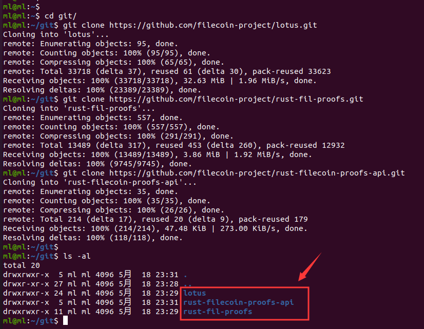


### (2). 配置源代码

下载下来之后， `~/git/` 目录中就有这三个项目的代码，而 `lotus` 本身默认使用的底层库代码不是我们放在 `~/git/` 目录下的代码，为了让它使用我们 `~/git/` 目录下底层库代码（方便后续修改代码，然后重新编译），我们需要对这项目中的配置文件做一些修改（改它们的 **Cargo.toml** 配置文件）。

**注意：**
待修改配置文件的项目有两个：`lotus` 和  `rust-filecoin-proofs-api` ，而 `rust-fil-proofs` **无需做任何修改**。

#### A. 修改 lotus 中的配置文件

首先修改 `lotus` 目录中的 **Cargo.toml** 配置文件，让它直接使用本地的 `rust-filecoin-proofs-api` 代码，这个配置文件的路径在：`lotus/extern/filecoin-ffi/rust/` 目录下，但是由于第一次使用这份代码，这个目录还不存在，因此，可以先编译一遍这个 `lotus` 的源码，让它先生成这个对应的目录，以及其中的相关代码，编译命令如下（**FFI_BUILD_FROM_SOURCE=1** 这个环境变量是必须的）：

```sh
FFI_BUILD_FROM_SOURCE=1 make clean debug
```

这里只是预编译，就是为了获取 `lotus/extern/filecoin-ffi/` 目录下的源码就可以了，如下图所示（当然你也可以直接从已有的项目中拷贝对应的代码过来）：

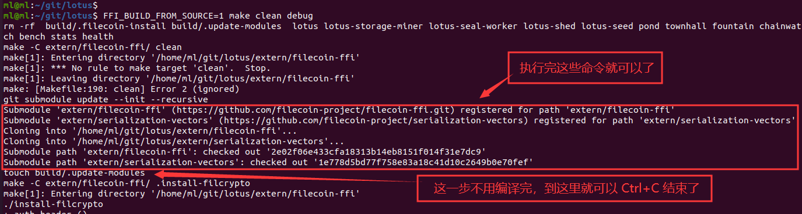

有了对应的代码，就可以修改对应的 **Cargo.toml** 文件了：

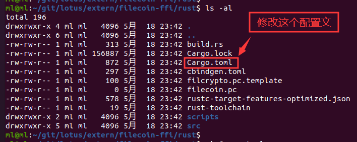

**修改前：**

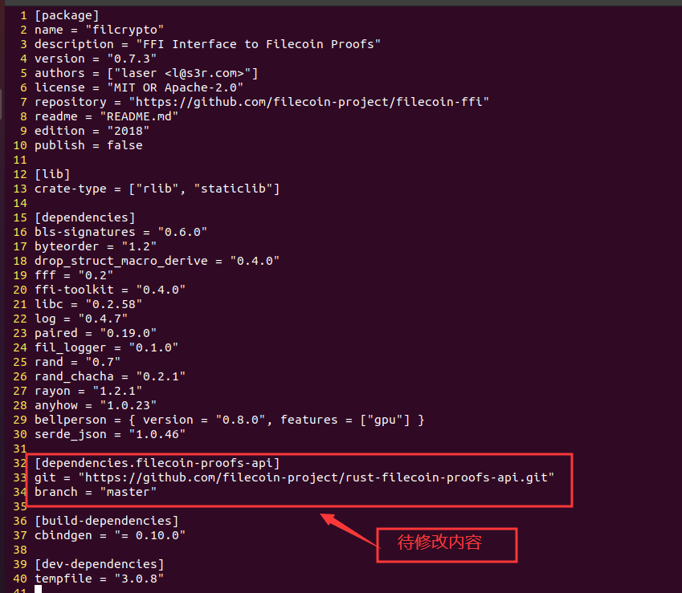

**修改后：**

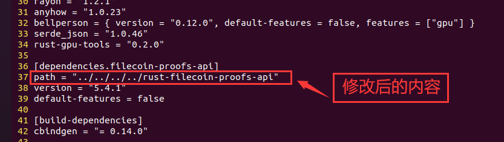

注意，上述修改中，原来用 **git** 关键字的，现在用的是 **path** 关键字，以及把下一行的 `branch="master"` 删除。


#### B. 修改 rust-filecoin-proofs-api 中的配置文件

`rust-filecoin-proofs-api` 中也需要修改对应的 **Cargo.toml** 文件，让它使用本地的 `rust-filecoin-proofs` 库中的代码：


**修改前：**

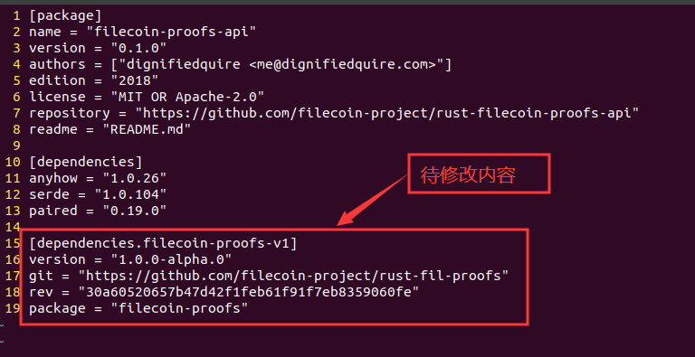

**修改后：**

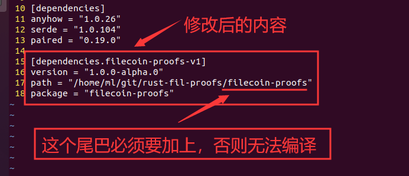

**这里要特别注意那个尾巴，是必须要加上去的，否则无法编译。**


## 2. 编译前的准备

### (1). 编译 Debug 版本代码

经过第一节的修改配置之后，其实已经可以正常编译了，并且使用的是本地的 rust 库代码，可以自己修改 rust 库代码，然后实现一些优化、定制等工作。

但是，我们现在的目的不但是为了能够方便的修改并使用本地的代码，有时候还需要进行运行时的观察、进行动态调试等，这在程序开发过程中是不可获取的一步。因此，我们把这个 rust 库和 lotus 都编译成带符号的可执行文件，也就是 Debug 版本，然后就方便我们动态调试和单步调试。

要把底层的 rust 库和上层的 go 实现的代码编译成 Debug 版本，需要修改以下三个配置文件：

- ~/git/lotus/Makefile
- ~/git/lotus/extern/filecoin-ffi/install-filcrypto
- ~/git/lotus/extern/filecoin-ffi/rust/scripts/build-release.sh

#### A. 修改 Makefile 文件

Makefile 中要把 `bench` 模块加入到 Debug 组，这样的话，我们执行 `FFI_BUILD_FROM_SOURCE=1 make clean debug` 命令的时候就能够把 `bench` 程序的 Debug 版本也编译出来（默认 `bench` 程序没有 Debug 版本的），修改结果如下：

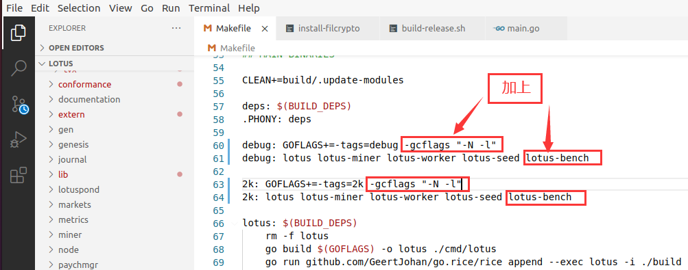

当然，你也可以在 `2k` 后面加上 `bench` 程序，这样我们就可以编译出 Debug 版本的 `bench` 程序，方便调试。

#### B. 修改 install-filcrypto 文件

这个 install-filcrypto 文件是用来安装底层 rust 库的时候用到的，因此，也需要修改它，让它指向 Debug 版本中的内容，使用 Debug 版本中的底层库来构建上层的 lotus，修改部分如下：

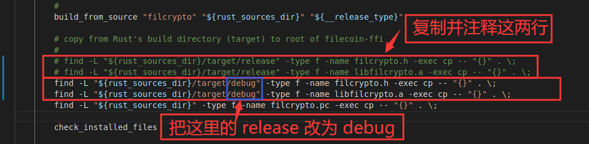

#### C. 修改 build-release.sh 文件

这个文件就涉及到编译底层 rust 库是使用到的编译变量（比如 `CFLAG`、 `CXXFLAG`、 `LDFLAG` 等），主要是把该文件中的 `--release` 字段去掉，这样编译出来的底层 rust 库就是 Debug 版本的，就带有源代码的符号信息，就可以使用 **GDB** 来跟住源代码单步调试，修改内容如下：


好了，通过以上三个文件的修改，现在已经可以编译出一个 Debug 版本的 lotus 和底层 rust 库了，最后就差一个改进版的 **GDB** 了。

### (2). 配置 GDB

Linux 中原生的 **GDB** 其实是比较难用的，我们一般都会对它做一些增强，使得我们用起来更加顺手，增强的方式一般是给 **GDB** 添加对应的插件，我们常用的插件包括 [**GEF**](https://github.com/hugsy/gef)、[**Peda**](https://github.com/longld/peda) 等，在这篇文章中，我们使用 **GEF**，当然，你要用啥由你自己决定。

本文中，我对 **GEF** 做了一些改进，使得我们用起来体验感更好，我自己修改过的 **GEF** 在 [**这里**](./files/.gdbinit-gef.py)，使用的方式是把这个跟文件下载到你的 `home` 目录下，然后在 `home` 目录下执行以下命令使 **GEF** 生效：

```sh
echo source "~/.gdbinit-gef.py" >> ~/.gdbinit
```

## 3. 编译并单步调试

其实有了上面的步骤，已经可以任意的调试 lotus 了，这一节我们主要关注如何下断点，如何使用 **GDB** 调试上层的 go 代码和底层的 rust 代码。

### (1). 编译 lotus

编译 lotus 很简单，就是一条命令，当然你也可以加上一些参数啥的，比如加上启用 GPU 的参数（`FIL_PROOFS_USE_GPU_COLUMN_BUILDER=1`）之类的，**当然，使用源码编译参数必须要加上的**（`FFI_BUILD_FROM_SOURCE=1`）,否则，编译 lotus 的时候，它就会从网上下载预编译好的底层库文件（**libfilcrypto.a**）。所以，一般用来生成可调试代码的编译命令如下：

```sh
FFI_BUILD_FROM_SOURCE=1 make clean debug
```

编译过程中，你就可以看到它使用的是本地 rust 库中的代码，如下图所示：


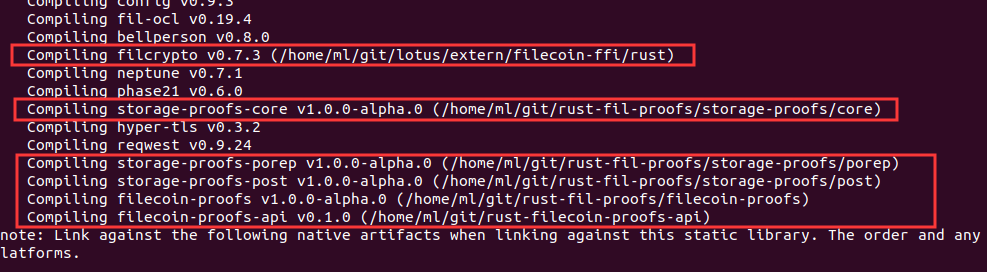
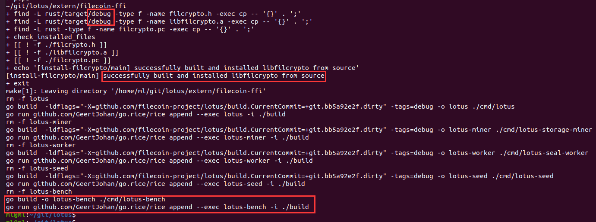

编译好之后，你就可以发现，这些文件的大小是相对比较大的，因为它们包含了大量的调试符号信息，可以方便的让我们使用 **GDB** 调试，如下图所示：

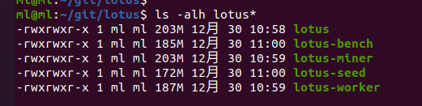

### (2). 调试 lotus

编译好之后，我们就开始可以调试了，在这里主要演示的是调试 `bench` 程序，并在 go 语言和 rust 语言里面下断点，观察中间结果，单步调试程序运行过程。

#### A. 启动程序并设置参数

首先使用 **GDB** 启动 `bench` 程序，命令很简单，在 lotus 目录中执行：

```sh
gdb ./bench
```

然后给 `bench` 程序加上参数，使用如下命令（就是让 `bench` 跑 **2KiB** 的扇区）：

```sh
set args sealing --sector-size=2KiB
```

这样就相当于是执行：

```sh
./bench sealing --sector-size=2KiB
```

当然，你可以在启动`bench` 程序之前启动 rust 的日志：

```sh
export RUST_LOG=Trace
```

总之，启动并配置好参数之后的效果如下所示：

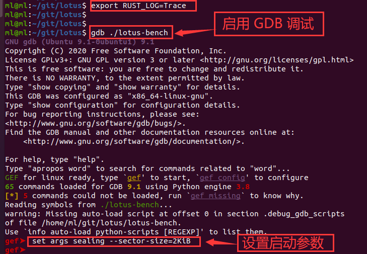

#### B. 在合适的地方下断点

上述命令指示把程序加载到内存，配置好运行参数信息，程序还没有开始运行，在它运行之前，我们需要给它下几个断点，在我们需要的地方让它停下来，方便我们观察中间结果。

现在，我们在 go 层面给它下一个断点，让它断在执行 `SealPreCommit1()` 函数的地方，这样我们就可以看到准备执行 Pre-commit1 的时候传给这个函数什么参数。Pre-commit1 所在的位置是 `/home/ml/git/lotus/cmd/lotus-bench/main.go` 文件中的第 465 行，如下图所示：


因此，我们使用如下命令给它在这一行下一个断点：

```sh
b /home/ml/git/lotus/cmd/lotus-bench/main.go:465
```

上述命令下断点的方式是其中的一种方式，就是指定某个文件的某一行，`b` 表示 `break` 的意思，就是下断点，如下图所示：

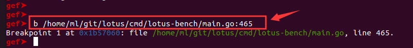

在 **go** 语言层面已经下了一个断点了，当然，你想在什么地方下断点都行，下几个也随你，**GDB** 每遇到一个断点就会停下来。接下来我们要在 **rust** 底层库中也下一个断点，下断点的方式和第一个断点一样，我们把断点下载到 **rust** 语言执行 Pre-commit1 操作的地方，也就是在 `seal_pre_commit_phase1()` 函数处，这个函数所在的位置是：`/home/ml/git/rust-fil-proofs/filecoin-proofs/src/api/seal.rs` 的第 43 行，如下图所示：

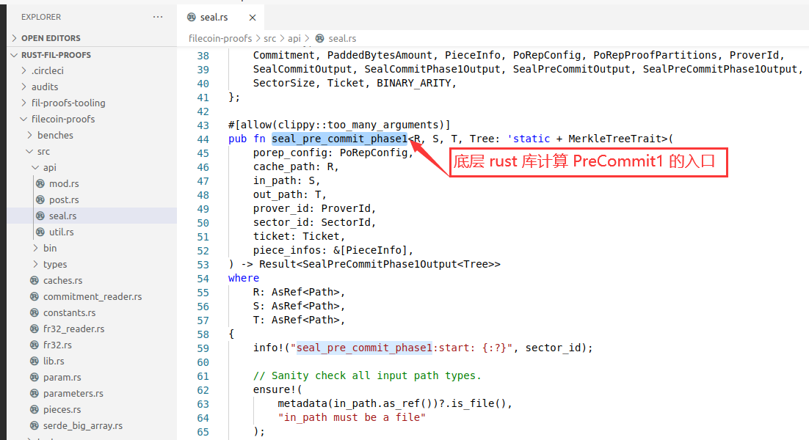

我们要在这个函数的第一行下一个断点，执行如下命令给它下一个断点：

```sh
b /home/ml/git/rust-fil-proofs/filecoin-proofs/src/api/seal.rs:58
```

如下图所示：

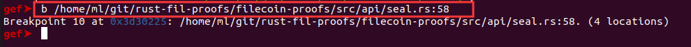

但是，由于这个 `seal_pre_commit_phase1()` 函数有些小复杂，为了方便小白们迅速找到 Precommit1 真正核心的代码，也就是生成 **11** 层 layer 的地方，我们在这个地方也下一个断点，这个地方就是 `/home/ml/git/rust-fil-proofs/storage-proofs/porep/src/stacked/vanilla/proof.rs` 文件中的 `generate_labels()` 函数，这个函数内部有一个双层嵌套的 `for` 循环，外层 `for` 循环执行 **11** 次，每次生成一层 layer， 内层 `for` 循环执行 **1G** 次（这里说 **1G** 次是针对 **32GB** 扇区的情况，并且所说的 **1G** 次就是： `1024 * 1024 * 1024` 次）。代码如下所示：

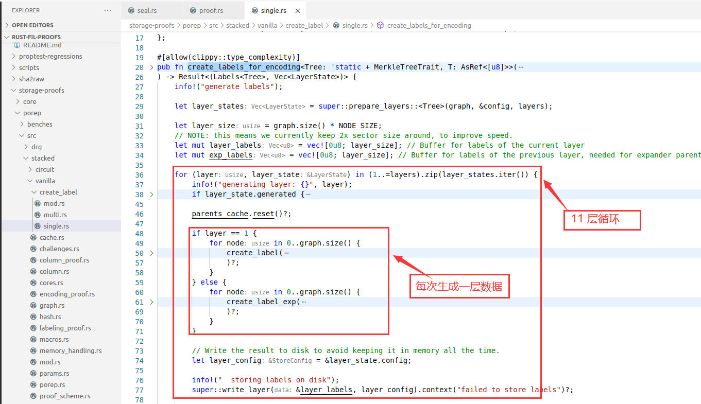

当然，这个说生成 **11** 层数据是指对与 **32GB** 扇区的情况，对于 **2KiB** 扇区的话，是不会有这么多层的，然后我们在这个 `generate_labels()` 函数的开头给它下一个断点，就下在 283 行吧，命令如下所示：

```sh
b /home/ml/git/rust-fil-proofs/storage-proofs/porep/src/stacked/vanilla/proof.rs:283
```

如下所示：

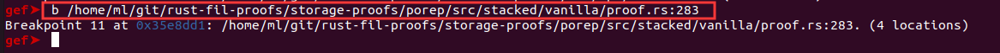

断点现在都下好了，下一步就开始可以运行了。

#### C. 开始运行

直接输入 `r` 就开始运行 `bench` 程序了，然后程序就会在 **go** 语言的 `SealPreCommit1()` 函数的地方停下来，如下图所示：

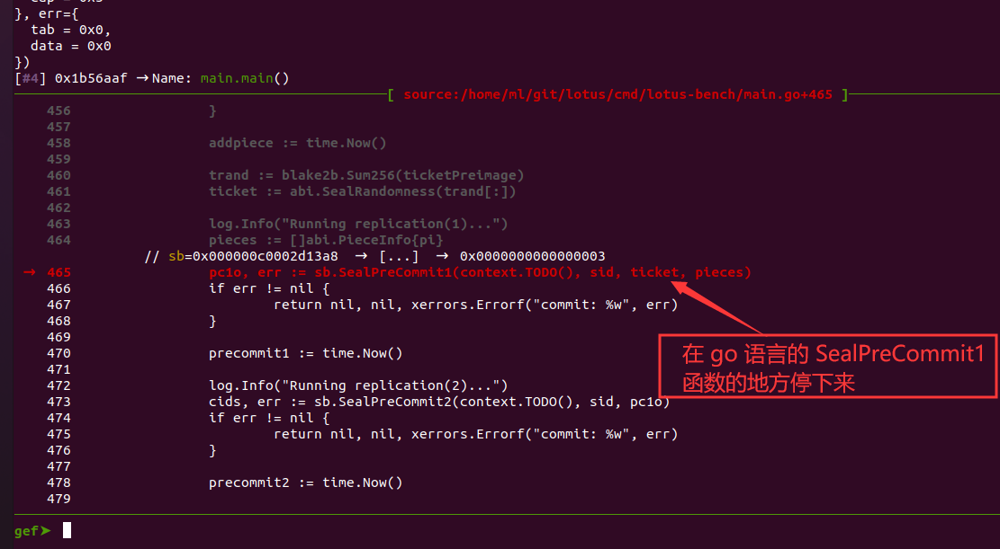

此时，就可以使用 `p` 命令查看各种变量的信息了，例如，如果我们想要看传入到 `SealPreCommit1()` 函数的 `sid`、 `ticket` 和 `pieces` 变量，就可以使用如下命令查看：

```sh
p sid
p sid
p pieces
```

如下图所示：

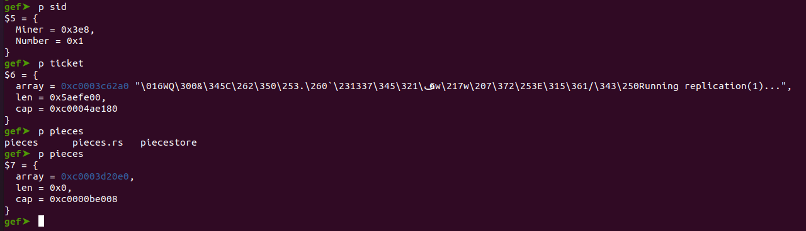

然后再按下 `n` 键，让它继续执行下一条语句，理论上应该是 `if err != nil {` 这个语句，但是由于我们在这个函数的内部下有断点，因此，它会在断点的地方停下来，而我们的断点是下在底层的 rust 库中，因此，断点自然就会断在底层的 rust 库中，如下图所示：

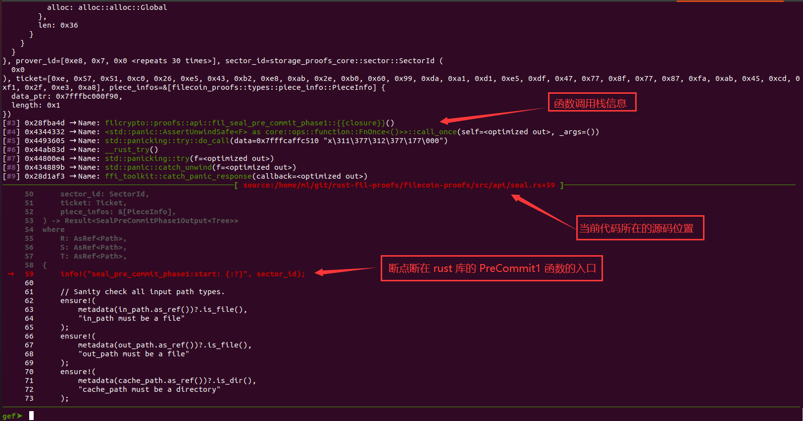

然后你想怎么调试就可以怎么调试了，当然，如果你对这个 go 语言如何调用 rust 语言感兴趣的话，也可以在上层 go 代码段下来的时候使用命令 `n` 和 `s` 一步一步的跟着代码走，这样你就能找到 go 语言是如何调用 rust 语言的了（在这里我可以告诉你，这中间经历了很多层的调用）。刚才提到的命令 `n` 和 `s` 的区别是：

- `n` 命令：单步执行，每次执行一条语句，当遇到函数调用的时候，不会进去函数内部执行
- `s` 命令：和 `n` 命令基本一样，不同地方是当遇到函数调用的时候，会进入函数内部执行

在此我就不一步一步演示了，我直接执行 `c` 命令（continue 的意思），让它直接执行到下一个断点（如果没有下一个断点的话，就执行到程序结束），也就是我们说的最耗时的地方 ---- 真正生成 layer 的地方，如下图所示：

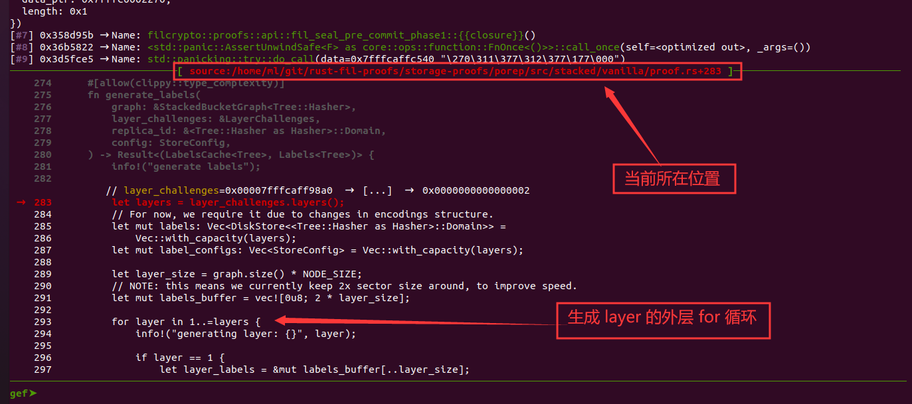

现在，你已经可以调试任意地方的任意代码了，当然，在这里的生成 layer 的每一个细节，你也可以跟进去看一下，也可以打印中间变量，相对还是比较方便的。

至此，这份教程也就结束了，如果你还能这么认真的看到这里，那么，恭喜你，你赢了。


