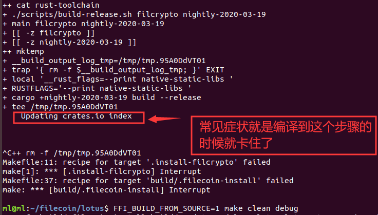
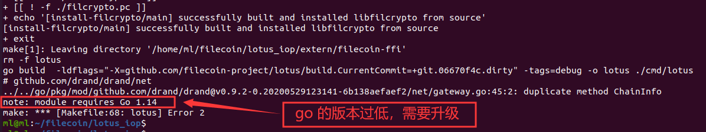
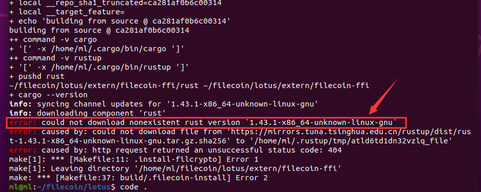
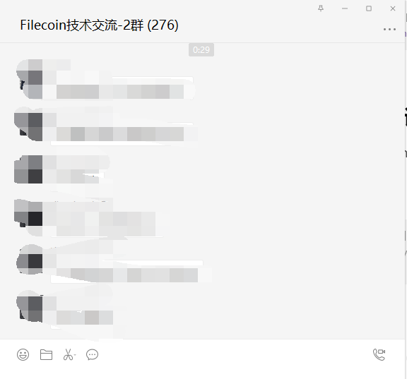

# Filecoin 资源分享

**CoinSummer实验室** Filecoin 资源分享。

## 1.常用链接

- [【群友 ican fly 开源项目】: 矿工监控告警系统（正在开发当中...）](https://github.com/twosson/fil_exporter)
- Lotus官方文档
  - [旧版文档](https://docs.lotu.sh/)
  - [新版文档](https://docs.filecoin.io/)
  - [新版文档【中文版】](https://filecoin.io/zh-cn/)
  - [搭建 Testnet本地测试网](https://github.com/filecoin-project/lotus/blob/master/documentation/en/local-dev-net.md)
  - [SpaceRace 文档](https://docs.filecoin.io/mine/spacerace/#structure-and-rules)
  - [SpaceRace 奖励说明](https://filecoin.io/zh-cn/blog/welcome-to-space-race/)
- 代码下载地址
  - [Lotus](https://github.com/filecoin-project/lotus)
  - [Go-filecoin](https://github.com/filecoin-project/go-filecoin)
  - [Rust-fil-proof](https://github.com/filecoin-project/rust-fil-proofs)
  - [Rust-fil-nse-gpu](https://github.com/filecoin-project/rust-fil-nse-gpu) - NSE 新算法
- 浏览器
  - [官方浏览器 stats](https://stats.testnet.filecoin.io/) - 按 ESC 可以选择看 Testnet3 的数据
  - [Filscout](https://filscout.io/en/) - 星际联盟团队开发，可切换 Testnet2 和 Testnet3
  - [官方 Filscan: testnet ](https://filscan.io/)
    - [官方 Filscan: interopnet ](https://interopnet.filscan.io)
  - [1475ipfs](https://1475ipfs.com/#/blockBrowser) - 1475 团队开发【**强烈推荐**】
  - [FilFox](https://calibration.filfox.io/) - 6Block 团队 （Testnet+Calibration 的浏览器）

- [矿工排行榜： Filfox](https://beta.filfox.io/en/ranks)

- [Filecoin官方博客](https://filecoin.io/blog/)
- [Lotus Specification 设计文档](https://filecoin-project.github.io/specs/)
- 水龙头地址
  - [Testnet phase 3](https://faucet.testnet.filecoin.io/)
  - [Interopnet](https://t01000.miner.interopnet.kittyhawk.wtf/)
  - [ButterFly](https://faucet.butterfly.fildev.network/)
  - [Calibration](https://faucet.calibration.fildev.network/)
- Benchmark 数据
  - [Testnet2(V20)](https://github.com/filecoin-project/lotus/issues/839)
  - [Testnet3(V24)](https://github.com/filecoin-project/lotus/issues/1475)
  - [Testnet3(V25)](https://filecoin-benchmarks.on.fleek.co/)
  - [Testnet3(V25)](https://github.com/CoinSummer/benchmarks/tree/master/benchmarks)
- Proof证明文件国内下载
  - [JDCloud(v25)参数下载](https://proof-parameters.s3.cn-south-1.jdcloud-oss.com/ipfs/) - `env IPFS_GATEWAY=https://proof-parameters.s3.cn-south-1.jdcloud-oss.com/ipfs/`
  <!-- - [国内专用v26参数下载](https://filecoin.coinsummer.io/v26.html) - CoinSummer实验室提供(暂停访问) -->
  - [国内专用v26参数下载](https://shimo.im/docs/C6ggY9xxhvVG3DX8) - 群友 Daniels 提供，白天效果不错，晚上较慢
  - [最新版Proofs发布地址](https://proofs.filecoin.io/) - 最新发布 Proof 参数的地方【官方】
- [Filecoin经济模型](https://filecoin.io/blog/filecoin-cryptoeconomic-constructions/)
- [甘特图](https://app.instagantt.com/shared/s/1152992274307505/latest)
- [测试网第二阶段启动](https://filecoin.io/zh-cn/blog/filecoin-testnet-phase-2-is-here/)
  - [400w FIL 奖励细节（中文版）](https://filecoin.io/zh-cn/blog/announcing-testnet-incentives/)
  - [Slack 上消息发布](https://filecoinproject.slack.com/archives/CPFTWMY7N/p1591727244272500)
  - [400w FIL 奖励细则（官方博客）](https://filecoin.io/blog/announcing-testnet-incentives/)
- rust 和 rustup 的安装环境配置（Cargo）
  - [官方文档](https://www.rust-lang.org/tools/install)
  - [社区文档](https://learnku.com/docs/rust-lang/2018/ch01-01-installation/4494)
- 使用 GPU 计算 Precommit2
  - [项目地址](https://github.com/filecoin-project/neptune)
  - [相关链接](https://filecoinproject.slack.com/archives/CEGB67XJ8/p1587776730458900)

- Filecoin Discover
  - [官方博客（中文版）](https://filecoin.io/zh-cn/blog/intro-filecoin-discover/)
  - [常见问题](https://store.filecoin-discover.com/pages/%E5%B8%B8%E8%A7%81%E9%97%AE%E9%A2%98)
  - [硬盘信息（8T 企业级 Seagate 硬盘）](https://www.amazon.com/Seagate-256MB-Cache-3-5-Inch-Enterprise/dp/B07D9625PB/ref=sr_1_3?dchild=1&keywords=exos+seagate+8tb&qid=1588907531&sr=8-3)
  - [Slack 频道：fil-discover-support](fil-discover-support)
  - [Filecoin Discover 商店](https://store.filecoin-discover.com/)

- [本地测试网](https://docs.lotu.sh/en+setup-local-dev-net)

- [IPFS.GUIDE 的地址导航栏（带图标，挺好看的）](http://www.ipfs.guide/)
  
- [官方挖矿参考文档： mining-hardware-config-v6.pdf](./files/mining-hardware-config-v6.pdf)

- Filecoin 经济解读
  - [官方博客](https://filecoin.io/blog/introducing-the-filecoin-economy/)
  - [中文版](https://filecoin.io/zh-cn/2020-engineering-filecoins-economy-zh-cn.pdf)


## 2. SpaceRace 专用（实时更新）

- **Branch:** master

- **tag:**  最新：2020/08/26 - 8:55 AM [【v0.5.4】](https://filecoinproject.slack.com/archives/C0179RNEMU4/p1598403354362700)

- **水龙头:**  https://spacerace.faucet.glif.io/

- **矿工联通性检查:** https://spacerace.filecoin.io/check

- **Slack 宣布地址:** https://filecoinproject.slack.com/archives/C0179RNEMU4/p1598299269304500

- **浏览器：**：  [【官方 Stats】](https://spacerace.filecoin.io/), [【Filscan】](https://filscan.io/#/mining?type=0), [【Filfox】](https://filfox.info/zh),  [【Filscout】](https://filscout.io/en/), [【Filblock】](http://filblock.io/#/), [【IPFS.GUIDE】](http://www.ipfs.guide/)

### 2.0 宋江 vs. Why

(1). [2020/08/21: 【宋江之 Filecoin Discover 硬盘拷问】](https://filecoinproject.slack.com/archives/CEHTVSEG6/p1597979257139500)

(2). [2020/08/21: 【宋江之 硬盘与数据探讨】](https://filecoinproject.slack.com/archives/CEHTVSEG6/p1598014788198600)

(3). [2020/08/22: 【宋江之 Filecoin 灵魂拷问】](https://filecoinproject.slack.com/archives/CEHTVSEG6/p1598056632223700)

(4). [2020/08/25: 【宋江之 Filecoin 网络容易受攻击】](https://filecoinproject.slack.com/archives/CEHTVSEG6/p1598343307062300)


### 2.1 参数下载

使用 JDCloud 下载 32GB 的证明参数：

```
# v28 版本的参数
export IPFS_GATEWAY=https://proof-parameters.s3.cn-south-1.jdcloud-oss.com/ipfs/
./lotus fetch-params 32GiB
```

### 2.2 官方文档

- [SpaceRace 说明](https://docs.filecoin.io/mine/spacerace/#structure-and-rules)
- [SpaceRace 常见问题](https://docs.filecoin.io/mine/spacerace/#frequently-asked-questions)

### 2.3 自己创建矿工

如果水龙头无法创建矿工，可以取一些 FIL 币，那可以自己在本地创建矿工：

```sh
# (1) 生成钱包地址【已有的忽略】
./lotus wallet new bls
# (2) 去水龙头取一次 FIL 币【一次可以取得 100 FIL】
# (3) 本地创建矿工【请把 t3 开头的地址替换成你自己的钱包地址】
./lotus-miner init --owner t3u3fa4z6sxprcm47ufzfiayyg6jnpsulis2xaua5fpyifmuzap2kavw7pefvgu5j3jeb4mtfaqvppzcqwl6gb --sector-size 32GiB
```

注： 创建矿工一般不支持指定 actor 地址，既： t01000, t01001,t1002 等，也就是说，init 命令中的 `--actor t01xxx` 是不可用的。

## 3. 节点操作

### 3.1 查看节点信息
```sh
# 查看本节点所监听的地址:
lotus net listen
# 查看连接的节点列表:
lotus net peers
```

### 3.2 手动连接其它节点（命令中的地址为示例地址）
```sh
lotus net connect /ip4/47.240.110.221/tcp/44845/p2p/12D3KooWRgxLL84TSkYSjhvhCy5ZNSuJZZzHWp2FXDY7ufqGBmUW
```
当启动 daemon 后无法正常同步链上的数据，可以试试在启动 daemon 的时候禁用自动连接 peers （即：加上 `--bootstrap=false` 参数），然后手动连接到一个正常节点，例如：
```sh
lotus daemon --bootstrap=false
lotus net connect /ip4/47.240.110.221/tcp/44845/p2p/12D3KooWRgxLL84TSkYSjhvhCy5ZNSuJZZzHWp2FXDY7ufqGBmUW
```
上述的节点是示例节点，当您在使用该命令的时候，您需要自己去找一个可以使用的节点。

### 3.3 手动设置链的高度
```sh
# 设置高度到9700
lotus chain sethead --epoch=9700
```
节点同步出错时，可下载 **CoinSummer实验室** 提供的 [国内节点备份](https://filecoin.coinsummer.io/datastore.html)，将下载后的文件解压得到 `datastore` 目录（包括目录内的所有内容），然后关闭 daemon 进程，关闭后删除你本机 `~/.lotus` 目录下的 `datastore` 目录，再把解压出来的 `datastore` 目录复制到你本机的 `~/.lotus` 目录下，复制完成之后启动 daemon，此时应该可以正常同步了，如果不行，可以试试：执行上面手动设置链高度的命令（需要 daemon 启动的情况下），即可从指定高度进行同步。

### 3.4 手动下载 proof 参数
```sh
# export IPFS_GATEWAY="https://proof-parameters.s3.cn-south-1.jdcloud-oss.com/ipfs/"
./lotus fetch-params --proving-params 2KiB     # 例如下载 2KiB 扇区对应的 Proof 参数
./lotus fetch-params --proving-params 16MiB    # 下载 16MiB 扇区对应的 Proof 参数
./lotus fetch-params --proving-params 32GiB    # 下载 32GiB 扇区对应的 Proof 参数

# v27 版本参数【目前在 next 分支: 2020/06/15】
git fetch
git checkout origin/next
export IPFS_GATEWAY="https://proof-parameters.s3.cn-south-1.jdcloud-oss.com/ipfs/"
./lotus fetch-params 32GiB
```
[参考](https://github.com/filecoin-project/lotus/blob/master/documentation/en/local-dev-net.md)

### 3.5 编译参数

#### v25 版本代码的编译命令:
```sh
env RUSTFLAGS="-C target-cpu=native -g" FFI_BUILD_FROM_SOURCE=1 make clean all
```
特别是针对 AMD 处理器，使用该命令自己编译出来的代码更适合自己的机器。

#### v26/v27 版本代码的编译命令:

```sh
# 启用 GPU 相关环境变量【Precommit2 的时候可以使用 GPU 计算】
env RUSTFLAGS="-C target-cpu=native -g" FIL_PROOFS_USE_GPU_COLUMN_BUILDER=1 FIL_PROOFS_USE_GPU_TREE_BUILDER=1 FFI_BUILD_FROM_SOURCE=1 make clean all bench
```

#### 启用内存最大化参数：
```sh
export FIL_PROOFS_MAXIMIZE_CACHING=1
```
该参数仅针对Testnet3的 32GB 扇区有效。

#### 启用 Log 日志：
```sh
export RUST_LOG=Debug
```
运行 miner 之前加入该参数可以在 miner 的日志中查看更详细的输出信息（底层 rust 代码的输出信息），Log 登记从低到高分别有： Trace、Debug、Info、Warn、Error，Trace 输出的信息最详细，Error 输出的信息最少，仅输入错误信息。

### 3.6 修改 Proofs 文件路径
```sh
export FIL_PROOFS_PARAMETER_CACHE=/path/to/proof_params/v26/
```

## 4 Storage miner 操作

### 4.1 查看扇区状态
```sh
# 列举所有扇区信息:
lotus-storage-miner sectors list
# 查看某个扇区的历史状态
lotus-storage-miner sectors status --log <SectorID>
```

### 4.2 手动修改扇区状态【谨慎操作】
```sh
lotus-storage-miner sectors update-state --really-do-it <SectorID> <NewSectorStatus>
# 例如：手动修改扇区 1 的状态为 FaultedFinal 状态
lotus-storage-miner sectors update-state --really-do-it 1 FaultedFinal
```

### 4.3 更改默认存储路径
```sh
export LOTUS_STORAGE_PATH="/path/to/.lotusstorage"
```
- 默认存储路径是 `~/.lotusstorage`，可通过指定 `LOTUS_STORAGE_PATH` 环境变量来更改；
- 每个存储路径下都会有 `sectorstore.json` 配置文件，该文件可以配置该存储路径的用途，比如，是否可以用来存储密封过程中生成的临时文件 `"CanSeal": true`， 是否可以用来存储密封好的数据 `"CanStore": true`，以及该路径的权重 `"Weight": 10` 和一个唯一标识符：`ID`；
```json
{
  "ID": "e59facdc-6a82-418f-a25e-4cbd9165b5de",
  "Weight": 10,
  "CanSeal": true,
  "CanStore": true
}
```
### 4.4 增加存储路径
```sh
# 设置数据存储路径，该路径用来存储最终密封好的数据
# 执行该命令可能需要一点时间等待
lotus-storage-miner storage attach --store --init /path/to/persistent_storage

# 设置密封扇区的存储路径，密封完成之后该路径下的数据会被自动清空，相当于临时目录
# 执行该命令可能需要一点时间等待
lotus-storage-miner storage attach --seal --init /path/to/fast_cache
```
以上两个命令都是在启动了 miner 之后才可以执行，是一种动态添加存储路径的方式，非常灵活。 当然还可以在命令中添加权重 `--weight=10`，默认权重是 `10`。
执行该命令后，可通过以下命令查看存储列表:
```sh
lotus-storage-miner storage list
```

### 4.5 移动存储目录
默认的存储目录 `~/.lotusstorage` 可以移动到其他地方。
移动前最好先停掉 daemon 和 miner。
移动后，假设新路径为 `/path/to/.lotusstorage`，需要手动更改 `/path/to/.lotusstorage` 目录下 `storage.json` 中的 `StoragePaths` 为新路径：
```json
{
  "StoragePaths": [
    {
      "Path": "/path/to/.lotusstorage"
    }
  ]
}
```
移动后，重启 daemon 和 miner，miner 会重新读取新路径下的所有 sector 信息。

### 4.6 使用远程 daemon（daemon 在其他机器）
假设daemon在 `192.168.1.100` 机器上，miner在 `192.168.1.101` 机器上：
1. 修改远程 daemon (192.168.1.100)上 `~/.lotus/config.toml` 中的 `ListenAddress` 为：
```toml
# Default config:
[API]
ListenAddress = "/ip4/192.168.1.100/tcp/1234/http"
```
2. 将远程 daemon (192.168.1.100) 上 `~/.lotus` 目录下的 `api` 和 `token` 拷贝到 miner 机器(192.168.1.101)的 `~/.lotus` 目录下；
3. 重启 miner 即可。

### 4.7 赎回已获得的奖励（Testnet3 才需要手动赎回）
```sh
lotus-storage-miner rewards redeem
lotus-storage-miner rewards list
```
赎回之后，可能需要过一段时间才能看到自己钱包的余额增加。

### 4.8 v26 版本参数中使用 GPU 计算 Precommit2 的方法
运行 miner 之前导出已下环境变量（目前官方还未放出v26参数）：
```sh
export FIL_PROOFS_USE_GPU_COLUMN_BUILDER=1
```

### 4.9 启动 miner 参考命令

```sh
# 注意空格不能少【以下命令是使用 screen 进行后台启动的方式】
t=$(date +%Y_%m_%d_%H_%M_%S)
FIL_PROOFS_USE_GPU_TREE_BUILDER=1 FIL_PROOFS_USE_GPU_COLUMN_BUILDER=1 FIL_PROOFS_MAXIMIZE_CACHING=1 RUST_LOG=Trace screen -L -S miner -t miner_${t} ./lotus-storage-miner run

# 常规方式
FIL_PROOFS_USE_GPU_TREE_BUILDER=1 FIL_PROOFS_USE_GPU_COLUMN_BUILDER=1 FIL_PROOFS_MAXIMIZE_CACHING=1 RUST_LOG=Trace ./lotus-storage-miner run

```

[参考](https://filecoinproject.slack.com/archives/CEGB67XJ8/p1588805545137700)

## 5 Worker操作
### 5.1 Testnet3 查看 Worker 信息
```sh
lotus-storage-miner workers list
```
### 5.2 Testnet3 集群配置

**5.2.1. 修改 miner**

修改 miner `~/.lotusstorage/config.toml` 里面的 `ListenAddress` 和 `RemoteListenAddress` ，把这两个变量中的地址都改为 miner 本机的地址:
```toml
[API]
ListenAddress = "/ip4/192.168.1.100/tcp/2345/http"
RemoteListenAddress = "192.168.1.100:2345"
```
**5.2.2. 配置 worker**

方法一：使用环境变量

```sh
export STORAGE_API_INFO=<TOKEN>:<API>
```
TOKEN 为 `~/.lotusstorage` 中的 `token`；
API 为 `~/.lotusstorage` 中的 `api`；

注意：启动 miner 之后再查看这两个的值。

**方法二：直接复制文件**

在 **启动了 miner 之后**，复制 miner 的 `~/.lotusstorage` 目录中的 `token` 和 `api` 到 worker 中的  `~/.lotusstorage` （worker 中没有这个目录就手动创建一个），然后启动 worker 即可。

**5.2.3. 启动 worker**
```sh
lotus-seal-worker run --address=192.168.1.201:2333 --precommit1=false --precommit2=true --commit=true
```
启动worker需要注意以下几点：
- 要给 worker 指定**本机地址**和一个**随机端口（至少四位数）**;
- `precommit1`、`precommit2` 和 `commit` 默认是启用的，如果想要禁用，可以设置为 `false`，例如：
`--precommit1=false`;
- `commit` 参数是配置 `commit2` 的，`commit1` 无法在 Worker 中启用。

## 6 Deal操作
### 6.1 Deal配置 - Miner有公网IP
假设Miner的公网IP为`123.123.73.123`，内网IP为`10.4.0.100`。
#### (1) MinerIP配置
修改`$LOTUS_STORAGE_PATH/config.toml`文件中的以下内容：
- 将`ListenAddresses`中的IP改为`123.123.73.123`（即公网IP地址），端口自己指定一个固定端口，例如`1024`；
```sh
[Libp2p]
ListenAddresses = ["/ip4/123.123.73.123/tcp/1024", "/ip6/::/tcp/0"]
```
配置修改以后，重启Miner。
#### (2) 设置multiaddress
这里的multiaddress即为上面第(1)步中配置的`ListenAddresses`的地址。
```sh
lotus-miner actor set-addrs /ip4/123.123.73.123/tcp/1024
```
设置完等待消息确认后，可以通过以下命令查看结果:
```sh
lotus state miner-info [t0xxxx]
```
#### (3) 设置Miner连接的节点
执行以下命令查看Miner连接的节点:
```sh
lotus-miner net peers
```
如果返回的结果很少(只有本地一个节点)，需要手动连接节点：
```sh
lotus-miner net connect /dns4/bootstrap-1.calibration.fildev.network/tcp/1347/p2p/12D3KooWQAKmfoAQBDwyaruE1bfFsuekttD974arrkB4G4ZKWk6r
lotus-miner net connect /dns4/bootstrap-0.calibration.fildev.network/tcp/1347/p2p/12D3KooWCoZZ9gExszHaNLoLXhW7DJa3dDZXjGgHELxwhqxoKJUQ
lotus-miner net connect /dns4/bootstrap-2.calibration.fildev.network/tcp/1347/p2p/12D3KooWKRNgz3a8RyxLFa1gihdFHMG6rPKuEFnSwmzk4GTo2TC1
lotus-miner net connect /dns4/bootstrap-3.calibration.fildev.network/tcp/1347/p2p/12D3KooWJt4zgPL8B2cMoCLDQ6MPpMKH62ZjgvvPmrfDBLWpggKG
```
**注意：上面连接的地址，需要替换成Louts项目`/build/bootstrappers.pi`文件中的地址**
连接成功后会有`connect 12D3KooWQAKmfoAQBDwyaruE1bfFsuekttD974arrkB4G4ZKWk6r: success`这样的返回。
执行上面的操作后，再次执行`lotus-miner net peers`，应该就能看到不少节点了。

#### (4) 太空竞赛订单过滤
太空竞赛可以配置Miner只接收官方机器人的订单[参考官方文档](https://docs.filecoin.io/mine/spacerace/#how-do-i-prioritize-deals-from-competition-bots)，将`$LOTUS_STORAGE_PATH/config.toml`文件中的：
```sh
[Dealmaking]
#  Filter = ""
```
改为：
```sh
Filter = "jq -e '.Proposal.Client == \"t1nslxql4pck5pq7hddlzym3orxlx35wkepzjkm3i\" or .Proposal.Client == \"t1stghxhdp2w53dym2nz2jtbpk6ccd4l2lxgmezlq\" or .Proposal.Client == \"t1mcr5xkgv4jdl3rnz77outn6xbmygb55vdejgbfi\" or .Proposal.Client == \"t1qiqdbbmrdalbntnuapriirduvxu5ltsc5mhy7si\" '"
```

#### (5) 检查配置
- 首先通过官方提供的[Ping工具](https://ping.eu/ping)看看能否ping通自己Miner的公网IP；
- 其次，通过[[Port-chk](https://ping.eu/port-chk/)]查看自己Miner的公网端口是否开放；
- `telnet 123.123.73.123 1024`(注意替换成自己的IP和端口)看看是否返回`/multistream/1.0.0`。

### 6.2 Deal配置 - Miner无公网IP
如果Miner机器没有公网IP，就需要在边缘网络设备(如路由器，或有公网IP和端口转发服务的服务器)上做公网IP和端口向内网IP和端口的转发，假设公网IP为`123.123.73.123`，Miner的内网IP为`10.4.0.100`。
#### (1) MinerIP配置
修改`$LOTUS_STORAGE_PATH/config.toml`文件中的以下内容：
- 将`ListenAddresses`中的端口改为自己指定一个固定端口，例如`1024`；
- 将`AnnounceAddresses`中的IP改为Miner所在网络的公网IP(例子中为：123.123.73.123)，端口改为公网监听端口，例如`10240`。
```sh
[Libp2p]
ListenAddresses = ["/ip4/0.0.0.0/tcp/1024", "/ip6/::/tcp/0"]
AnnounceAddresses = ["/ip4/123.123.73.123/tcp/10240"]
```
配置完以后，重启Miner。
#### (2) 设置端口转发规则
- 如果边缘网络设备为路由器，登录路由器管理控制台，将外网的`10240`转发到内网的`1024`端口；
- 如果边缘网络设备为服务器，按以下方式设置转发规则：
编辑系统的`/etc/sysctl.conf`文件(以Ubuntu为例)，将`net.ipv4.ip_forward=1`前面的#注释去掉，保存文件，然后执行`sudo sysctl -p`使其生效。
在Miner所在网络中，添加以下端口转发规则，将外网的10240端口映射到内网的1024端口。
```sh
sudo iptables -t nat -A PREROUTING -p tcp -m tcp --dport 10240 -j DNAT --to-destination 10.4.0.100:1024
```
其中`10.4.0.100`为Miner的内网IP。

#### (3) 设置multiaddress
参照6.1中的设置multiaddress。
#### (4) 设置Miner连接的节点
参照6.1中的设置Miner连接的节点。

### 6.3 Deal常用操作
```sh
# query ask
lotus client query-ask [t0xxxx]

# 查看本地导入的文件
lotus client local

# 导入文件，需要在daemon所在机器上操作
lotus client import /path/filename

# 发送订单
lotus client deal [CID] [miner_id] 0.0000000005 622080

# 查看deals列表
lotus client list-deals

# Miner查看存储订单列表
lotus-miner storage-deals list

# Miner查看检索订单列表
lotus-miner retrieval-deals list
```

### 6.4 Deal常见问题
**(1) 我已经接单成功了，但是在官方的[dashboard](https://calibration.spacerace.filecoin.io/)上看不到？**  
官方的dashboard更新比较慢，一般需要半天到一天时间，才能看到自己的信息。

## 7 常用环境变量

```sh
# lotus 路径：
LOTUS_PATH
# 例如： export LOTUS_PATH=/home/user/nvme_disk/lotus

# miner 路径： 
LOTUS_STORAGE_PATH
# 例如： export LOTUS_STORAGE_PATH=/home/user/nvme_disk/lotusstorage

# worker 路径： 
WORKER_PATH
# 例如： export WORKER_PATH=/home/user/nvme_disk/lotusworker

# proof 证明参数路径： 
FIL_PROOFS_PARAMETER_CACHE
# 例如： export FIL_PROOFS_PARAMETER_CACHE=/home/user/nvme_disk/filecoin-proof-parameters

# 临时文件夹路径： 
TMPDIR
# 例如： export TMPDIR=/home/user/nvme_disk/tmp

# 最大化内存参数
FIL_PROOFS_MAXIMIZE_CACHING
# 例如： export FIL_PROOFS_MAXIMIZE_CACHING=1

# Rust 日志
RUST_LOG
# 例如： export RUST_LOG=Debug

# GPU计算Precommit2
FIL_PROOFS_USE_GPU_COLUMN_BUILDER
# 例如： export FIL_PROOFS_USE_GPU_COLUMN_BUILDER=1

# 源码编译底层库
FFI_BUILD_FROM_SOURCE
# 例如： export FFI_BUILD_FROM_SOURCE=1

# GOLANG 代理
GOPROXY
# 例如： export GOPROXY=https://goproxy.cn

# 启动小扇区支持
FIL_USE_SMALL_SECTORS
# 例如： export FIL_USE_SMALL_SECTORS=true

# 显卡相关
BELLMAN_CUSTOM_GPU
# 例如： export BELLMAN_CUSTOM_GPU="GeForce RTX 2080 Ti:4352"

# 下载证明参数代理：
IPFS_GATEWAY
# 例如： export IPFS_GATEWAY="https://proof-parameters.s3.cn-south-1.jdcloud-oss.com/ipfs/"

# Parent cache 参数
FIL_PROOFS_PARENT_CACHE
# 例如： export FIL_PROOFS_PARENT_CACHE=/disk/parent_cache

# 启用 GPU 计算 Precommit2 中的部分过程
FIL_PROOFS_USE_GPU_TREE_BUILDER
FIL_PROOFS_USE_GPU_COLUMN_BUILDER
# 例如：export FIL_PROOFS_USE_GPU_TREE_BUILDER=1
# 例如：export FIL_PROOFS_USE_GPU_COLUMN_BUILDER=1

# 禁用 GPU 参数
BELLMAN_NO_GPU
# 例如：export BELLMAN_NO_GPU=1
# 如果要启用 GPU，则不能让这个环境变量（BELLMAN_NO_GPU）出现在系统的环境变量中（env）
# 如果它出现在 env 中，则需要使用以下命令取消，
#（因为设置 export BELLMAN_NO_GPU=0 无效）：
unset BELLMAN_NO_GPU

```

## 8. 解决拉取代码冲突问题（git pull）

如果你在执行 `git pull` 的时候出现类似如下错误（`CONFLICT xxx`），你可以使用以下方法解决该问题：

```sh
warning: Cannot merge binary files: build/genesis/devnet.car (HEAD vs. 8bea0e02d77a6d36c3fc72746a9b38c7018608e9)
Auto-merging build/genesis/devnet.car
CONFLICT (add/add): Merge conflict in build/genesis/devnet.car
Auto-merging build/bootstrap/bootstrappers.pi
CONFLICT (content): Merge conflict in build/bootstrap/bootstrappers.pi
Automatic merge failed; fix conflicts and then commit the result.
```

上述示例来源于从 `interopnet` 分支的 `799f5e5` 版本执行 `git pull` 的时候出现的问题（2020年5月7日），而这个问题在新版的代码中经常会出现，解决这个问题的方法如下（只是其中一个方法，当然还有别的方法）：

### 7.1 方法一：
```sh
# 先重置代码，恢复代码到原始状态
git reset --hard HEAD
# 再随意的获取一个很久以前的代码版本号： commit ID
git log -111 | tail | grep -ni "commit "
# 假设这里拿到的一个 commit ID 是："8c0f2c1ce06"
# 然后恢复到这个版本
git reset --hard 8c0f2c1ce06
# 最后再重新拉取代码
git pull
# 这时候就完成代码更新了，并解决代码冲突问题
# 此时就可以重新编译代码了：
# 当然，在这之前，你可能需要设置一下 GOLANG 的代理
# 已经挂了代理的用户可忽略
env RUSTFLAGS="-C target-cpu=native -g" FFI_BUILD_FROM_SOURCE=1 make clean all bench
```

### 7.2 方法二：
```sh
# 先重置代码，恢复代码到原始状态
git reset --hard HEAD
# 切换到 master 分支或者其它分支也行
git checkout master
# 删除 interopnet 分支
git branch -D interopnet
# 拉取所有代码
git fetch
# 或者拉取 interopnet 分支的代码：
git fetch origin interopnet:interopnet
# 再切换到 interopnet 分支
git checkout interopnet
```

### 7.3 方法三：
```sh
# 如果你没有修改代码，直接执行以下两条命令
git fetch origin
git reset --hard origin/interopnet
```

## 9. 重置本地测试网环境

如果你在使用本地测试网，发现 lotus daemon 启动不了，或者是 miner 启动不了，或者是其它的问题，这时候，如果你没有别的更好的解决方法，你可以尝试完全清理本地环境，然后再启动 daemon 和 miner， 默认情况下，你需要清理如下的文件或文件夹等：
```sh
# 如果 daemon 一直同步不了，也可以试试这个方法，很多情况下可以解决同步问题
# 此外，处理前请检查环境变量，比如，是否修改了默认的 ~/.lotus 目录的位置
rm -rf ~/.lotus/
rm -rf ~/.lotusstorage/
rm -rf ~/.lotusworker/
rm -rf ~/.lotus-bench/
rm -rf ~/.genesis-sectors/
rm -rf ~/dev.gen
rm -rf ~/localnet.json
```

如果是同步不了，还建议清空 `FIL_PROOFS_MAXIMIZE_CACHING` 环境变量，最近不少人因为在 `.bashrc` 中加入这个环境变量导致无法同步，原因未知：

```sh
unset FIL_PROOFS_MAXIMIZE_CACHING
```

## 10. GDB 调试 lotus 源码

使用 GDB 调试 lotus 源码（包括上层的 **go** 语言代码和底层的 **rust** 语言代码），你只需要一个 GDB 工具就可以单步调试了，非常方便：

[链接](./GDB_Debug.md)

## 11. 常用的两个查看系统资源的工具

### 11.1 htop 查看 CPU 和内存等信息

htop 比系统自带的 top 界面更加友好，在 Ubuntu 上安装只需要执行：

```sh
sudo apt install htop
```

效果如下：


### 11.2 nvtop 查看显卡信息

nvtop 比 nvidia-msi 好看多了，但是安装稍微麻烦一些：
在 Ubuntu 19.04 之后可以直接使用 `sudo apt install nvtop` 安装，否则，你需要执行以下命令安装：

```sh
sudo apt install cmake libncurses5-dev libncursesw5-dev git
git clone https://github.com/Syllo/nvtop.git
mkdir -p nvtop/build && cd nvtop/build
cmake ..
cmake .. -DNVML_RETRIEVE_HEADER_ONLINE=True  # 如果上一个命令出错就用这个
sudo make install
```

效果如下：


## 12 编译相关问题

### 12.1 crate.io 源的问题

如果因为编译的时候卡住，症状如下图所示：



解决方法：可以试试更改 `crate.io` 的源为国内的源，例如：

```sh
# 上海交通大学
[source.crates-io]
replace-with = 'sjtu'
[source.sjtu]
registry = "https://mirrors.sjtug.sjtu.edu.cn/git/crates.io-index"

# 清华的源（正常使用）
[source.crates-io]
replace-with = 'tuna'
[source.tuna]
registry = "https://mirrors.tuna.tsinghua.edu.cn/git/crates.io-index.git"

# rustcc社区
[source.crates-io]
replace-with = 'rustcc'
[source.rustcc]
registry = "git://crates.rustcc.cn/crates.io-index"

```
使用方法：`vi ~/.cargo/config`， 然后把以上中的任意一个添加进去，保存好，然后再重新编译一次即可。
[参考](https://blog.csdn.net/xiangxianghehe/article/details/105874880)

### 12.2 GOPROXY 的问题

如果在编译的时候因为下载代码子模块的时候卡住（GO 代码），可能是 GOPROXY 没有设置，此时，设置一下 GOPROXY，然后再重新编译一遍即可：

```sh
export GOPROXY=https://goproxy.cn
```
### 12.3 go 版本太低的问题

lotus 的 interopnet 分支在编译的时候，如果检测到 go 的版本低于 1.14， 则会编译失败，如下图所示：



解决方法，安装新版本的 go，并软链接 `/usr/bin/go` 到新版的 go 可执行文件中（或者卸载旧版的 go）：

```sh
# Ubuntu 20.04 示例
sudo apt install golang-1.14
# 删除原来的 go 软链接
sudo rm /usr/bin/go
# 让它链接到新版本的 go 可执行文件中
sudo ln -s /usr/lib/go-1.14/bin/go /usr/bin/go
```

### 12.4 编译提示 Rustup 1.43.1 版本找不到

在编译最新版的 master 分支分支的时候遇到这个问题（2020年6月19号23点，master 的 commit 是： ffa7be86fe6ee738ab4b095469029b9fac51e090），编译的时候提示找不到 `1.43.1-x86_64-unknown-linux-gnu` ，错误信息如下所示：



解决方法是跳过这个版本，直接使用 `nightly` 的版本，即，替换以下这个文件中的 `1.43.1` 为 `nightly`。

```sh
echo "nightly" > ./extern/filecoin-ffi/rust/rust-toolchain
```

然后再重新编译，即可正常编译。

## 13 Benchmark

### 13.1 v26 版本参数

- CPU： AMD 3970x (32核心64线程)
- GPU： RTX 2080Ti
- 内存： 256GB (2133MHz)
- 硬盘： NVMe 1TB * 2

#### CPU+GPU

```sh
# 命令
t=$(date +%Y_%m_%d_%H_%M_%S)
FIL_PROOFS_USE_GPU_COLUMN_BUILDER=1 FIL_PROOFS_MAXIMIZE_CACHING=1 RUST_LOG=Trace screen -L -S bench -t bench_${t} ./bench sealing --sector-size=32GiB --storage-dir=/home/gossip/disk_nvme1/lotus-bench

# 结果

results (v26) (34359738368)
seal: addPiece: 6m15.3044756s (87.3 MiB/s)
seal: preCommit phase 1: 4h12m45.246321786s (2.16 MiB/s)
seal: preCommit phase 2: 33m25.314284805s (16.3 MiB/s)
seal: commit phase 1: 3.376010315s (9.48 GiB/s)
seal: commit phase 2: 43m46.504108069s (12.5 MiB/s)
seal: verify: 30.908086ms
unseal: 4h10m45.224077903s  (2.18 MiB/s)

generate candidates: 2.716063ms (11.5 TiB/s)
compute winnnig post proof (cold): 4.727151776s
compute winnnig post proof (hot): 2.921746828s
verify winnnig post proof (cold): 72.31729ms
verify winnnig post proof (hot): 15.464289ms

compute window post proof (cold): 17m16.771668516s
compute window post proof (hot): 11m34.142457801s
verify window post proof (cold): 5.157438678s
verify window post proof (hot): 43.763838ms

```

#### CPU

```sh
# 命令
# BELLMAN_NO_GPU 环境变量的使用请参考第 6 节的说明
t=$(date +%Y_%m_%d_%H_%M_%S)
BELLMAN_NO_GPU=1 FIL_PROOFS_MAXIMIZE_CACHING=1 RUST_LOG=Trace screen -L -S bench -t bench_${t} ./bench sealing --sector-size=32GiB --no-gpu --storage-dir=/home/gossip/disk_nvme1/lotus-bench

# 结果

results (v26) (34359738368)
seal: addPiece: 6m18.045655671s (86.7 MiB/s)
seal: preCommit phase 1: 4h11m2.665760729s (2.18 MiB/s)
seal: preCommit phase 2: 51m35.998398427s (10.6 MiB/s)
seal: commit phase 1: 3.2534009s (9.84 GiB/s)
seal: commit phase 2: 1h19m24.107221673s (6.88 MiB/s)
seal: verify: 27.802053ms
unseal: 4h10m25.648494319s  (2.18 MiB/s)

generate candidates: 2.331868ms (13.4 TiB/s)
compute winnnig post proof (cold): 5.941671756s
compute winnnig post proof (hot): 4.172625272s
verify winnnig post proof (cold): 64.764102ms
verify winnnig post proof (hot): 17.119677ms

compute window post proof (cold): 26m34.328794808s
compute window post proof (hot): 20m47.199004707s
verify window post proof (cold): 5.195517605s
verify window post proof (hot): 46.366221ms

```

### 13.2 v27 版本参数

- CPU： AMD 3970x (32核心64线程)
- GPU： RTX 2080Ti
- 内存： 256GB (2133MHz)
- 硬盘： NVMe 1TB * 2

#### CPU+GPU【next 分支】

```sh
# 命令
t=$(date +%Y_%m_%d_%H_%M_%S)
FIL_PROOFS_USE_GPU_COLUMN_BUILDER=1 FIL_PROOFS_MAXIMIZE_CACHING=1 RUST_LOG=Trace screen -L -S bench -t bench_${t} ./bench sealing --sector-size=32GiB --storage-dir=/home/gossip/disk_nvme1/lotus-bench

# 结果

results (v27) (34359738368)
seal: addPiece: 10m0.840580268s (54.5 MiB/s)
seal: preCommit phase 1: 4h11m42.386256191s (2.17 MiB/s)
seal: preCommit phase 2: 27m5.279700449s (20.2 MiB/s)
seal: commit phase 1: 2.594602083s (12.3 GiB/s)
seal: commit phase 2: 50m31.427904703s (10.8 MiB/s)
seal: verify: 27.388448ms
unseal: 4h12m40.52388773s  (2.16 MiB/s)

generate candidates: 2.714168ms (11.5 TiB/s)
compute winnnig post proof (cold): 6.114939733s
compute winnnig post proof (hot): 5.097337848s
verify winnnig post proof (cold): 50.41631ms
verify winnnig post proof (hot): 15.678623ms

compute window post proof (cold): 18m51.79180394s
compute window post proof (hot): 11m25.783003134s
verify window post proof (cold): 5.36059116s
verify window post proof (hot): 47.596046ms

```


#### CPU【master 分支】

```sh
# 命令
# BELLMAN_NO_GPU 环境变量的使用请参考第 6 节的说明
t=$(date +%Y_%m_%d_%H_%M_%S)
BELLMAN_NO_GPU=1 FIL_PROOFS_MAXIMIZE_CACHING=1 RUST_LOG=Trace screen -L -S bench -t bench_${t} ./bench sealing --sector-size=32GiB --no-gpu --storage-dir=/home/gossip/disk_nvme1/lotus-bench


# lotus 版本
# lotus version 0.4.1+git.9d56dabb

# 结果

results (v27) (34359738368)
seal: addPiece: 10m10.633126077s (53.7 MiB/s)
seal: preCommit phase 1: 4h14m22.4235947s (2.15 MiB/s)
seal: preCommit phase 2: 51m36.998604335s (10.6 MiB/s)
seal: commit phase 1: 1.151689271s (27.8 GiB/s)
seal: commit phase 2: 1h36m30.270483546s (5.66 MiB/s)
seal: verify: 34.083162ms
unseal: 4h13m10.812170289s  (2.16 MiB/s)

generate candidates: 2.333397ms (13.4 TiB/s)
compute winnnig post proof (cold): 7.327267683s
compute winnnig post proof (hot): 6.318365117s
verify winnnig post proof (cold): 45.298003ms
verify winnnig post proof (hot): 16.806329ms

compute window post proof (cold): 28m6.99008574s
compute window post proof (hot): 20m41.201090515s
verify window post proof (cold): 5.46349285s
verify window post proof (hot): 37.986216ms

```

## 14 Scripts

### 14.1 Auto pledge sectors script

脚本中默认每 15 分钟添加一个扇区，总共添加 2000 个扇区（你可以自己修改），此外，使用次脚本你需要手动指定 lotus 的路径，即：脚本中的 `lotus_path` 参数。

[auto_pledge_sector.sh](./scripts/auto_pledge_sector.sh)

## 15 Filecoin 中文交流群

Filecoin 中文交流-1群（目前已满人）, Filecoin 中文交流-2群（目前还有空位）





> 参考文档
- [NewMai-CommonLinkForFilecoin](https://github.com/NewMai/CommonLinkForFilecoin)
- [Lotus Docs](https://docs.lotu.sh/)
- [Improving connectivity](https://docs.filecoin.io/mine/connectivity/)
