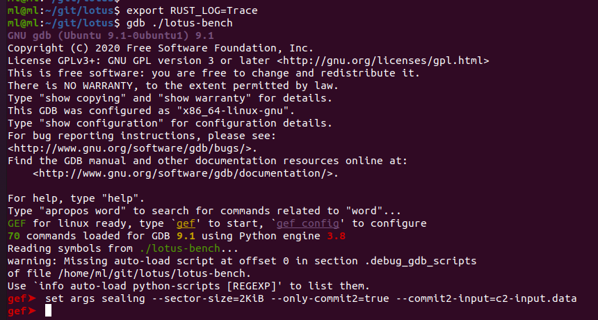
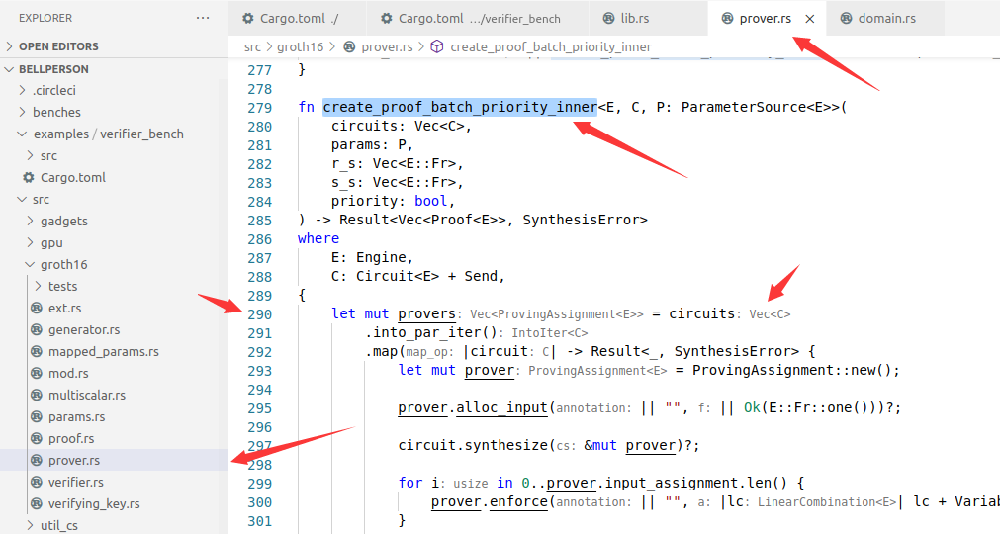
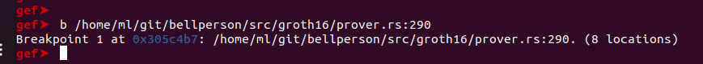
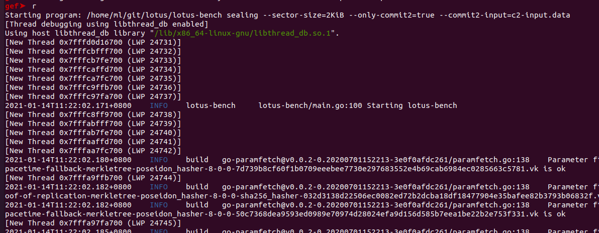
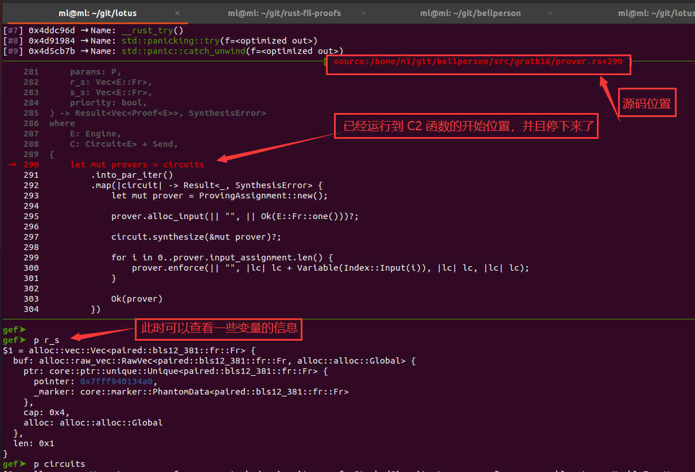

# 编译本地的 Bellperson 库

## 1. 背景

由于需要对 bellperson 库的代码进行一些修改和定制，因此，需要把 bellperson 库拿出来放到本地指定的路径下，方便修改和编译。
以前由于没有解决依赖问题，修改 bellperson 的代码的时候都需要在 ~/.cargo/registry/src/mirrors.sjtug.sjtu.edu.cn-7a04d2510079875b/bellperson-0.9.2/ 这样的路径下修改，编译的时候也很不方便。

## 2. 环境配置

配置环境和 [【使用 GDB 调试 lotus 代码】](./gdb_debug.md) 这篇文章差不多，不过比那篇文章要多配置两个库，一个是 `neptune`， 另一个是 `neptune-triton`。

配置方法如下：
总共要修改 6 个库的内容：
- `lotus`
- `rust-filecoin-proofs-api`
- `rust-fil-proofs`
- `neptune`
- `neptune-triton`
- `bellperson`

### 2.0 下载代码

第一步就是下载代码，并把每个项目的代码版本切换到对应的版本：

```sh
cd ~/git/
cd ./lotus
git clone https://github.com/filecoin-project/lotus.git
git checkout v1.4.0
FFI_BUILD_FROM_SOURCE=1 make clean debug  # 预编译一轮

cd ~/git/
git clone https://github.com/filecoin-project/rust-fil-proofs.git
cd ./rust-fil-proofs
git checkout v5.4.1

cd ~/git/
git clone https://github.com/filecoin-project/rust-filecoin-proofs-api.git
cd ./rust-filecoin-proofs-api
git checkout filecoin-proofs-v5.4.0

cd ~/git/
git clone https://github.com/filecoin-project/neptune.git
cd ./neptune
git checkout v2.2.0

cd ~/git/
git clone https://github.com/filecoin-project/neptune-triton.git
cd ./neptune-triton
git checkout neptune-triton-v2.0.0

cd ~/git/
git clone https://github.com/filecoin-project/bellperson.git
cd ./bellperson
git checkout v0.12.1

```

下载好代码，并切换到对应的版本之后，各个库的 commit 信息如下所示：

| 序号 | 代码仓库名称               | commit 信息                                                  |
| ---- | -------------------------- | ------------------------------------------------------------ |
| 1    | `lotus`                    | `e9989d0e4651b278ea7ec9d247c65e111aca2a9f` (HEAD, tag: v1.4.0) |
| 2    | `rust-filecoin-proofs-api` | `1e2ccacdb4c706a96b11878c67681096e133d30e` (HEAD, tag: v5.4.1) |
| 3    | `rust-fil-proofs`          | `9049e4c9b320a611349b9bb6d3b9287523f9e3d8` (HEAD, tag: storage-proofs-v5.4.0, ...) |
| 4    | `neptune`                  | `221ec39bfaf615fb3376e58b733e44b24556629d` (HEAD, tag: v2.2.0) |
| 5    | `neptune-triton`           | `34825bf541e1a7f03f8ecda3ee5df559fdb6b006` (HEAD, tag: neptune-triton-v2.0.0) |
| 6    | `bellperson`               | `a96c9a107b8d3d2a05a87011a29c9b373d58332d` (HEAD, tag: v0.12.1) |
| 7    | `filecoin-ffi`             | `1d9cb3e8ff53f51f9318fc57e5d00bc79bdc0128`                   |

上述的 `filecoin-ffi` 库是默认在 `lotus` 库的 `extern` 目录下的，它会在你第一次执行编译命令的时候切换到对应的版本，因此，你无需理会它。

### 2.1 修改 lotus 项目：

直接放 `git diff` 的信息吧，这样比较直观：
`lotus` 这个项目需要修改的是 `extern/filecoin-ffi/rust/Cargo.toml` 文件，修改信息如下所示：

```git diff
ml@ml:~/git/lotus/extern/filecoin-ffi$ git diff ./rust/Cargo.toml
diff --git a/rust/Cargo.toml b/rust/Cargo.toml
index 1a3bd4a..9898218 100644
--- a/rust/Cargo.toml
+++ b/rust/Cargo.toml
@@ -29,12 +29,12 @@ rand = "0.7"
 rand_chacha = "0.2.1"
 rayon = "1.2.1"
 anyhow = "1.0.23"
-bellperson = { version = "0.12.0", default-features = false, features = ["gpu"] }
+bellperson = { path = "../../../../bellperson", version = "0.12.1", default-features = false, features = ["gpu"] }
 serde_json = "1.0.46"
 rust-gpu-tools = "0.2.0"
 
 [dependencies.filecoin-proofs-api]
-package = "filecoin-proofs-api"
+path = "../../../../rust-filecoin-proofs-api"
 version = "5.4.1"
 default-features = false

```

### 2.2 修改 rust-filecoin-proofs-api 项目：

修改 `./Cargo.toml` 文件：

```git diff
ml@ml:~/git/rust-filecoin-proofs-api$ git diff ./Cargo.toml
diff --git a/Cargo.toml b/Cargo.toml
index c68d35b..f758534 100644
--- a/Cargo.toml
+++ b/Cargo.toml
@@ -12,8 +12,8 @@ readme = "README.md"
 anyhow = "1.0.26"
 bincode = "1.1.2"
 serde = "1.0.104"
-filecoin-proofs-v1 = { package = "filecoin-proofs", version = "5.4.0", default-features = false, features = ["gpu"] }
-bellperson = { version = "0.12", default-features = false, features = ["gpu"] }
+filecoin-proofs-v1 = { path = "../rust-fil-proofs/filecoin-proofs", package = "filecoin-proofs", version = "5.4.0", default-features = false, features = ["gpu"] }
+bellperson = { path = "../bellperson", version = "0.12.1", default-features = false, features = ["gpu"] }
 
 [features]
 default = ["pairing"]
ml@ml:~/git/rust-filecoin-proofs-api$
```

### 2.3 修改 rust-fil-proofs 项目：

这个项目需要修改 5 个 `./Cargo.toml` 文件：

```git diff
ml@ml:~/git/rust-fil-proofs$ git status 
HEAD detached at filecoin-proofs-v5.4.0
Changes not staged for commit:
  (use "git add <file>..." to update what will be committed)
  (use "git restore <file>..." to discard changes in working directory)
	modified:   fil-proofs-tooling/Cargo.toml
	modified:   filecoin-proofs/Cargo.toml
	modified:   storage-proofs/core/Cargo.toml
	modified:   storage-proofs/porep/Cargo.toml
	modified:   storage-proofs/post/Cargo.toml

no changes added to commit (use "git add" and/or "git commit -a")
ml@ml:~/git/rust-fil-proofs$
```

#### 2.3.1 ./fil-proofs-tooling/Cargo.toml

```git diff
ml@ml:~/git/rust-fil-proofs$ git diff ./fil-proofs-tooling/Cargo.toml
diff --git a/fil-proofs-tooling/Cargo.toml b/fil-proofs-tooling/Cargo.toml
index 2ae07279..aa29d3a8 100644
--- a/fil-proofs-tooling/Cargo.toml
+++ b/fil-proofs-tooling/Cargo.toml
@@ -22,7 +22,7 @@ regex = "1.3.7"
 commandspec = "0.12.2"
 chrono = { version = "0.4.7", features = ["serde"] }
 memmap = "0.7.0"
-bellperson = { version = "0.12", default-features = false }
+bellperson = { path = "../../bellperson", version = "0.12.1", default-features = false }
 rand = "0.7"
 tempfile = "3.0.8"
 cpu-time = "1.0.0"
ml@ml:~/git/rust-fil-proofs$
```

#### 2.3.2 ./filecoin-proofs/Cargo.toml

```git diff
ml@ml:~/git/rust-fil-proofs$ git diff ./filecoin-proofs/Cargo.toml
diff --git a/filecoin-proofs/Cargo.toml b/filecoin-proofs/Cargo.toml
index dd3593e1..54733b63 100644
--- a/filecoin-proofs/Cargo.toml
+++ b/filecoin-proofs/Cargo.toml
@@ -23,7 +23,7 @@ serde_json = "1.0"
 regex = "1.3.7"
 ff = { version = "0.2.3", package = "fff" }
 blake2b_simd = "0.5"
-bellperson = { version = "0.12", default-features = false }
+bellperson = { path = "../../bellperson", version = "0.12.1", default-features = false }
 clap = "2"
 log = "0.4.7"
 fil_logger = "0.1"
ml@ml:~/git/rust-fil-proofs$
```

#### 2.3.3 ./storage-proofs/core/Cargo.toml

```git diff
ml@ml:~/git/rust-fil-proofs$ git diff ./storage-proofs/core/Cargo.toml
diff --git a/storage-proofs/core/Cargo.toml b/storage-proofs/core/Cargo.toml
index de41e6b6..37334279 100644
--- a/storage-proofs/core/Cargo.toml
+++ b/storage-proofs/core/Cargo.toml
@@ -30,7 +30,7 @@ blake2b_simd = "0.5"
 blake2s_simd = "0.5"
 toml = "0.5"
 ff = { version = "0.2.3", package = "fff" }
-bellperson = { version = "0.12", default-features = false }
+bellperson = { path = "../../../bellperson", version = "0.12.1", default-features = false }
 serde_json = "1.0"
 log = "0.4.7"
 rand_chacha = "0.2.1"
@@ -38,7 +38,7 @@ hex = "0.4.0"
 generic-array = "0.14.4"
 anyhow = "1.0.23"
 thiserror = "1.0.6"
-neptune = { version = "2.2.0", default-features = false, features = ["gpu"] }
+neptune = { path = "../../../neptune", version = "2.2.0", default-features = false, features = ["gpu"] }
 cpu-time = { version = "1.0", optional = true }
 gperftools = { version = "0.2", optional = true }
 num_cpus = "1.10.1"
ml@ml:~/git/rust-fil-proofs$ 
```

#### 2.3.4 ./storage-proofs/porep/Cargo.toml

```git diff
ml@ml:~/git/rust-fil-proofs$ git diff ./storage-proofs/porep/Cargo.toml
diff --git a/storage-proofs/porep/Cargo.toml b/storage-proofs/porep/Cargo.toml
index e52f30da..7dd7d69b 100644
--- a/storage-proofs/porep/Cargo.toml
+++ b/storage-proofs/porep/Cargo.toml
@@ -11,7 +11,7 @@ readme = "README.md"
 [dependencies]
 crossbeam = "0.8"
 digest = "0.9"
-storage-proofs-core = { path = "../core", version = "^5.0.0", default-features = false}
+storage-proofs-core = { path = "../core", version = "5.4.0", default-features = false}
 sha2raw = { path = "../../sha2raw", version = "^2.0.0"}
 rand = "0.7"
 merkletree = "0.21.0"
@@ -23,12 +23,12 @@ rayon = "1.0.0"
 serde = { version = "1.0", features = ["derive"]}
 serde_json = "1.0"
 ff = { version = "0.2.3", package = "fff" }
-bellperson = { version = "0.12", default-features = false }
+bellperson = { path = "../../../bellperson", version = "0.12.1", default-features = false }
 log = "0.4.7"
 pretty_assertions = "0.6.1"
 generic-array = "0.14.4"
 anyhow = "1.0.23"
-neptune = { version = "2.2.0", default-features = false, features = ["gpu"] }
+neptune = { path = "../../../neptune", version = "2.2.0", default-features = false, features = ["gpu"] }
 num_cpus = "1.10.1"
 hex = "0.4.2"
 bincode = "1.1.2"
ml@ml:~/git/rust-fil-proofs$ 
```

#### 2.3.5 ./storage-proofs/post/Cargo.toml

```git diff
ml@ml:~/git/rust-fil-proofs$ git diff ./storage-proofs/post/Cargo.toml
diff --git a/storage-proofs/post/Cargo.toml b/storage-proofs/post/Cargo.toml
index 6dbacfdf..67497721 100644
--- a/storage-proofs/post/Cargo.toml
+++ b/storage-proofs/post/Cargo.toml
@@ -9,7 +9,7 @@ repository = "https://github.com/filecoin-project/rust-fil-proofs"
 readme = "README.md"
 
 [dependencies]
-storage-proofs-core = { path = "../core", version = "^5.0.0", default-features = false}
+storage-proofs-core = { path = "../core", version = "5.4.0", default-features = false}
 rand = "0.7"
 merkletree = "0.21.0"
 byteorder = "1"
@@ -20,12 +20,12 @@ serde = { version = "1.0", features = ["derive"]}
 blake2b_simd = "0.5"
 blake2s_simd = "0.5"
 ff = { version = "0.2.3", package = "fff" }
-bellperson = { version = "0.12", default-features = false }
+bellperson = { path = "../../../bellperson", version = "0.12.1", default-features = false }
 log = "0.4.7"
 hex = "0.4.0"
 generic-array = "0.14.4"
 anyhow = "1.0.23"
-neptune = { version = "2.2.0", default-features = false, features = ["gpu"] }
+neptune = { path = "../../../neptune", version = "2.2.0", default-features = false, features = ["gpu"] }
 num_cpus = "1.10.1"
 
 [dev-dependencies]
ml@ml:~/git/rust-fil-proofs$
```

### 2.4 修改 neptune 项目：

这个项目需要修改 2 个 `./Cargo.toml` 文件：

```git diff
ml@ml:~/git/neptune$ git status 
HEAD detached at v2.2.0
Changes not staged for commit:
  (use "git add <file>..." to update what will be committed)
  (use "git restore <file>..." to discard changes in working directory)
	modified:   Cargo.toml
	modified:   gbench/Cargo.toml

no changes added to commit (use "git add" and/or "git commit -a")
```

#### 2.4.1 ./Cargo.toml

```git diff
ml@ml:~/git/neptune$ git diff ./Cargo.toml
diff --git a/Cargo.toml b/Cargo.toml
index e911309..0653434 100644
--- a/Cargo.toml
+++ b/Cargo.toml
@@ -9,7 +9,7 @@ repository = "https://github.com/porcuquine/poseidon"
 
 [dependencies]
 lazy_static = "1.4.0"
-bellperson = { version = "0.12", default-features = false }
+bellperson = { path = "../bellperson", version = "0.12.1", default-features = false }
 blake2s_simd = "0.5"
 byteorder = "1"
 ff = { version = "0.2.1", package = "fff" }
@@ -28,7 +28,7 @@ rand_xorshift = "0.2.0"
 serde_json = "1.0.53"
 
 [build-dependencies]
-bellperson = { version = "0.12", default-features = false }
+bellperson = { path = "../bellperson", version = "0.12.1", default-features = false }
 ff = { version = "0.2.1", package = "fff" }
 
 [[bench]]
ml@ml:~/git/neptune$
```

#### 2.4.2 ./gbench/Cargo.toml

```git diff
ml@ml:~/git/neptune$ git diff ./gbench/Cargo.toml
diff --git a/gbench/Cargo.toml b/gbench/Cargo.toml
index 5e57388..dfb5286 100644
--- a/gbench/Cargo.toml
+++ b/gbench/Cargo.toml
@@ -8,7 +8,7 @@ license = "MIT OR Apache-2.0"
 
 [dependencies]
 lazy_static = "1.4.0"
-bellperson = { version = "0.12", default-features = false }
+bellperson = { path = "../../bellperson", version = "0.12.1", default-features = false }
 blake2s_simd = "0.5"
 byteorder = "1"
 env_logger = "0.7.1"
ml@ml:~/git/neptune$ 
```


### 2.5 修改 neptune-triton 项目：

这个项目无需修改，只需要把代码版本切换到对应的版本即可。

### 2.6 修改 bellperson 项目：

这个项目无需修改，只需要把代码版本切换到对应的版本即可。

## 3. 开始编译

编译命令参考：

```sh
FFI_BUILD_FROM_SOURCE=1 make clean debug
```

编译过程中将会看到，Cargo 编译的时候使用的是本地的指定的代码：

```sh
ml@ml:~/git/lotus$ FFI_BUILD_FROM_SOURCE=1 make clean debug
rm -rf  build/.filecoin-install build/.update-modules  lotus lotus-miner lotus-worker lotus-shed lotus-gateway lotus-seed lotus-pond lotus-townhall lotus-fountain lotus-chainwatch lotus-bench lotus-stats lotus-pcr lotus-health lotus-wallet lotus-keygen testground
make -C extern/filecoin-ffi/ clean
make[1]: Entering directory '/home/ml/git/lotus/extern/filecoin-ffi'
rm -rf filcrypto.h filcrypto.pc libfilcrypto.a .install-filcrypto
rm -f ./runner
cd rust && cargo clean && cd ..

--- skip ---

+ local '__rust_flags=--print native-static-libs -C target-feature=+sse2,+avx2,+avx,+sse4.2,+sse4.1'
+ RUSTFLAGS='--print native-static-libs -C target-feature=+sse2,+avx2,+avx,+sse4.2,+sse4.1'
+ cargo +nightly-2020-10-05 build --release --no-default-features --features pairing
+ tee /tmp/tmp.aCpzeyvXdz
   Compiling autocfg v1.0.1
   Compiling libc v0.2.80
   Compiling cfg-if v0.1.10

   --- skip ---

   Compiling cbindgen v0.14.0
   Compiling storage-proofs v5.4.0 (/home/ml/git/rust-fil-proofs/storage-proofs)
   Compiling bitintr v0.3.0
   Compiling mime v0.3.16
   
   --- skip ---

   Compiling fff v0.2.3
   Compiling neptune-triton v2.0.0
   Compiling sha2-asm v0.5.4
   Compiling block-padding v0.1.5
   Compiling rustc_version v0.1.7
   Compiling hwloc v0.3.0
  
   --- skip ---

   Compiling hmac v0.10.1
   Compiling aes-soft v0.6.3
   Compiling block-modes v0.7.0
   Compiling sha2 v0.9.2
   Compiling sha2raw v2.0.0 (/home/ml/git/rust-fil-proofs/sha2raw)
   Compiling console v0.13.0
   Compiling sha2 v0.8.2
   Compiling hmac v0.7.1
     
   --- skip ---

   Compiling groupy v0.3.1
   Compiling ff-cl-gen v0.2.0
   Compiling toml v0.5.7
   Compiling merkletree v0.21.0
   Compiling bincode v1.3.1
   Compiling serde_urlencoded v0.6.1
   Compiling h2 v0.2.7
   Compiling paired v0.21.0
   Compiling paired v0.20.1
   Compiling config v0.10.1
   Compiling bellperson v0.12.1
   Compiling bls-signatures v0.6.1
   Compiling hyper v0.13.9
   Compiling fil-ocl v0.19.4
   Compiling phase21 v0.11.0
   Compiling rust-gpu-tools v0.2.1
   Compiling filcrypto v0.7.5 (/home/ml/git/lotus/extern/filecoin-ffi/rust)
   Compiling bellperson v0.12.1 (/home/ml/git/bellperson)
   Compiling neptune v2.2.0 (/home/ml/git/neptune)
   Compiling storage-proofs-core v5.4.0 (/home/ml/git/rust-fil-proofs/storage-proofs/core)
   Compiling storage-proofs-porep v5.4.0 (/home/ml/git/rust-fil-proofs/storage-proofs/porep)
   Compiling storage-proofs-post v5.4.0 (/home/ml/git/rust-fil-proofs/storage-proofs/post)
   Compiling tokio-tls v0.3.1
   Compiling hyper-tls v0.4.3
   Compiling reqwest v0.10.8
   Compiling filecoin-proofs v5.4.0 (/home/ml/git/rust-fil-proofs/filecoin-proofs)
   Compiling filecoin-proofs-api v5.4.1 (/home/ml/git/rust-filecoin-proofs-api)
  
   --- skip ---

[install-filcrypto/main] successfully built and installed libfilcrypto from source
+ exit
make[1]: Leaving directory '/home/ml/git/lotus/extern/filecoin-ffi'
rm -f lotus
go build  -ldflags="-X=github.com/filecoin-project/lotus/build.CurrentCommit=+git.e9989d0e4.dirty" -tags=debug -o lotus ./cmd/lotus
go run github.com/GeertJohan/go.rice/rice append --exec lotus -i ./build
rm -f lotus-bench
go build -o lotus-bench ./cmd/lotus-bench
go run github.com/GeertJohan/go.rice/rice append --exec lotus-bench -i ./build
```

当然，如果要编译 Debug 版本的代码，还需要修改 `lotus` 项目中的几个文件：

- ./Makefile
- ./extern/filecoin-ffi/install-filcrypto
- ./extern/filecoin-ffi/rust/scripts/build-release.sh

diff 信息如下所示：

```git diff
ml@ml:~/git/lotus$ git diff ./Makefile
diff --git a/Makefile b/Makefile
index aa7575698..272683d0d 100644
--- a/Makefile
+++ b/Makefile
@@ -57,8 +57,9 @@ CLEAN+=build/.update-modules
 deps: $(BUILD_DEPS)
 .PHONY: deps
 
-debug: GOFLAGS+=-tags=debug
-debug: lotus lotus-miner lotus-worker lotus-seed
+debug: GOFLAGS+=-tags=debug -gcflags "-N -l"
+debug: lotus lotus-bench
+# debug: lotus lotus-miner lotus-worker lotus-seed
 
 2k: GOFLAGS+=-tags=2k
 2k: lotus lotus-miner lotus-worker lotus-seed
ml@ml:~/git/lotus$
```

```git diff
ml@ml:~/git/lotus/extern/filecoin-ffi$ git diff ./install-filcrypto
diff --git a/install-filcrypto b/install-filcrypto
index b8a9734..b44d71e 100755
--- a/install-filcrypto
+++ b/install-filcrypto
@@ -57,8 +57,8 @@ main() {
 
         # copy from Rust's build directory (target) to root of filecoin-ffi
         #
-        find -L "${rust_sources_dir}/target/release" -type f -name filcrypto.h -exec cp -- "{}" . \;
-        find -L "${rust_sources_dir}/target/release" -type f -name libfilcrypto.a -exec cp -- "{}" . \;
+        find -L "${rust_sources_dir}/target/debug" -type f -name filcrypto.h -exec cp -- "{}" . \;
+        find -L "${rust_sources_dir}/target/debug" -type f -name libfilcrypto.a -exec cp -- "{}" . \;
         find -L "${rust_sources_dir}" -type f -name filcrypto.pc -exec cp -- "{}" . \;
 
         check_installed_files
ml@ml:~/git/lotus/extern/filecoin-ffi$ git diff ./rust/Cargo.toml
diff --git a/rust/Cargo.toml b/rust/Cargo.toml
index 1a3bd4a..9898218 100644
--- a/rust/Cargo.toml
+++ b/rust/Cargo.toml
@@ -29,12 +29,12 @@ rand = "0.7"
 rand_chacha = "0.2.1"
 rayon = "1.2.1"
 anyhow = "1.0.23"
-bellperson = { version = "0.12.0", default-features = false, features = ["gpu"] }
+bellperson = { path = "../../../../bellperson", version = "0.12.1", default-features = false, features = ["gpu"] }
 serde_json = "1.0.46"
 rust-gpu-tools = "0.2.0"
 
 [dependencies.filecoin-proofs-api]
-package = "filecoin-proofs-api"
+path = "../../../../rust-filecoin-proofs-api"
 version = "5.4.1"
 default-features = false
 
ml@ml:~/git/lotus/extern/filecoin-ffi$
```

详细信息请参考：
[【使用 GDB 调试 lotus 代码】](./gdb_debug.md) 

## 4. Debug 版代码调试 Bellperson 库

使用 `Debug` 版本编译好 `lotus` 代码之后，就可以使用 `gdb` 调试了， `gdb` 调试基础教程可查看 [【使用 GDB 调试 lotus 代码】](./gdb_debug.md) ，现在简单看一下本地调试 bellperson 的方法吧：

### 4.1 启动调试

```sh
export RUST_LOG=Trace
gdb ./lotus-bench
set args sealing --sector-size=2KiB --only-commit2=true --commit2-input=c2-input.data
```

如下所示：



这里调试的时候，我修改了 `lotus-bench` 的代码，使它可以直接复用以前 `C1` 输出的结果继续进行测试，也就是每次调试的时候，就不需要经历 `AP` -> `P1` -> `P2` -> `C1` 的过程了，而是直接从文件中读取 `C1` 的输入数据（在这里是 `c2_input.data` 文件）。


### 4.2 下断点并运行查看变量信息

然后直接在 bellperson 库中下一个断点，如下所示：





使用 `r` 命令开始执行，并执行到断点处自动停下：



断点段下来之后，就可以查看变量信息了：




### 4.3 定制化修改 lotus-bench

只需要修改 `./cmd/lotus-bench/main.go` 文件即可， `diff` 信息如下所示：

```git diff
ml@ml:~/git/lotus$ git diff cmd/lotus-bench/main.go
diff --git a/cmd/lotus-bench/main.go b/cmd/lotus-bench/main.go
index b246aedbb..57608158a 100644
--- a/cmd/lotus-bench/main.go
+++ b/cmd/lotus-bench/main.go
@@ -151,6 +151,14 @@ var sealBenchCmd = &cli.Command{
                        Name:  "skip-commit2",
                        Usage: "skip the commit2 (snark) portion of the benchmark",
                },
+               &cli.BoolFlag{
+                       Name:  "only-commit2",
+                       Usage: "Only bench the commit2 (snark) portion of the benchmark",
+               },
+               &cli.StringFlag{
+                       Name:  "commit2-input",
+                       Usage: "Commit2 input data",
+               },
                &cli.BoolFlag{
                        Name:  "skip-unseal",
                        Usage: "skip the unseal portion of the benchmark",
@@ -264,16 +272,35 @@ var sealBenchCmd = &cli.Command{
                var sealedSectors []saproof2.SectorInfo
 
                if robench == "" {
-                       var err error
-                       parCfg := ParCfg{
-                               PreCommit1: c.Int("parallel"),
-                               PreCommit2: 1,
-                               Commit:     1,
-                       }
-                       sealTimings, sealedSectors, err = runSeals(sb, sbfs, sectorNumber, parCfg, mid, sectorSize, []byte(c.String("ticket-preimage")), c.String("save-commit2-input"), skipc2, c.Bool("skip-unseal"))
-                       if err != nil {
-                               return xerrors.Errorf("failed to run seals: %w", err)
+
+                       if !c.Bool("only-commit2") {
+                               var err error
+                               parCfg := ParCfg{
+                                       PreCommit1: c.Int("parallel"),
+                                       PreCommit2: 1,
+                                       Commit:     1,
+                               }
+                               sealTimings, sealedSectors, err = runSeals(sb, sbfs, sectorNumber, parCfg, mid, sectorSize, []byte(c.String("ticket-preimage")), c.String("save-commit2-input"), skipc2, c.Bool("skip-unseal"))
+                               if err != nil {
+                                       return xerrors.Errorf("failed to run seals: %w", err)
+                               }
+
+                       } else {
+                               // We only run Commit2 phase
+                               var err error
+                               parCfg := ParCfg{
+                                       PreCommit1: c.Int("parallel"),
+                                       PreCommit2: 1,
+                                       Commit:     1,
+                               }
+                               var c2in = c.String("commit2-input")
+                               sealTimings, sealedSectors, err = runCommit2(sb, sbfs, c.Int("num-sectors"), parCfg, mid, sectorSize, []byte(c.String("ticket-preimage")), c2in)
+                               if err != nil {
+                                       return xerrors.Errorf("failed to run seals: %w", err)
+                               }
+                               return nil
                        }
+
                } else {
                        // TODO: implement sbfs.List() and use that for all cases (preexisting sectorbuilder or not)
 
@@ -772,6 +799,39 @@ var proveCmd = &cli.Command{
        },
 }
 
+func runCommit2(sb *ffiwrapper.Sealer, sbfs *basicfs.Provider, numSectors int, par ParCfg, mid abi.ActorID, sectorSize abi.SectorSize, ticketPreimage []byte, saveC2inp string) ([]SealingResult, []saproof2.SectorInfo, error) {
+
+       sealTimings := make([]SealingResult, numSectors)
+       sealedSectors := make([]saproof2.SectorInfo, numSectors)
+
+       sid := storage.SectorRef{
+               ID: abi.SectorID{
+                       Miner:  mid,
+                       Number: 0,
+               },
+               ProofType: spt(sectorSize),
+       }
+
+       commit2Start := time.Now()
+
+       // Reand previously-saved Commit1 output data
+       b, err := ioutil.ReadFile(saveC2inp)
+       if err != nil {
+               log.Warnf("Read precommit1 output failed: %+v", err)
+       }
+       var c2in Commit2In
+       err = json.Unmarshal(b, &c2in)
+       c1o := c2in.Phase1Out
+       sb.SealCommit2(context.TODO(), sid, c1o)
+
+       commit2End := time.Now()
+
+       log.Warnf("MAILONG: start time %+v", commit2Start)
+       log.Warnf("MAILONG: end   time %+v", commit2End)
+
+       return sealTimings, sealedSectors, nil
+}
+
 func bps(sectorSize abi.SectorSize, sectorNum int, d time.Duration) string {
        bdata := new(big.Int).SetUint64(uint64(sectorSize))
        bdata = bdata.Mul(bdata, big.NewInt(int64(sectorNum)))
ml@ml:~/git/lotus$ 

```

修改好之后，重新编译，此时的编译不需要编译底层的 rust 代码，只更新了上层的 go 代码，因此编译命令无需 clean，如下所示：

```sh
FFI_BUILD_FROM_SOURCE=1 make debug
```

生成一份 `C2` 的输入数据，以后可重复使用：

```sh
RUST_LOG=Trace ./lotus-bench sealing --sector-size=2KiB --save-commit2-input=c2-input.data
```

只测试 `C2` ：

```sh
RUST_LOG=Trace ./lotus-bench sealing --sector-size=2KiB --only-commit2=true --commit2-input=c2-input.data
```

## 5. 结束

如有任何问题，欢迎到 [【Filecoin技术交流群】](./15_weixin_groups.md) 交流。


