# 本地搭建 2K 测试网入门教程

## 1. 序言

刚入门 [lotus](https://github.com/filecoin-project/lotus) 挖矿的小白用户最需要的资料就是：**傻瓜式的图文操作教程**。
当然，新手入门首先可以找官方的入门文档：[Lotus: install and setup](https://docs.filecoin.io/get-started/lotus/installation/#build-and-install-lotus) 和 [Run a Filecoin local devnet](https://docs.filecoin.io/build/local-devnet/#textile-s-lotus-devnet)，这两个文档中有手把手教你怎么搭建环境、怎么安装和运行 `lotus`，但是是英文的，很多朋友就不太喜欢看英文的文档，因此，就有了这个文章。

## 2. 环境搭建


本文以 `Ubuntu 18.04` 系统为例搭建开发环境，首先需要安装依赖项，依赖项没有安装好的话，会导致 `lotus` 编译无法通过，也就无法执行后续的命令。

### 2.1 安装基础依赖的方法：

```sh
sudo apt upgrade -y
sudo apt install mesa-opencl-icd ocl-icd-opencl-dev gcc git bzr jq pkg-config curl clang -y
sudo apt install build-essential hwloc libhwloc-dev wget -y
sudo apt upgrade -y
```

**注：** 如果没有设置过本地 `apt 更新源`，建议使用国内的 [【阿里云】](https://developer.aliyun.com/mirror/ubuntu?spm=a2c6h.13651102.0.0.3e221b11IlyctM) 的源，或者是 [【163】](https://mirrors.163.com/.help/ubuntu.html) 的源，或者是 [【腾讯云】](https://mirrors.tencent.com/help/ubuntu.html) 的源，这样安装依赖软件会快速些。

### 2.2 rustup 安装方法：

要编译源代码，还需要安装 `rust` 相关的编译工具链，因为整个 `lotus` 项目的底层实现代码，大部分都是使用 `rust` 语言编写的：

```sh
# 千万别使用 sudo apt install xxx 安装
# 如果嫌弃安装的慢，可以挂上代理在安装，参考 【3.2 高级操作--使用代理下载：】
curl --proto '=https' --tlsv1.2 -sSf https://sh.rustup.rs | sh
# rust 编译工具链默认安装到 ~/.cargo/bin 目录下，安装好之后，你需要设置它的环境变量，或者写入到 ~/.bashrc 中
export PATH=$PATH:$HOME/.cargo/bin
# 或者在  ~/.bashrc 的末尾加入如下代码：
source "$HOME/.cargo/env"
```

参考： 
- [1]. https://www.rust-lang.org/zh-CN/tools/install
- [2]. https://learnku.com/docs/rust-lang/2018/ch01-01-installation/4494

安装好之后，可以在终端中输入 `rustc --version`、`rustup --version` 和 `cargo --version` 来检查是否安装成功，安装成功之后，你输入上述命令会看到如下所示的输出结果（不完全一致，版本号可能不同）：


**注意：** 如果机器上已经安装了旧版的 `rust` 编译工具链（`rustc`、`rustup` 和 `cargo` 等），则**必须**要把旧版的  `rust` 编译工具链卸载之后再安装新版的  `rust` 编译工具链（使用 `rustup self uninstall` 方法卸载），如下图所示：

```sh
# 示例中演示的机器是 Ubuntu 16.04 x64
# 示例中旧版的 rustc 是  rustc 1.41.0，卸载命令如下：
# 注意，卸载 rust 编译工具链不需要使用 sudo
rustc --version
rustup --version
cargo --version
rustup self uninstall
```

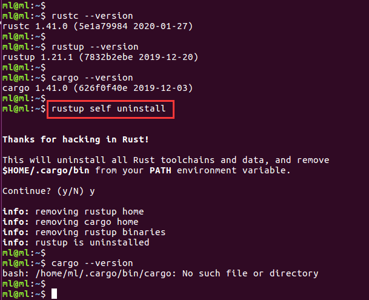

卸载旧版之后，再使用上述安装命令重新安装新版即可，如下图所示：


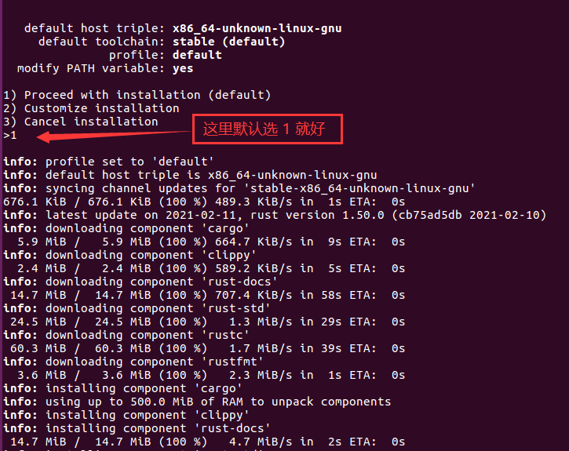
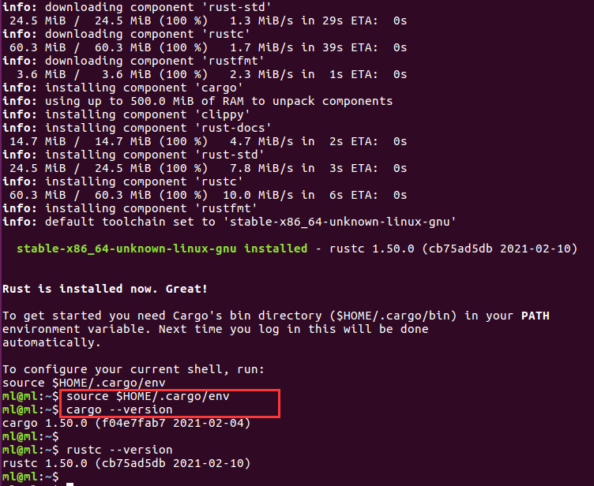

有时候，在编译 `lotus` 代码的过程中，它也会自动安装 `nightly` 版本（每日更新的版本）的 `rust` 编译工具链，如下图所示：


如果不想让它使用 `nightly` 版本的 `rust` 编译工具链，则可以在 `./extern/filecoin-ffi/rust/rust-toolchain` 中把原来的版本改为 `stable`，然后再重新编译：

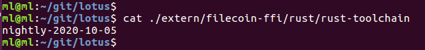

### 2.3 go 安装方法：

`lotus` 的上层代码基本上都是使用 `go` 语言开发的，因此，要编译 `lotus`，还需要安装 `go` 的编译器：

```sh
# 千万别使用 sudo apt install xxx 安装
# 如果嫌弃安装的慢，可以挂上代理在安装，参考 【3.2 高级操作--使用代理下载：】
wget -c https://golang.org/dl/go1.15.5.linux-amd64.tar.gz -O - | sudo tar -xz -C /usr/local
# 上述命令会将 golang 安装到 /usr/local/go 目录下，你需要手动设置一下环境变量，或者把它写入到 ~/.bashrc 中
export PATH=$PATH:/usr/local/go/bin
```

参考：
- [1]. https://golang.org/doc/install

`go` 的版本至少需要 `1.15.5`，低于这个版本的 `go` 将无法编译 `lotus`，安装好 `go` 之后，你可以在终端输入 `go version` 查看：


**注意：** 如果机器上已经安装了旧版的 `golang`，则**必须**要把旧版的 `golang` 卸载之后再安装新版的 `golang`（使用 `sudo apt get remove xxx` 方法卸载，或者使用 `sudo snap remove xxx` 等），如下所示：

```sh
# 示例中演示的机器是 Ubuntu 16.04 x64
# 示例中旧版的 golang 是  golang-1.13，卸载命令如下：
go version
sudo apt remove golang-1.13-go golang-go golang-1.13-src golang-src
# 上述命令会将 golang 安装到 /usr/local/go 目录下，你需要手动设置一下环境变量，或者把它写入到 ~/.bashrc 中
export PATH=$PATH:/usr/local/go/bin
```

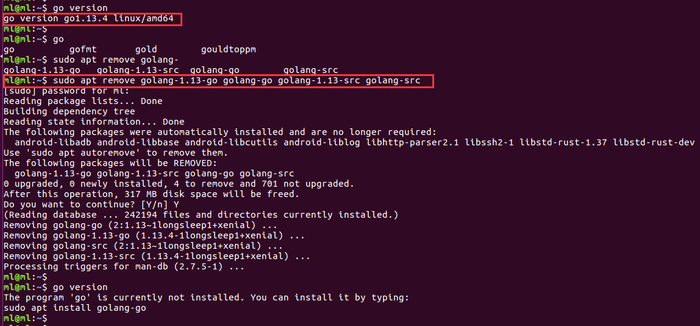

卸载旧版之后，再使用上述安装命令重新安装新版即可，如下图所示：

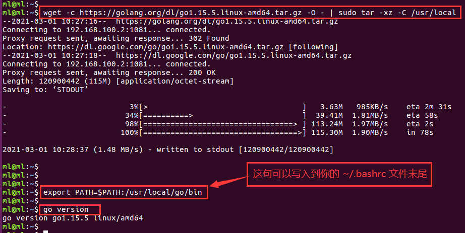

### 2.4 lotus 网络面板：

有关于网络的详细信息，请查看 [【网络面板】](https://network.filecoin.io/)，里面有各种关于**测试网**（官方维护的测试网）和**主网**的资源，比如测试网的水龙头位置（获取测试代币的地方）、slack 聊天频道、项目 Github 地址、网络浏览器和当前网络状态等。

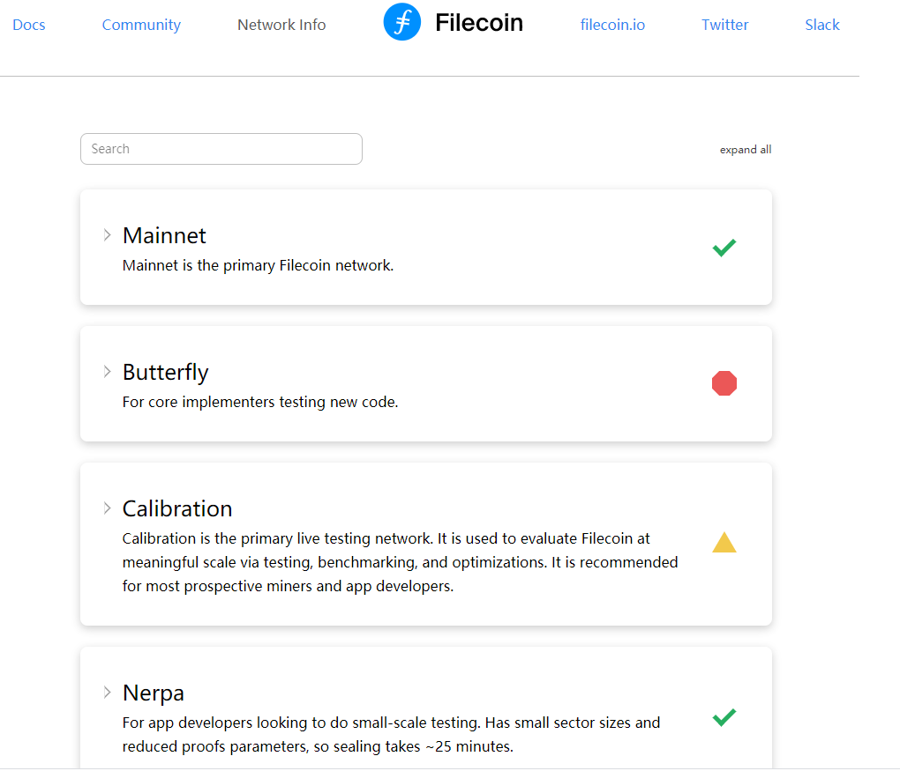

## 3. 下载代码

### 3.1 基础操作--直接下载代码：

配置好开发环境之后，就可以下载 `lotus` 源码进行愉快的编译了，假设我们使用的路径是 `~/git`，我们进入该目录，然后执行如下命令下载代码：

```sh
cd ~/git
git clone https://github.com/filecoin-project/lotus.git
```

如果你之前没有给你的机器设置过代理，你会发现你的下载速度奇慢，只有 `20KB/s` 左右，并且你可能需要下载大半天才能下载完（甚至可能会在下载到一半就中断，然后又要重新开始下载，如此反复），如下所示：


目前（`2021/02/07`），`lotus` 这个 `repo` 的大小是 `76MB` 左右，如果没有代理，你可以自己估算一下你下载这个 `repo` 所需的时间。此外，后续编译过程也还需要下载各种依赖库，也需要非常漫长的时间等待，甚至还会编译失败（比如编译过程中下载依赖项代码库的时候，可能由于网络不稳定，导致下载失败等）。

### 3.2 高级操作--使用代理下载：

要想快速下载好代码，最简单的方法就是设置代理，假如你的 `Ubuntu 机器`和你的笔记本在同一个局域网，并且你的笔记本电脑正在使用 `ssr` 或者 `v2ray` 等代理工具上网，你可以共享笔记本的代理给你的 `Ubuntu 机器`，假设你笔记本上使用的是 `v2ray`，你可以开启 `允许来自局域网的连接` ：


然后你就可以看到你的 `v2ray` 界面最底端的状态栏中显示本地监听的端口：

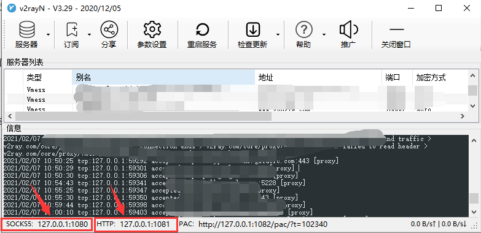

示例中的 `SOCKS5` 监听的是 `1080` 端口（和前面设置的端口一样）， `HTTP` 监听的是 `1081` 端口（比 `SOCKS5` 监听的端口大 `1`）。

然后回到 `Ubuntu 机器`那边，打开 【右上角的设置】 -> 【网络/Network】 -> 【Network Proxy】，如下所示：


然后点击 【Manual】， 把你 `笔记本` 的 `IP` 地址填进去（我笔记本的 `IP` 地址是：`192.168.100.2` ），并修改端口号为 `HTTP` 的端口号（我的是 `1081`），如下所示：

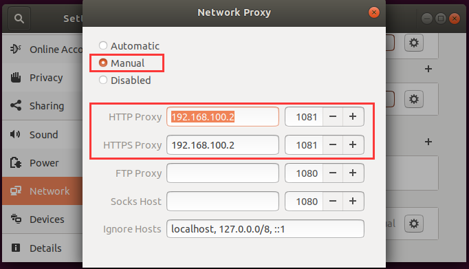

设置好之后，直接关闭 【Network Proxy】和 【网络/Network】这两窗口即可，然后重新打开一个终端（或者在当前终端中按 `Ctrl+Shift+T`），在终端中输入 `env | grep -ni "proxy"`，看到如下所示的输出即表示设置成功：


**验证代理是否生效：**

在新的终端中输入 `curl www.google.com`，看到如下结果就表明此时代理生效，可以愉快的下载代码了：

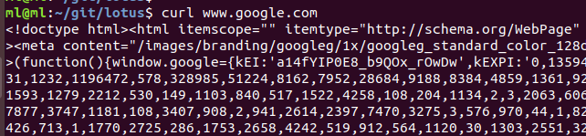

如果代理没有起作用，或者代理没有配置好，在终端中输入 `curl www.google.com` 命令后，你会一直处于等待状态，也没有输出信息，等待几分钟之后，才会输出**连接超时**的信息，如下图所示：

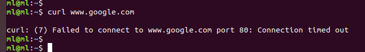

**注：** 这一步的设置不仅仅是为了下载 `lotus` 这个项目的代码，还为了后续在编译过程中下载它的 `依赖项目` 的代码做好准备，因为 `lotus` 会依赖很多子项目，并且都需要代理才能顺畅的下载下来，如果没有代理，编译的时候也可能会花费漫长的时间等待，并且每次编译都要等。

当然，如果你直接在出口路由器配置了代理，或者直接在目标机器上设置了代理，就不需要像上面这么麻烦。

## 4. 编译

有了代理，编译就不是什么问题了，直接进入 `~/git/lotus` 目录，然后切换到 `v1.4.1` 这个 tag（踩坑： ~~`v1.5.0-pre3`~~ 这个 tag 可以正常启动创世节点，但是无法正常启动其它节点，因此不使用这个版本的代码），
执行如下的编译命令进行编译（编译 `debug` 版本比较方便）：

```sh
git checkout v1.4.1
# 我们默认使用 Debug 版本
FFI_BUILD_FROM_SOURCE=1 make clean debug
```

当然，也可以编译 `Release` 版本（`v1.4.1` 这个版本的代码，编译 `Release` 模式的时候，后续生成的旷工 `ID` 会和 `Debug` 版本不一样，`Release` 生成的旷工 `ID` 叫做 `f01xxx`， `Debug` 生成的旷工 `ID` 叫做 `t01xxx`），但是需要加上 `lotus-seed`（生成创世节点时需要使用到这个工f具），如下所示：

```sh
git checkout v1.4.1
FFI_BUILD_FROM_SOURCE=1 make clean all lotus-seed
```


部分依赖项下载到当前目录的 `./extern/` 目录下，下载好之后如下所示：

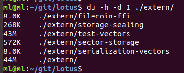

编译好 `Debug` 版本的 `lotus` 如下所示：


**注：** 如果编译过程中遇到编译失败，请参考 **【10. 潜在的问题】**。

编译完整的 log 日志请参考：[【lotus_build_log.md】](./files/lotus_build_log.md)
老机器上的编译日志：[【lotus_build_old_machine.md】](./files/lotus_build_old_machine.md)


## 5. 下载证明参数

要想玩转 `lotus`，还有一个很重要的问题要解决，那就是下载证明参数，没有证明参数， `lotus` 是启动不了的（如果没有，则在启动过程中它也会自动下载，只是很慢），下载证明参数的方法如下：

```sh
# 2KiB 表示我们要下载的证明参数是 2KiB 大小的扇区所需要的证明参数
# 主网上使用的是 32GB 的证明参数，或者是 64GB 的证明参数
~/git/lotus/lotus fetch-params 2KiB
```

下载证明参数的过程可能会比较慢，因为证明参数放在国外的服务器，如果你有代理，可以挂上代理再下载。
此外，也可以从 `JDCloud` 上面下载，你需要做的事情就是在执行上述命令之前设置一下 `JDCloud` 的代理：

```sh
export IPFS_GATEWAY=https://proof-parameters.s3.cn-south-1.jdcloud-oss.com/ipfs/
```

证明参数下载过程大致如下所示：
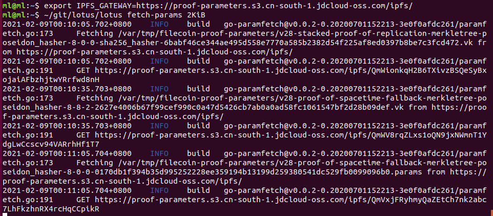

下载好的证明参数需要放在 `/var/tmp/filecoin-proof-parameters/` 目录中（默认下载的参数就放在这个目录中），下载好之后，可以看到如下所示的证明参数信息（`2KiB` 扇区的证明参数）：


## 6. 启动创世节点

创建创世节点之前，如果你的机器之前有创建过创世节点，请清理掉旧的数据，所需要清理的数据包括（**假设我们执行的命令是在 home 目录下执行**）：

```sh
rm -rf ~/.lotus/
rm -rf ~/.lotusminer/
rm -rf ~/.genesis-sectors/
rm -rf ~/devgen.car
rm -rf ~/localnet.json
```

### 6.1 预密封两个 2KiB 大小的扇区

```sh
# --sector-size 用于指定扇区大小
# --num-sectors 用于指定预密封扇区的数量
~/git/lotus/lotus-seed pre-seal --sector-size=2KiB --num-sectors=2
```

执行预密封命令之后，就可以看到预密封好的数据保存在： `~/.genesis-sectors/` 目录中：


查看 `~/.genesis-sectors/` 目录可以看到预密封好的数据：


如果代码使用 `Release` 模式，则对应的结果如下图所示（旷工 `ID` 会发生变化）：


### 6.2 生成创世块

```sh
~/git/lotus/lotus-seed genesis new localnet.json
~/git/lotus/lotus-seed genesis add-miner localnet.json ~/.genesis-sectors/pre-seal-t01000.json
```

执行完命令之后，`home` 目录下会多出一个 `localnet.json` 文件：
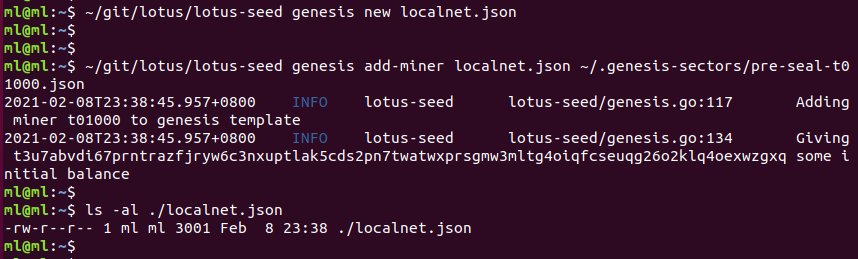

### 6.3 启动创世创世节点（第一个节点）

```sh
# --lotus-make-genesis 用于指定 xxx
# --genesis-template 用于指定 xxx
# --bootstrap 一定要指定为 false
~/git/lotus/lotus daemon --lotus-make-genesis=devgen.car --genesis-template=localnet.json --bootstrap=false
```


启动创世节点之后（也就是 `daemon`），若没有明显的错误信息（`Error` 类型的消息），则表明创世节点运行正常，此时会在 `home` 目录下生产 `.lotus/` 目录，目录中的 `config.toml` 表示节点的配置信息，如下图所示：


此时，创世节点正在运行，你不能关闭它，也不能关闭该终端，要想查看创世节点的信息，**可以另外开启一个终端查看**。

~~当前这个版本的代码 `v1.5.0-pre3` 在启动创世节点之后，会有一个错误信息，我们暂时可以忽略它，错误信息如下图所示：~~

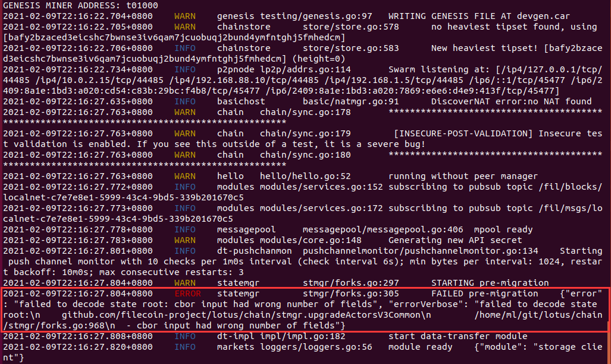

**注：** `v1.4.1` 版本的代码没有这个问题，`v1.5.0-pre3` 才出现这个问题，其它版本还没试过，可以自行尝试。

### 6.4 导入创世节点的钱包

```sh
~/git/lotus/lotus wallet import --as-default ~/.genesis-sectors/pre-seal-t01000.key
~/git/lotus/lotus wallet list
```

导入钱包信息之后，就可以看到你的钱包，里面会有大量的初始余额（大约 `50000000 FIL` 左右），如下图所示：

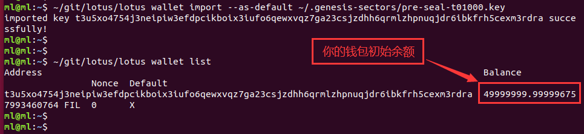

### 6.5 初始化创世旷工

```sh
# 注意加上 --nosync 参数，创世旷工不需要等待链同步的过程
~/git/lotus/lotus-miner init --genesis-miner --actor=t01000 --sector-size=2KiB --pre-sealed-sectors=~/.genesis-sectors --pre-sealed-metadata=~/.genesis-sectors/pre-seal-t01000.json --nosync
```

初始化完成之后，如果没有什么错误信息，就表明已经正确初始化创世旷工了，如下图所示：


### 6.5 启动创世旷工（第一个旷工）

```sh
# 注意加上 --nosync 参数，创世旷工不需要等待链同步的过程
~/git/lotus/lotus-miner run --nosync
```

运行创世旷工，然后你会在短时间内看到它输出大量的信息，并且过了一会之后，它的输出信息就变得比较缓慢了，这一切都是正常的。
在输出的信息中，大部分都是 `WARN` 和 `INFO`，你可以不理会它们，只要没有 `ERROR` 就行，如下所示：


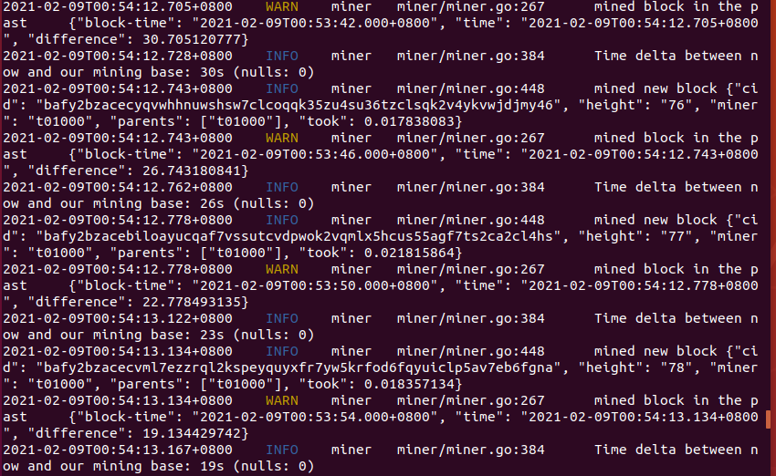

自此，你的创世节点和创世旷工都创建好，并且正常运行了。

### 6.6 查看创世旷工的状态

创世旷工（第一个旷工）运行起来之后，可以通过 `~/git/lotus/lotus-miner info` 命令查看当前旷工的状态：
包括当前旷工的算力（图中显示的是 `40KiB`）和全网总算力（图中显示的是 `40KiB`），扇区大小（图中显示的是 `2KiB`），扇区数量（图中显示的是 `2个`），还有各项余额等等，如下图所示：

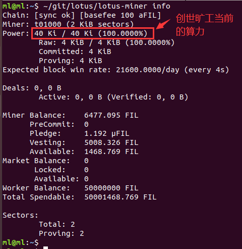

## 7. 启动其它节点

启动好创世节点和创世旷工之后，就可以去**另一台机器**上启动其它节点了，一般情况下，我们会在其它节点上做测试，而不是直接在创世节点上做测试。
假设我们现在来到另一台机器上（`192.168.100.18`），并且也编译好 `lotus`，编译好的 `lotus` 所在的目录是 `~/git2/lotus` ，在该机器上启动节点之前，也需要首先清理干净环境，执行如下所示的命令（**假设我们执行的命令是在 home 目录下执行**）：

```sh
rm -rf ~/.lotus/
rm -rf ~/.lotusminer/
rm -rf ~/.genesis-sectors/
rm -rf ~/devgen.car
rm -rf ~/localnet.json
```

假设**创世节点**机器的 `IP` 地址为 `192.168.100.19`，并且该机器被命名为 `MA` （MachineA）， 现在要启动的另一个节点所在的 `IP` 地址为 `192.168.100.18`，并且该机器被命名为 `MB` 。

**注意：** 本小节中执行的命令，如果没有特殊说明，都是在新机器上执行，**部分命令需要在创世节点上执行**，比如获取创世节点的连接信息和发送一些 `FIL` 到新账号中的钱包等。

### 7.1 拷贝同步数据

为了能够连接上我们自己创建的创世节点，我们需要先把自己生产的创世节点信息拷贝到本机，也就是启动创世节点的时候生产的文件 `devgen.car`：

```sh
scp ml@192.168.100.19:~/devgen.car ./
```

拷贝结果如下所示：


### 7.2 启动节点

有了创世节点的 `devgen.car` 文件之后，我们就可以使用该文件来启动新节点了，启动命令如下：

```sh
# 同样需要设置 --bootstrap=false，因为后面我们需要手动连接到我们自己创建的创世节点上
~/git2/lotus/lotus daemon --genesis=devgen.car --bootstrap=false
```


### 7.3 获取创世节点的连接信息

此时需要到创世节点机器上（`MA` 机器）执行命令获取它的连接信息，用于给其它节点连接，在 `MA` 上执行如下所示的命令即可获取创世节点的连接信息：

```sh
~/git/lotus/lotus net listen | grep "192.168.100.19"
```

地址 `192.168.100.19` 是 `MA` 机器的 `IP` 地址，我们只需要这个地址的连接信息即可，如下所示：

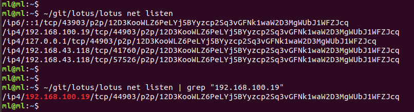

示例中的连接信息是（注意，你自己的创世节点的连接信息和我的是不一样的，你需要用你自己的）：

`/ip4/192.168.100.19/tcp/44903/p2p/12D3KooWLZ6PeLYj5BYyzcp2Sq3vGFNk1waW2D3MgWUbJ1WFZJcq`

### 7.4 连接到创世节点

有了创世节点的连接信息，其它节点就可以使用这个信息手动连接到我们的创世节点，执行如下命令连接创世节点：

```sh
~/git2/lotus/lotus net connect /ip4/192.168.100.19/tcp/44903/p2p/12D3KooWLZ6PeLYj5BYyzcp2Sq3vGFNk1waW2D3MgWUbJ1WFZJcq
```


连接成功之后，会在 `daemon` 这边的 `log` 中看到大量同步数据的信息（通常会快速的输出）：

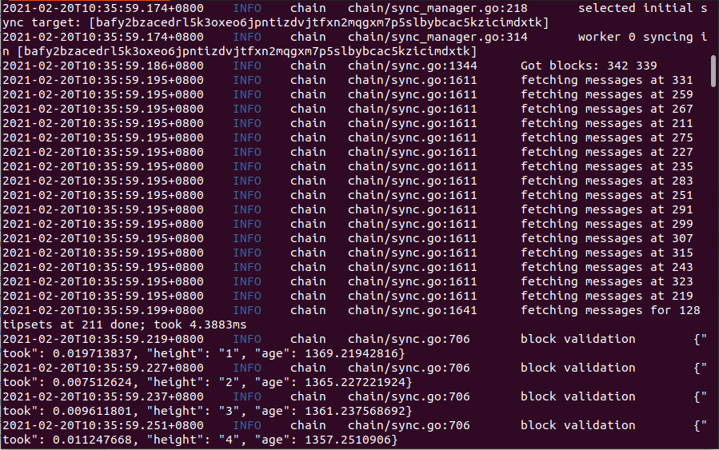

另外，可以通过如下命令查看当前节点的同步状态：

```sh
~/git2/lotus/lotus sync status
~/git2/lotus/lotus sync wait    # 未同步成功的时候，这个命令会一直处于等待状态，同步成功之后，这个命令会自动退出
```

只有同步成功之后，新节点的钱包余额才能正常显示，才能创建新的旷工，同步成功之后，会看到如下图所示的信息：


### 7.5 创建钱包

连接到创世节点成功之后，创建一个新的钱包，创建命令如下：

```sh
# 注意，这里使用的钱包类型是 BLS
~/git2/lotus/lotus wallet new bls
```

创建好之后会给出你的钱包地址，如下所示：

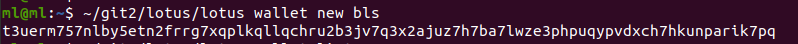

示例中的钱包地址是（注意，你自己的钱包地址和我的是不一样的，你需要用你自己的，钱包地址一般是 `t3` 开头的）：

`t3uerm757nlby5etn2frrg7xqplkqllqchru2b3jv7q3x2ajuz7h7ba7lwze3phpuqypvdxch7hkunparik7pq`


### 7.6 从创世节点处发送一些余额到当前钱包

有了钱包，就可以从**创世节点**那里发送一些 `FIL` 到这个钱包了（因为创建新旷工需要有  `FIL` 才能创建），此时，**需要在创世节点机器上**执行如下命令来发送一些 `FIL` 到这个钱包：

```sh
# 假设发送 100 FIL 到这个钱包
~/git/lotus/lotus send t3uerm757nlby5etn2frrg7xqplkqllqchru2b3jv7q3x2ajuz7h7ba7lwze3phpuqypvdxch7hkunparik7pq 100
```


### 7.7 等待钱包到账

从创世节点处发送一些余额到当前钱包后，需要等待这个余额到账，可以使用如下命令查看当前余额：

```sh
~/git2/lotus/lotus wallet balance
# 或者这个命令（这个命令会查看到当前节点下的所有钱包信息，因为一个节点下可以允许有多个钱包）
~/git2/lotus/lotus wallet list
```


### 7.8 初始化新节点

当钱包中有 `FIL` 之后，就可以初始化新旷工了，使用如下命令初始化：

```sh
# 指定扇区大小为 2KiB
~/git2/lotus/lotus-miner init --sector-size=2KiB
```


初始化新节点的时候，在等待消息上链的过程需要一小段时间，通常会在**1分钟**左右完成，如下图所示：

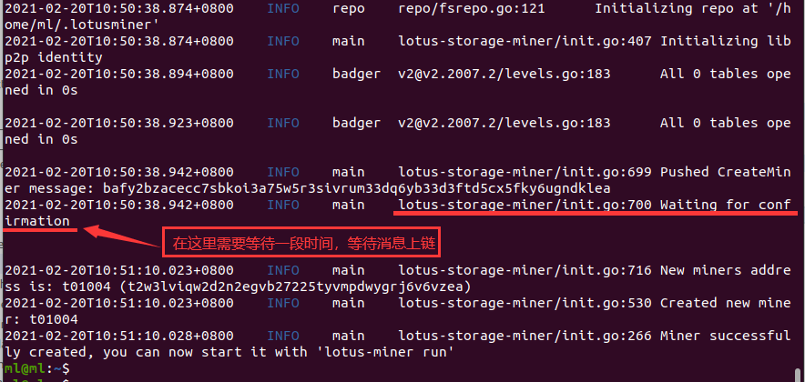

### 7.9 启动新节点

初始化好之后，就可以启动新节点了，启动命令如下所示：

```sh
~/git2/lotus/lotus-miner run
```


### 7.10 查看新节点

```sh
~/git2/lotus/lotus-miner info
```

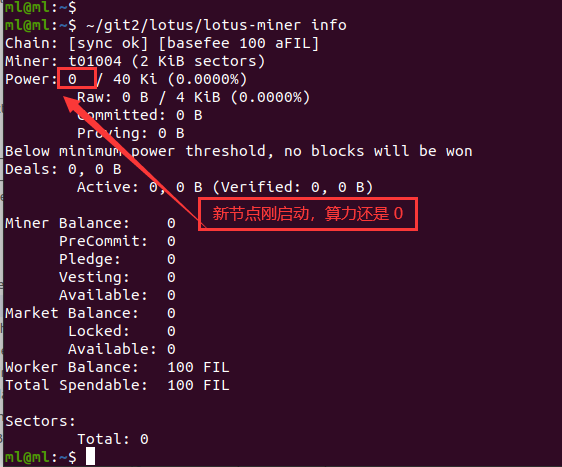

自此，新节点启动成功，当然，你可以启动任意多个新节点。新旷工启动之后，还没有任何有效算力，因此，还不会参与出块的过程，需要有算力之后才会参与出块，详细内容请看下一节。

## 8. 质押扇区（增加节点算力）

增加算力的其中一个方式就是质押扇区（当然也可以通过接收订单来增加算力），旷工只有拥有算力，才能出块，才能获得奖励，目前，在 `2KiB` 测试网中，从质押第一个扇区开始，直到该扇区的状态变成 `Proving`，并且完成第一次 `WindowPoST`，之后，再过 `1` 个小时，就可以开始出块获取奖励了。

### 8.1 质押方式

质押扇区的命令如下所示：

```sh
~/git2/lotus/lotus-miner sectors pledge
```

没有执行过质押之前（此时旷工的算力还是 `0`），`miner` 的 `log` 日志信息中会停留在一个地方不动，如下图所示：

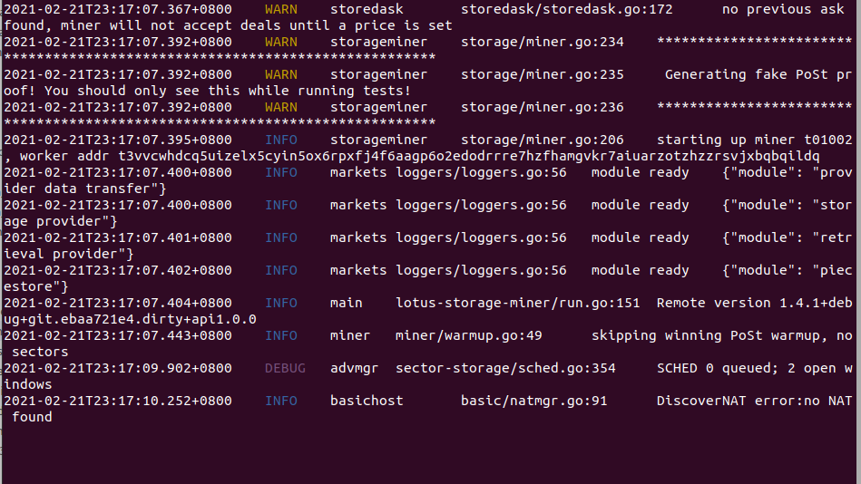

开始质押扇区之后，就可以看到 `miner` 的 `log` 日志中开始有源源不断的输出（启动 `miner` 之前要设置 `log` 日志等级为 `Trace` 才能看到 `miner` 的 `log` 日志信息， 例如 `export RUST_LOG=Trace`），如下图所示：


### 8.2 查看扇区状态/信息

使用如下命令查看质押扇区之后的旷工/扇区状态，如下图所示：

```sh
# 查看旷工状态
~/git2/lotus/lotus-miner info
# 查看扇区 ID，获取扇区列表
~/git2/lotus/lotus-miner sectors list
# 查看具体的某个扇区的状态（示例中显示的是扇区 0 的状态）
~/git2/lotus/lotus-miner sectors status 0
# 查看 0 号扇区的详细日志信息
~/git2/lotus/lotus-miner sectors status --log 0
```

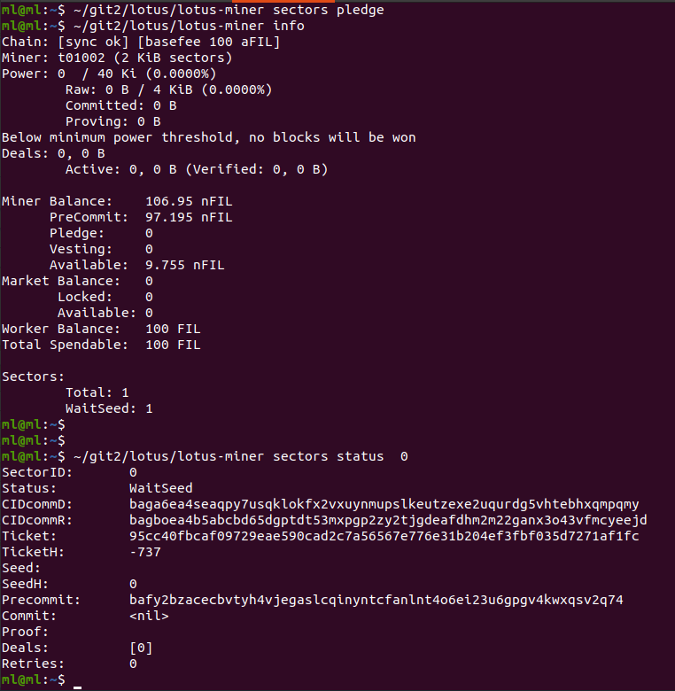

`WaitSeed` 表示该扇区正在等待链上的消息，准备让扇区的数据上链（`PreCommitSector` 的信息），如下图所示：

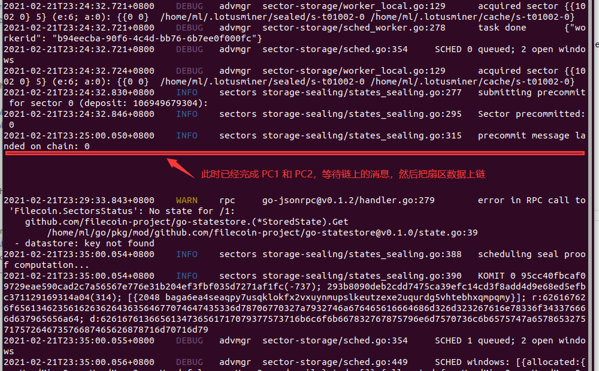

`PreCommitSector` 消息上链之后，`miner` 会继续做 `C1` 和 `C2`，做完之后，还需要有另一条消息上链：`ProveCommitSector`，这两条消息都上链之后（这两条消息都是需要收钱的，包括燃烧掉的 `gas` 费用和质押费用， 其中， `gas` 费用永久消耗，质押费用等扇区生命周期结束之后会退回），就可以看到该扇区的状态变成 `Proving` 了，如下所示：

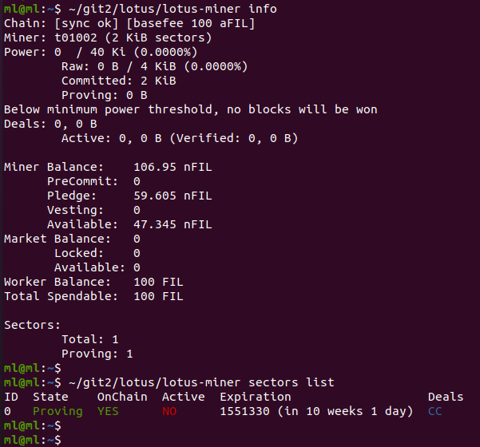

使用命令 `~/git2/lotus/lotus-miner sectors list` 可以查看到该扇区的 `OnChain` 选项已经是 `YES` 了，但是它的 `Active` 选项依然还是 `NO`，需要等一个固定的时间之后， `miner` 做完一次 `WindowsPoST` 之后（需要向链上发送一条 `SubmitWindowedPoSt` 消息，目前该消息已经基本不收费了），这个 `Active` 选项才会变成 `YES`。

等了一段时间之后，所有消息都成功上链，就可以看到这个 `Active` 状态变成 `Yes` 了，如下图所示：


`Active` 状态变成 `Yes` 之后，你就开始拥有算力了（示例是中 `2KiB` 大小的算力，当前占全网总算力约 `13%`），而本地 `2KiB` 测试网没有最低出块要求（主网 `32GiB` 扇区的最低出块要求是 `10TB` 算力，`64GiB` 扇区的最低出块要求是 `20TB` 算力），有算力就可以出块了（旷工做完第一个 `WindowPoST` 之后再过 `1` 个小时才开始出块）。因此，有算力之后，后面就是激动人心的开始出块过程了（算力越大，出块越多）。

### 8.3 查看消息收费情况

目前，提交扇区需要向链上发送两条固定的消息：`PreCommitSector` 消息和 `ProveCommitSector` 消息，以及后续周期性的 `SubmitWindowedPoSt` 消息，要查看这些消息的收费情况，目前本地查看的方法，我还没有找到有（如果谁知道可以本地查看的方法，可以告诉我一声，我更新上来，并标识贡献者），现在（2021/02/27）在一个 [【filfox 浏览器】](https://filfox.info/zh) 上查看，并且随意找到一个矿工（假设旷工 `ID` 为 [【f094764】](https://filfox.info/zh/address/f094764)，我随便找的，我也不知道这个旷工是谁的），查看它的消息列表，可以看到里面记录的这些消息的收费情况（不同时间，收费可能不一样）：

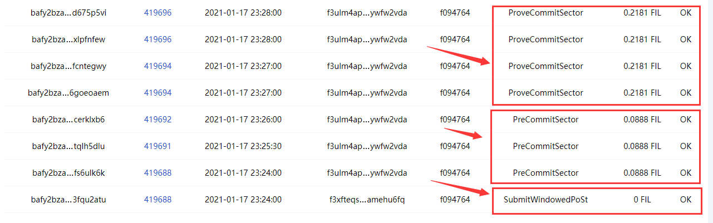


## 9. 订单操作

在主网，如果旷工不想开启接单功能（接单会有很多坑，谨慎开启），只是单纯的挖矿（靠质押扇区增加算力，然后靠出块获取收益），则不需要配备 `公网 IP 地址`。运行本地测试网也不需要有公网 IP 地址（包括本地测试网的接单功能）。

订单操作可以是在线的，也可以是离线的（参考：[【官方文档：Offline storage deals】](https://docs.filecoin.io/mine/lotus/manage-storage-deals/#offline-storage-deals) 和 [【5.13 离线进行Deal数据传输】](https://github.com/CoinSummer/filecoin)），现在演示在线订单操作（通过网络把订单发送给目标旷工）。

### 9.1 旷工默认配置信息：

注意，新建的旷工，默认是开启接单功能的，可以在 `.lotusminer/` 目录下的 `config.toml` 文件中将其关闭，默认配置如下所示：

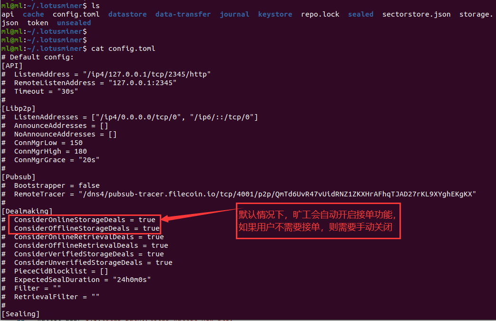

如果想要关闭接单功能，则把这个配置文件中的 `ConsiderOnlineStorageDeals` 前面的注释符号 `#` 去掉，并把它的值改为 `false`，然后再重启 `miner` 就可以了，如下所示：

```sh
...
[Dealmaking]
ConsiderOnlineStorageDeals = false
....
```

**注意：** 在主网中，如果要接单，还需要在 `miner` 中设置你的公网 `IP` 地址。

当然，也可以不用重启 `miner` 来关闭接收订单这个功能，使用命令如下[【参考官方文档】](https://docs.filecoin.io/mine/lotus/manage-storage-deals/#enabling-and-disabling-deals)：

```sh
~/git2/lotus/lotus-miner storage-deals selection reject --online --offline
# 查看效果
~/git2/lotus/lotus-miner storage-deals selection list
```

重新开启接单功能：

```sh
~/git2/lotus/lotus-miner storage-deals selection reset
# 查看效果
~/git2/lotus/lotus-miner storage-deals selection list
```

### 9.2 在线发送订单/订单交易

首先查看一下当前的链中有哪些旷工，使用如下命令查看：

```sh
~/git2/lotus/lotus state list-miners
```


从图中我们可以看到当前在线的旷工有 `t01000`（创世旷工： `MA-192.168.100.19`）、 `t01002`（自己： `MB-192.168.100.19`）和 `t01004`（另一个旷工： `MC-192.168.100.20`），假设我们想和旷工 `t01004` 进行交易，把订单发给它，则，现在查看它声明的收费情况（默认情况）：

```sh
# 该命令能查到对方的收费情况，但是并不代表你能够发订单给对方
~/git2/lotus/lotus-miner storage-deals get-ask t01004
```


我们现在关心如下三个数据：

- `Price per GiB/Epoch` 列： 每 `GiB` 数据在每个 `Epoch` 周期的收费情况（示例是中 `0.0000000005 FIL`）
- `Min. Piece Size (padded)` 列：订单数据的最小要求（示例是中 `256 B`）（`B` 表示字节）
- `Max. Piece Size (padded)` 列：订单数据的最大要求（示例是中 `2 KiB`）

现在我们已经知道目标旷工的收费情况了，但是，还要确保目标旷工能够被我们检测到（能够正常发订单给它），接单操作时通过 `p2p` 进行的，因此，在进行发单之前，还要确认一件事：要确保使用如下命令能够查看到正确的数据（**默认情况下是查看不到的,，并且会返回错误信息：`ERROR: failed to open stream to miner: exhausted 5 attempts but failed to open stream, err: failed to find any peer in table`**）：

```sh
# 如果这条命令能查到目标旷工，则说明我们能够检测到对方，可以进行订单交易
# 默认是检测不到对方的，因此，这条命令会阻塞很长一段时间
~/git2/lotus/lotus client query-ask t01004
```


所以，这里还有一个重要的步骤，就是设置目标旷工的 `p2p` 地址，在目标旷工（`MC`）的 `.lotusminer/config.toml` 文件中配置，

```sh
[Libp2p]
# 修改前
#  ListenAddresses = ["/ip4/0.0.0.0/tcp/0", "/ip6/::/tcp/0"]
# 修改后
  ListenAddresses = ["/ip4/192.168.100.20/tcp/1024", "/ip6/::/tcp/0"]
```

把目标旷工的 `IP` 地址（示例中是 `192.168.100.20` ）和一个随机端口（示例中是 `1024` ）设置到它的 `p2p` 地址中，**然后重启目标旷工**（不重启的话，比人依然无法感知到自己），重启之后，再使用如下命令来对外声明自己的 `p2p` 地址，这样就可以让别人感知得到自己了（可以给自己发送订单了）：

```sh
~/git/lotus/lotus-miner actor set-addrs /ip4/192.168.100.20/tcp/1024
# 注意，示例中的目标旷工是 t01004
~/git/lotus/lotus state miner-info t01004
```


然后再回到我们要发送订单的旷工，再使用 `query-ask` 命令查看目标旷工的情况，此时，已经能够正确显示了，如下图所示：

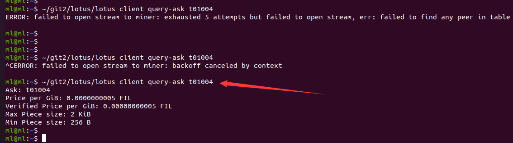


现在已经可以和目标旷工进行订单交易了，首先，假设我要存储的文件是当前目录下的 `./start_bash.sh`，查看该文件的大小（`1051 字节`），符合目标接单的大小范围（`256 B` ~  `2 KiB`），然后使用 `import` 命令导入该文件，获取该文件的 `CID`，如下所示：

```sh
~/git2/lotus/lotus client import ./start_bash.sh
# 使用 client local 命令查看导入的本地订单
~/git2/lotus/lotus client local
```

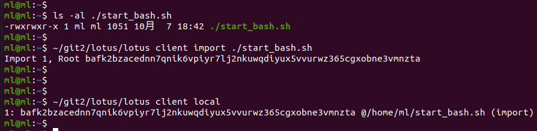

导入文件之后，就会生成该文件的 `CID`，示例中的 `CID` 是： `bafk2bzacednn7qnik6vpiyr7lj2nkuwqdiyux5vvurwz365cgxobne3vmnzta`，

然后使用这个 `CID` 进行发送订单，如下所示：

```sh
~/git2/lotus/lotus client deal bafk2bzacednn7qnik6vpiyr7lj2nkuwqdiyux5vvurwz365cgxobne3vmnzta t01004 0.0000000005 518400
```

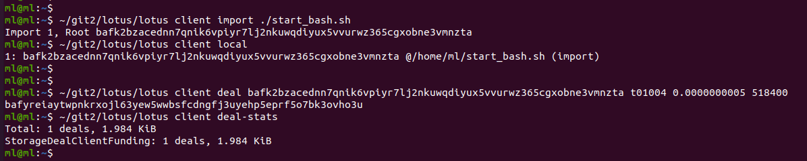

**命令解释：**

```sh
# 命令格式
~/git2/lotus/lotus client deal <Data CID> <miner ID> <price in FIL> <duration>
```

`duration` 是持续时间，以 `45秒` 为单位（1 duration=45s）（`duration` 最小是 `518400` （`270` 天），如果输入不正常，命令会提示给你），执行成功之后返回交易 `ID`，示例中的交易 `ID` 是 `bafyreiaytwpnkrxojl63yew5wwbsfcdngfj3uyehp5eprf5o7bk3ovho3u`，交易 `ID` 可用于检索该文件。

这是在线交易的方式，当然，还可以使用离线交易，具体方法可参考： [【5.13 离线进行Deal数据传输】](https://github.com/CoinSummer/filecoin)

### 9.3 交易记录查看

可以使用如下命令查看交易的状态：

```sh
# 查看交易的大概信息
~/git2/lotus/lotus client deal-stats
~/git2/lotus/lotus client list-deals
# 使用数据的 CID 查看该交易状态
~/git2/lotus/lotus client stat bafk2bzacednn7qnik6vpiyr7lj2nkuwqdiyux5vvurwz365cgxobne3vmnzta
# 使用交易 ID 查看该交易状态
~/git2/lotus/lotus client get-deal bafyreiaytwpnkrxojl63yew5wwbsfcdngfj3uyehp5eprf5o7bk3ovho3u
```

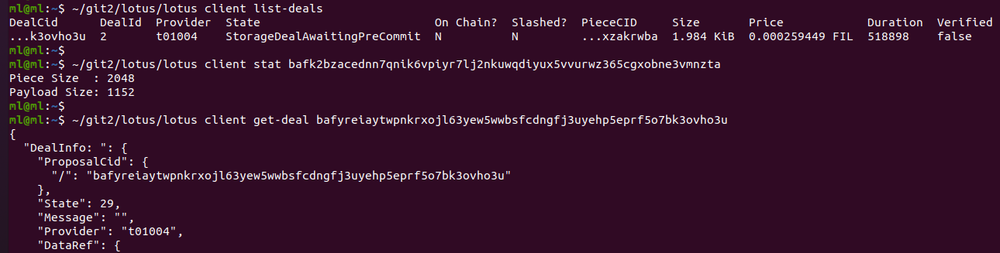

当前完整的交易 log 如下所示：

```sh
ml@ml:~$ ~/git2/lotus/lotus client get-deal bafyreiaytwpnkrxojl63yew5wwbsfcdngfj3uyehp5eprf5o7bk3ovho3u
{
  "DealInfo: ": {
    "ProposalCid": {
      "/": "bafyreiaytwpnkrxojl63yew5wwbsfcdngfj3uyehp5eprf5o7bk3ovho3u"
    },
    "State": 29,
    "Message": "",
    "Provider": "t01004",
    "DataRef": {
      "TransferType": "graphsync",
      "Root": {
        "/": "bafk2bzacednn7qnik6vpiyr7lj2nkuwqdiyux5vvurwz365cgxobne3vmnzta"
      },
      "PieceCid": null,
      "PieceSize": 0
    },
    "PieceCID": {
      "/": "baga6ea4seaqp6sgyzdec7al3qass6canpicjuzw4td7i72ntymkh6okxzakrwba"
    },
    "Size": 2032,
    "PricePerEpoch": "500000000",
    "Duration": 518898,
    "DealID": 2,
    "CreationTime": "2021-03-02T11:05:52.761330878+08:00",
    "Verified": false,
    "TransferChannelID": {
      "Initiator": "12D3KooWEayGhSvGCAt2vbjDr1S7YYh3hQkTSiah8ogf5Y5bAE9M",
      "Responder": "12D3KooWRQZQqyq92HcZ3qfAHt6FewnSdfa1SH5wconrrbgk1Hj4",
      "ID": 0
    },
    "DataTransfer": {
      "TransferID": 0,
      "Status": 6,
      "BaseCID": {
        "/": "bafk2bzacednn7qnik6vpiyr7lj2nkuwqdiyux5vvurwz365cgxobne3vmnzta"
      },
      "IsInitiator": true,
      "IsSender": true,
      "Voucher": "{\"Proposal\":{\"/\":\"bafyreiaytwpnkrxojl63yew5wwbsfcdngfj3uyehp5eprf5o7bk3ovho3u\"}}",
      "Message": "",
      "OtherPeer": "12D3KooWRQZQqyq92HcZ3qfAHt6FewnSdfa1SH5wconrrbgk1Hj4",
      "Transferred": 0
    }
  },
  "OnChain": {
    "Proposal": {
      "PieceCID": {
        "/": "baga6ea4seaqp6sgyzdec7al3qass6canpicjuzw4td7i72ntymkh6okxzakrwba"
      },
      "PieceSize": 2048,
      "VerifiedDeal": false,
      "Client": "t01001",
      "Provider": "t01004",
      "Label": "mAVWg5AIg2t/BqFeq9GI/WnTVUtAaMUv2taRtnfuiNdwWk3VjczA",
      "StartEpoch": 45135,
      "EndEpoch": 564033,
      "StoragePricePerEpoch": "500000000",
      "ProviderCollateral": "0",
      "ClientCollateral": "0"
    },
    "State": {
      "SectorStartEpoch": -1,
      "LastUpdatedEpoch": -1,
      "SlashEpoch": -1
    }
  }
}
ml@ml:~$ 
```

### 9.4 交易状态转换

一笔交易从发起到完成的整个过程，所需要的时间比较久，并且会经历多个不同的状态转换，主要的状态包括如下所示的 `5` 个：

- `StorageDealClientFunding`
- `StorageDealCheckForAcceptance`
- `StorageDealAwaitingPreCommit`
- `StorageDealSealing`
- `StorageDealActive`

可通过命令 `~/git2/lotus/lotus client list-deals` 查看交易的状态信息，当交易达到最后一个 `StorageDealActive` 状态的时候，表明这笔交易已经完成。在整个交易的过程中，最耗时的是从 `StorageDealAwaitingPreCommit` 状态到 `StorageDealSealing` 状态，一般需要等待 `5` 个小时以上，其它状态耗时相对比较短。

下面用两个额外的交易（**不是上一节中演示的那笔交易**）示例来讲解这整个过程，首先是发起交易，

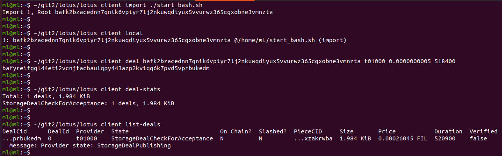

然后目标旷工（接收交易方）收到交易信息（如果想看目标旷工收到交易之后所需要做的事情，可以查看这里：[【旷工接收交易的完整日志】](./files/target_miner_accept_deal_log.md)，它记录一个旷工收到一笔交易之后的完整日志信息），

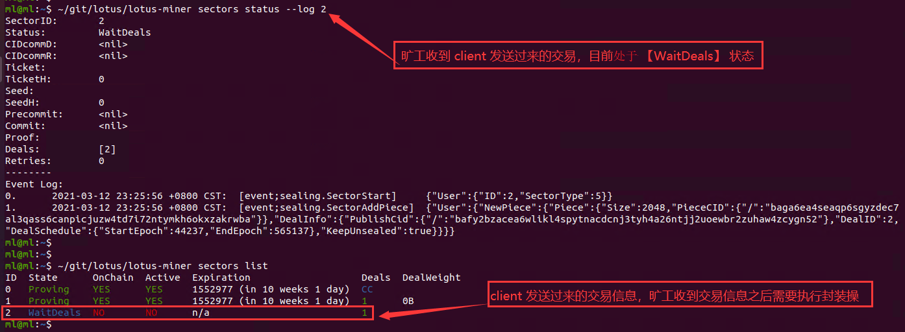

`client` （发送交易方） 开始提交租金，并发送交易数据给目标旷工，然后等待链上的数据（随机数等，这一步需要很长的等待时间），

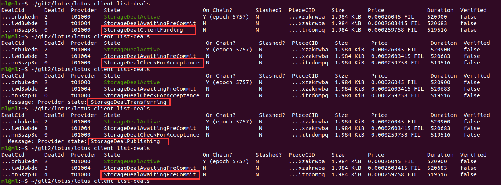

等到数据的之后，目标旷工开始进行密封数据，密封完成之后，交易状态变成 `StorageDealActive`，到此，交易完成。

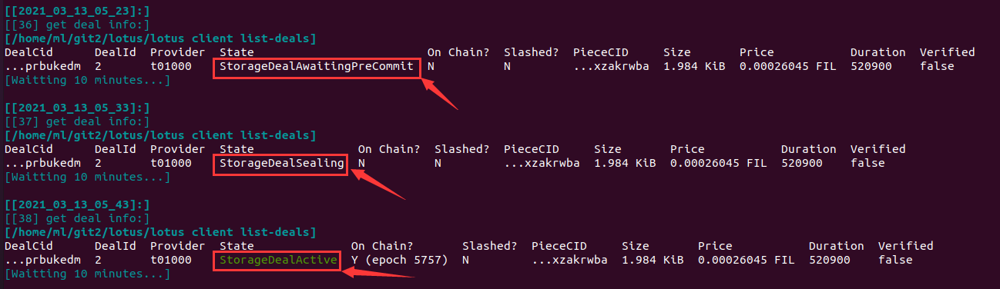

再到接收方查看扇区状态，如下所示：

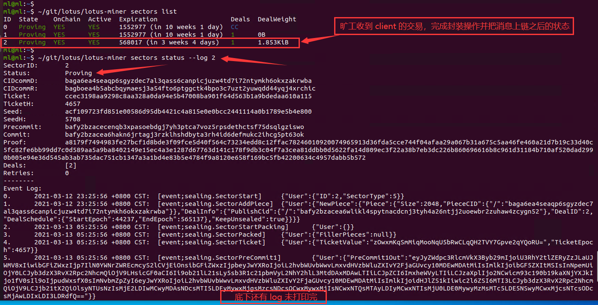


### 9.5 检索交易

等交易完成之后，就可以在检索市场检索之前的交易信息了，并获取交易文件的具体内容，检索方式如下：

```sh
# 1. 首先通过数据 CID 查找数据信息，格式如下：
# ~/git2/lotus/lotus client find <Data CID>
~/git2/lotus/lotus client find bafk2bzacednn7qnik6vpiyr7lj2nkuwqdiyux5vvurwz365cgxobne3vmnzta

# 2. 通过数据 CID 检索数据，并把检索到的数据保存到 ./tmp.log 文件中，格式如下：
# ~/git2/lotus/lotus client retrieve <Data CID> <outfile>
~/git2/lotus/lotus client retrieve  bafk2bzacednn7qnik6vpiyr7lj2nkuwqdiyux5vvurwz365cgxobne3vmnzta ./tmp.log
```


检索到数据之后，使用 `diff` 命令验证数据的正确性，如下所示：


结果显示，使用 `diff` 命令查看，仅仅只是两个文件的权限格式不一样，文件内容完全一样。


## 10. 潜在的问题

### 10.1 编译 lotus 失败： *** No rule to make target '.install-filcrypto'.  Stop.

如果在编译 `lotus` 的时候出现如下所示的错误：


则直接删除 `./extern/` 目录，然后重新编译：

```sh
rm -rf ./extern/
FFI_BUILD_FROM_SOURCE=1 make clean debug
```

### 10.2 编译 lotus 失败：Get "https://proxy.golang.org/github.com/xxxxxx": net/http: TLS handshake timeout

如果在编译 `lotus` 的时候出现如下所示的错误：


则需要设置  `GOPROXY` 这个环境变量，然后重新编译：

```sh
export GOPROXY=https://goproxy.cn
FFI_BUILD_FROM_SOURCE=1 make debug  # 此时不需要执行 clean 操作
```

### 10.3 编译 lotus 失败：server response: not found: module github.com/filecoin-project/lotus/extern/storage-sealing/sealiface: no matching versions for query "latest"

如果在编译 `lotus` 的时候出现如下所示的错误：

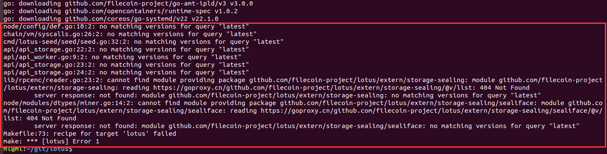

则，更换代码版本吧，这个版本的代码有问题，目前出现这个问题的代码版本是：`v1.4.2-rc1`。

### 10.4 运行 lotus 出现崩溃：SIGILL: illegal instruction

这个一般是老机器才会出现的问题，由于老机器不支持 `adx` 等指令导致的，
解决方法： 编译的时候加上参数 **CGO_CFLAGS="-D__BLST_PORTABLE__"**：

```sh
FFI_BUILD_FROM_SOURCE=1 CGO_CFLAGS="-D__BLST_PORTABLE__" make clean debug
```

### 10.5 启动 daemon 失败：xxxxx: genesis in the repo is not the one expected by this version of Lotus!

如果启动 daemon 的时候出现如下所示的错误：`xxxxx: genesis in the repo is not the one expected by this version of Lotus!`：

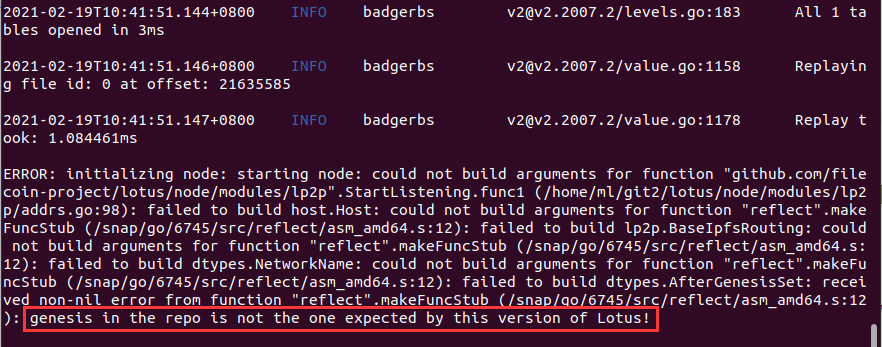

则建议不要使用这个版本的代码，如果一定要使用，则可以在启动 `daemon` 之前设置一下环境变量：

```sh
export LOTUS_SKIP_GENESIS_CHECK=_yes_
```

然后再次启动  `daemon`，如下所示：

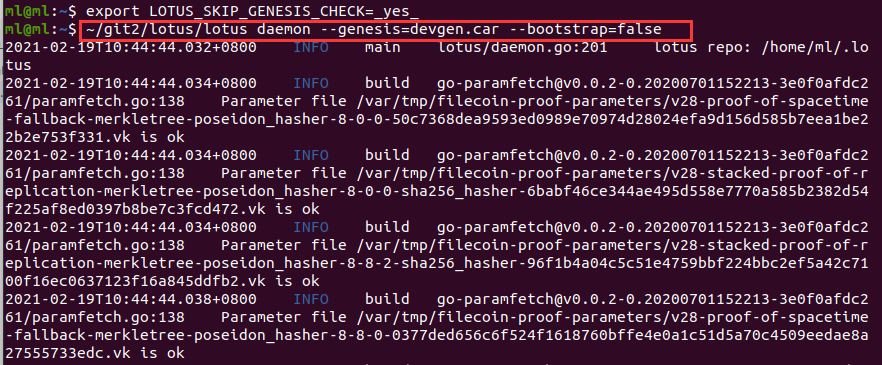

此时虽然会有一些 `ERROR` 信息，但是已经可以正常启动  `daemon` （但是也不保证后面不会出现什么问题）。

### 10.6 daemon 同步失败：Received block with impossibly large height xxx

在测试本地测试网的时候，如果创世节点的代码编译的时候使用的是 `Debug` 模式，而其它节点的代码编译的时候使用 `Release` 模式，则在启动新节点的时候，运行完 `lotus net connect xxxx` 命令的时候，有可能在 `daemon` 的日志中看到这个错: `ERROR	chain	chain/sync.go:236	Received block with impossibly large height 197`，看到这个错误之后，新节点后续的操作都不会成功（比如同步节点信息，或者从创世节点发送一些 `FIL` 到新旷工的钱包等）。


解决的方法就是让新节点的代码也是用 `Debug` 模式编译。

### 10.7 启动创世节点失败：VM.Call failure: Allowance 4096 below MinVerifiedDealSize for add verifier f081 (RetCode=16)

这个错误信息，是因为启动创世节点的时候（搭建本地 `2KiB` 测试网），所使用的代码的编译模式没有使用 `Debug` 模式（大概率是因为使用了 `Release` 模式编译代码）导致的，如下所示：

```sh
# 错误信息
WARN	vm	vm/runtime.go:332	Abortf: Allowance 4096 below MinVerifiedDealSize for add verifier f081
WARN	vm	vm/runtime.go:145	VM.Call failure: Allowance 4096 below MinVerifiedDealSize for add verifier f081 (RetCode=16):
genesis func failed: make genesis block: 
failed to verify presealed data: 
failed to create verifier: 
doExec apply message failed: Allowance 4096 below MinVerifiedDealSize for add verifier f081 (RetCode=16)
```


解决方法是使用 `Debug` 模式重新编译一次代码，然后重新启动创世节点。

### 10.8 查看钱包列表出现 Warn：error in RPC call to 'Filecoin.WalletDefaultAddress': failed to get default key: xxx key info not found

这不是一个 Error，其实可以不用管它，消除这个 `Warn` 的方法也很简单，因为这个警告的意思是指：用户没有设置默认钱包，可能是因为用户在导入创世钱包的时候 `./lotus wallet import xxx` 没有指定 `--as-default` 参数，或者是导入之后没有执行 `./lotus wallet set-default xxx` 设置默认钱包（只要有默认钱包就不会报这个警告了）。
所以，消除这个警告的方法就是在导入钱包的时候加上 `--as-default` 参数，或者在导入钱包之后执行 `./lotus wallet set-default xxx` 设置默认钱包即可。

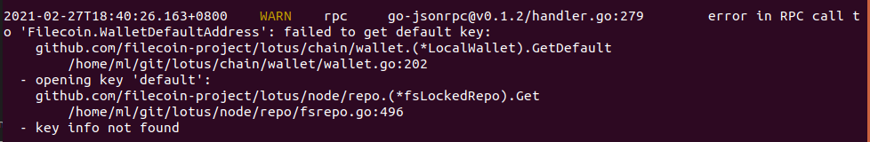


### 10.9 查看Miner 信息：ERROR: could not get API info: could not get api endpoint: API not running (no endpoint)

如果是在执行 `./lotus-miner xxx` 的时候看到这个错误，则说明你的 `miner` 还没有启动，或者是 `miner` 的默认目录不是 `~/.lotusminer/`，而你执行名的这边（执行命令所在的终端）没有检测到你的 `miner` 所使用的目录。比如， `miner` 那边运行的时候设置了 `export LOTUS_STORAGE_PATH=/lotusminer`，而执行命令这边没有检测到 `LOTUS_STORAGE_PATH` 这个环境变量。

如果是在执行 `./lotus xxx` 的时候看到这个错误，则原理和 `miner` 类似，如下所示：

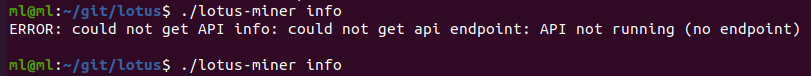


### 10.10 lotus 编译错误：/usr/bin/ld: cannot find -lhwloc

如果在编译过程中遇到这个错误，则说明你的系统中没有安装 `hwloc` 相关的库：

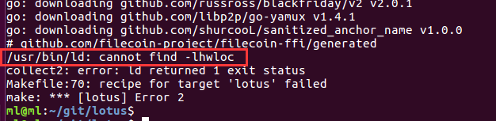

解决方法，安装 `hwloc` 相关的库，然后再重新编译 `lotus`：

```sh
sudo apt get install hwloc libhwloc-dev
```
如下图所示：


### 10.11 miner 的日志中显示 drand 错误：failed getting beacon entry: 

错误信息（drand：distributed random）：

```sh
ERROR   miner   miner/miner.go:208      
 failed getting beacon entry: drand failed Get request: no valid clients - doing request:
 Get "https://api3.drand.sh/public/643563": context deadline exceeded - doing request: 
 Get "https://api2.drand.sh/public/643563": context deadline exceeded - doing request: 
 Get "https://drand.cloudflare.com/public/643563": context deadline exceeded - doing request: 
 Get "https://api.drand.sh/public/643563": context deadline exceeded
```

这个错误一般都是你的机器无法联网导致的，或者网络不稳定等，导致 `miner` 无法访问到分布式随机数服务器，而且，如果一直无法访问的话， `miner` 的 log 日志中会不断的输出这个错误信息，如果 `miner` 的 log 日志中已经暂定输出这个错误信息，则说明已经恢复正常（`WaitSeed` 阶段需要正确获得 `drand` 信息才能继续），如下图所示：


## 11. 其它

### 11.1 文章来源

本文来自于微信群 `Filecoin技术交流-1/2/3群` 群主（`TEARS`）出品，详细信息请查看 [【Filecoin 资源分享目录】](https://github.com/CoinSummer/filecoin)。

如有任何问题，请在微信群 `Filecoin技术交流-1/2/3群` 中讨论。


