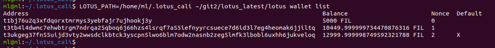
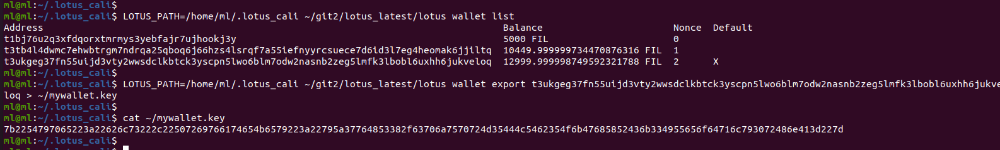
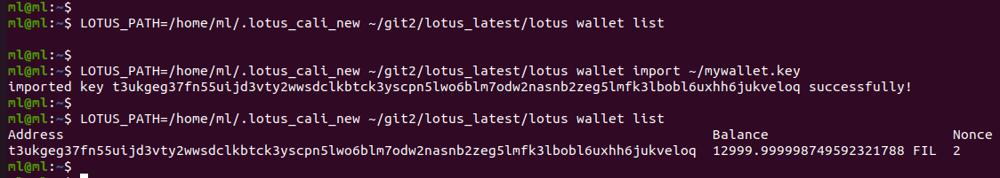
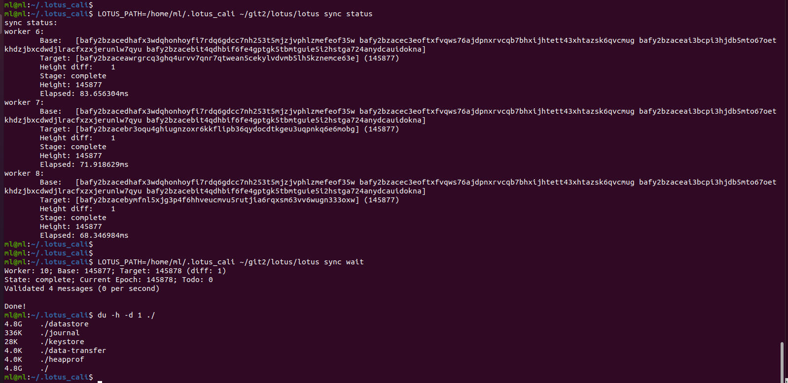
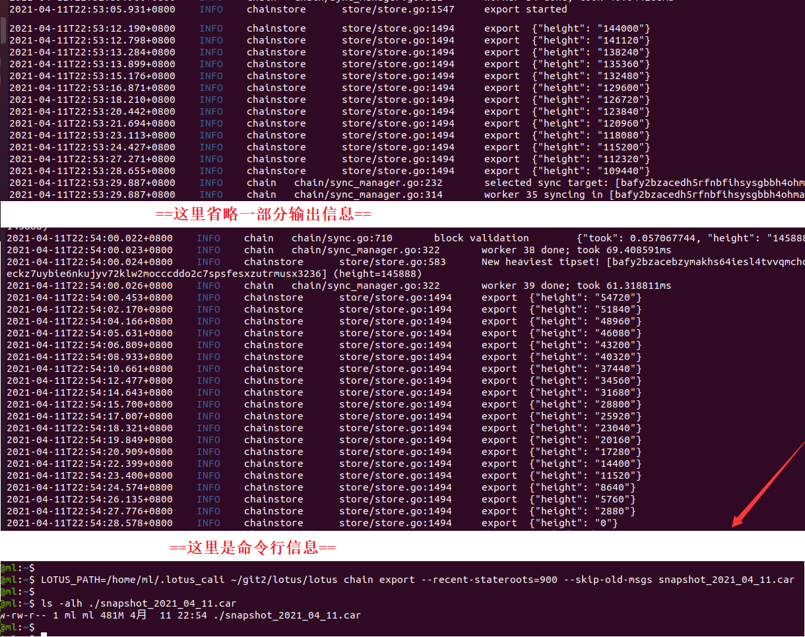
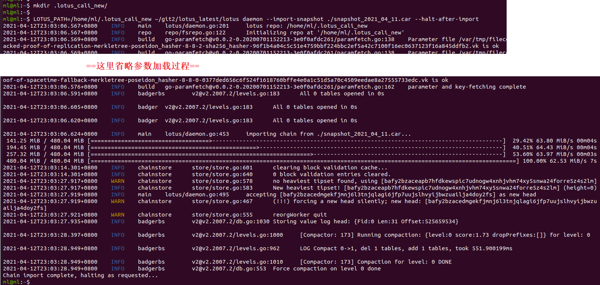
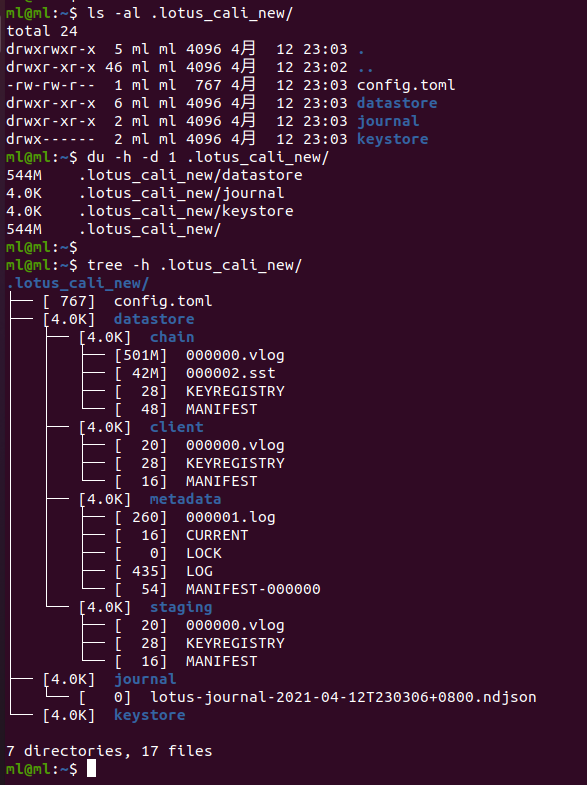
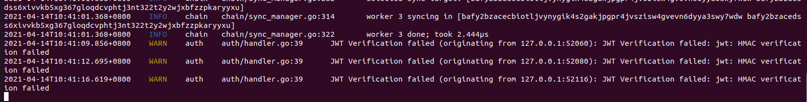
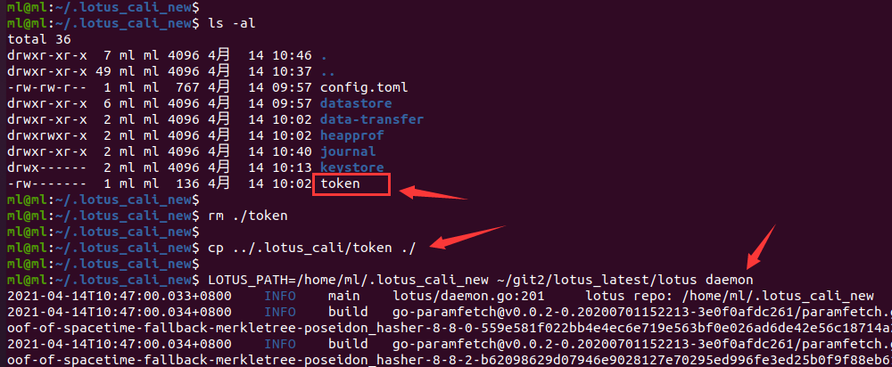
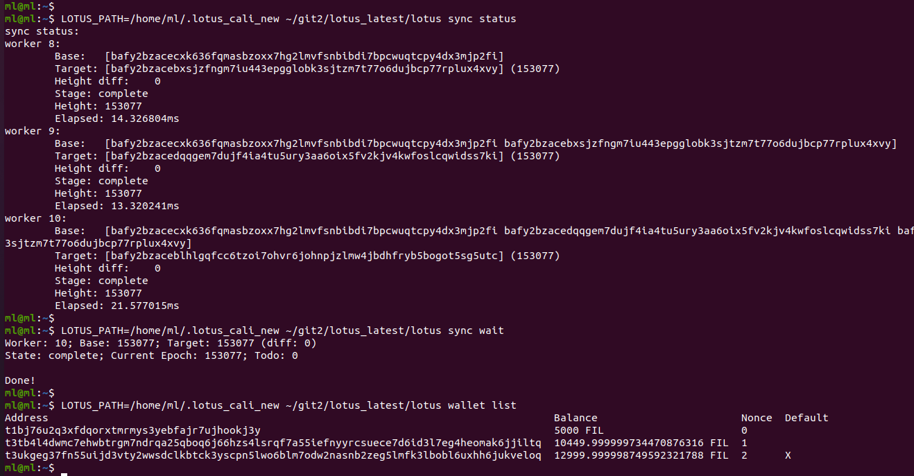

# lotus 链数据导入导出使用教程

## 1. 基本信息

`lotus` 的链数据保存着 `lotus` 的同步信息，每天 `lotus` 目录下的链同步数据都会增加，因此，可以通过把链数据导出再导入（也叫裁剪链数据）的方法来减少 `lotus` 目录的体积。通过裁剪链数据，不但可以减少 `lotus` 目录的体积，还可以让你的 `lotus` 节点更加健康、跟稳定，减少磁盘消耗。

## 2. 导入导出操作

导入导出链数据的操作相对比较简单，详细步骤如下所示：

### 2.1 备份关键数据

在进行任何危险操作之前，请务必记得先备份好自己的钱包私钥等重要信息，可以选择导出钱包私钥到文件中保存，也可以通过备份 `lotus` 目录下的 `keystore/` 文件夹和 `token` 文件。如果通过导出私钥来备份钱包，则可以在另一个 `lotus` 目录中通过导入该钱包的私钥来导入该钱包；如果是通过备份 `lotus` 目录下的 `keystore/` 文件夹和 `token` 文件，则可以在一个已经同步好的 `lotus` 节点中替换 `lotus` 目录下的 `keystore/` 文件夹和 `token` 文件，这样同样可以获取原来的钱包数据（支持多个钱包）。

备份 `lotus` 目录下的 `keystore/` 文件夹和 `token` 文件就不说了，直接 `cp` 到其它地方就可以了，下面讲一下导出钱包私钥的方法，首先查看你的钱包列表（包括钱包地址），执行如下所示的命令：

```sh
LOTUS_PATH=/home/ml/.lotus_cali ~/git2/lotus_latest/lotus wallet list
```



示例中有三个钱包地址，现在以钱包地址 `t3ukgeg37fn55uijd3vty2wwsdclkbtck3yscpn5lwo6blm7odw2nasnb2zeg5lmfk3lbobl6uxhh6jukveloq` 为例进行说明，导出该钱包的私钥的命令如下所示：

```sh
# 示例中把导出的钱包私钥放到了文件  ~/mywallet.key 中
LOTUS_PATH=/home/ml/.lotus_cali ~/git2/lotus_latest/lotus wallet export t3ukgeg37fn55uijd3vty2wwsdclkbtck3yscpn5lwo6blm7odw2nasnb2zeg5lmfk3lbobl6uxhh6jukveloq > ~/mywallet.key
```



导出成功之后，就可以利用这个私钥信息导入钱包，假如我们现在在一个新的 `/home/ml/.lotus_cali_new` 目录中同步好了链数据，但是还没有导入任何钱包信息，那我们就可以利用之前导出的钱包私钥来进行导入，如下所示：

```sh
LOTUS_PATH=/home/ml/.lotus_cali ~/git2/lotus_latest/lotus wallet import ~/mywallet.key
```




### 2.2 导出链数据

在执行导出操作之前，请确保你的 `lotus daemon` 运行正常，并且同步完成。下面以 `calibration 测试网` 为例进行说明，执行导出操作之前，链同步状态和 `lotus` 目录（示例中通过环境变量 `LOTUS_PATH=/home/ml/.lotus_cali` 来手动修改了默认的 `~/.lotus/` 目录所在的路径）如下所示：



导出链数据的命令如下所示：

```sh
# --recent-stateroots=900 参数用于指定要保留的消息数量，最少是 900 条
LOTUS_PATH=/home/ml/.lotus_cali ~/git2/lotus/lotus chain export --recent-stateroots=900 --skip-old-msgs snapshot_2021_04_11.car
```

执行这条命令的时候，在当前的命令行中是看不到导出进度的，不过可以在 `lotus daemon` 的日志中看到链数据导出的过程，如下图所示截取了一部分导出过程中的日志信息：



执行这条命令之后，会在当前目录下生成链数据的快照文件 `snapshot_2021_04_11.car`（参数中可以给该文件加上路径信息，让它输出到指定的路径中），后续就可以使用这个快照文件来导入裁剪（瘦身）过后的链数据了。


### 2.3 导入链数据

导入链数据，有几种可选的方案：

#### 2.3.1 就地导入

**就地导入** 就是在原来 `lotus` 目录中进行导入（示例中是 `/home/ml/.lotus_cali`），这种方案就需要先把原来目录中的 `datastore/` 文件夹删除（为了防止意外，重命名一下也行），因为 `datastore/` 文件夹中保存的就是链的同步数据，删除了这个 `datastore/` 目录之后，再执行导入命令即可，示例命令如下：

```sh
# 注意这里的 LOTUS_PATH=/home/ml/.lotus_cali 指向的还是原来的目录
cd /home/ml/.lotus_cali
mv ./datastore/ ./datastore_old
LOTUS_PATH=/home/ml/.lotus_cali ~/git2/lotus_latest/lotus daemon --import-snapshot ~/snapshot_2021_04_11.car --halt-after-import
```

这种方式导入之后，钱包信息不会被改变，也不需要重新导入钱包等操作，导入之后可直接启动。

#### 2.3.2 异地导入

**异地导入** 就是在新 `lotus` 目录中进行导入（示例中是 `/home/ml/.lotus_cali_new`），这种方案就比较推荐，因为它不会损坏原来的 `lotus` 目录，可以防止一些误操作，示例命令如下：

```sh
# 参数 --halt-after-import 可以使得导入之后程序自动退出，而不是直接启动 daemon 进行同步数据
# 可以先创建 .lotus_cali_new 目录，也可以不用创建，导入过程中会自动创建
LOTUS_PATH=/home/ml/.lotus_cali_new ~/git2/lotus_latest/lotus daemon --import-snapshot ./snapshot_2021_04_11.car --halt-after-import
```

导入过程中可以看到导入进度条，并且在导入完成之后会自动退出，如下图所示：



导入完成之后，在新的 `lotus` 目录中（示例中是 `/home/ml/.lotus_cali_new`）不会有原来钱包的信息，需要导入旧的钱包信息，或者把原来的 `lotus` 目录（示例中是 `/home/ml/.lotus_cali`）中的 `keystore/` 文件夹和 `token` 文件直接拷贝到新的目录中（示例中是 `/home/ml/.lotus_cali_new`）进行覆盖（新目录中最好直接删除 `keystore/` 文件夹和 `token` 文件，然后再进行拷贝）。
经过裁剪之后，可以发现 `lotus` 目录的体积已经变小了很多，如下所示：



导入成功，并且配置好钱包之后，就可以启动 `lotus daemon` 进行正常的同步了，

**注意：**
- 可能会由于新导入的 `lotus` 的 `token` 发生改变，导致 `miner` 无法连接，此时你需要更新 `miner` 中的 `token` 信息。
- 如果你用的是主网，并且没有快照的话，则可以下载官方提供的 [~~【链数据快照~~】](https://fil-chain-snapshots-fallback.s3.amazonaws.com/mainnet/minimal_finality_stateroots_latest.car)，然后进行导入，以加快你的同步过程（官方提供的快照数据会经常更新，如果你的网速不够快，可能在你下载到一半的时候官方就更新了这个快照文件，导致你下载下来的文件是不正确的）。
- 下载主网快照：
   ```
   # 下载完成之后记得使用 sha256sum ./minimal_finality_stateroots_xxxx.car 计算一下哈希，
   # 并和下载文件中的 minimal_finality_stateroots_xxxx.sha256sum 哈希比较，相同则没有问题，不同则需要重新下载
   curl -sI https://fil-chain-snapshots-fallback.s3.amazonaws.com/mainnet/minimal_finality_stateroots_latest.car | perl -ne '/x-amz-website-redirect-location:\s(.+)\.car/ && print "$1.sha256sum\n$1.car"' | xargs wget
   ```
   请不要直接使用 `https://fil-chain-snapshots-fallback.s3.amazonaws.com/mainnet/minimal_finality_stateroots_latest.car` 这个链接进行下载，否则下载下来可能也用不了。

## 3. 常见问题

### 3.1 ERROR: websocket: bad handshack & JWT verification failed

如果你忘记拷贝旧 `lotus` 目录中的 `token` 文件到新的 `lotus` 目录中，就会出现如下所示的错误：

```sh
LOTUS_PATH=/home/ml/.lotus_cali_new ~/git2/lotus_latest/lotus wallet list
```




如果你是通过拷贝 `lotus` 目录中的 `keystore/` 文件夹和 `token` 文件来备份的钱包，但是如果只拷贝了 `keystore/` 文件夹，而忘记拷贝 `token` 文件的时候，就会出现这个错误，解决方法就是先关闭 `lotus daemon`，再把旧 `lotus` 目录中的 `token` 文件到新的 `lotus` 目录中进行覆盖，最后再启动 `lotus daemon`，此时就一切恢复正常了。

```sh
cd .lotus_cali_new/
rm ./token
cp ../.lotus_cali/token ./
LOTUS_PATH=/home/ml/.lotus_cali_new ~/git2/lotus_latest/lotus daemon
```



把旧的 `lotus` 目录中的 `token` 文件也一起复制过来之后，再启动 `lotus daemon`，就可以进行正常的操作了，如下所示：




## 4. 其它

### 4.1 参考信息

- [【官方主网快照操作手册】](https://docs.filecoin.io/get-started/lotus/chain/#lightweight-snapshot)： https://docs.filecoin.io/get-started/lotus/chain/#lightweight-snapshot
- [【官方主网快照下载地址】](https://fil-chain-snapshots-fallback.s3.amazonaws.com/mainnet/minimal_finality_stateroots_latest.car)： https://fil-chain-snapshots-fallback.s3.amazonaws.com/mainnet/minimal_finality_stateroots_latest.car

### 4.2 文章来源

本文来自于微信群 `Filecoin技术交流-1/2/3/4/5群` 群主（`TEARS`）出品，详细信息请查看 [【Filecoin 中国社区论坛】](https://github.com/filecoin-project/community-china)。

如有任何问题，请在微信群 `Filecoin技术交流-1/2/3/4/5群` 或 `Filecoin 中国社区论坛的【讨论模块】`中讨论。

