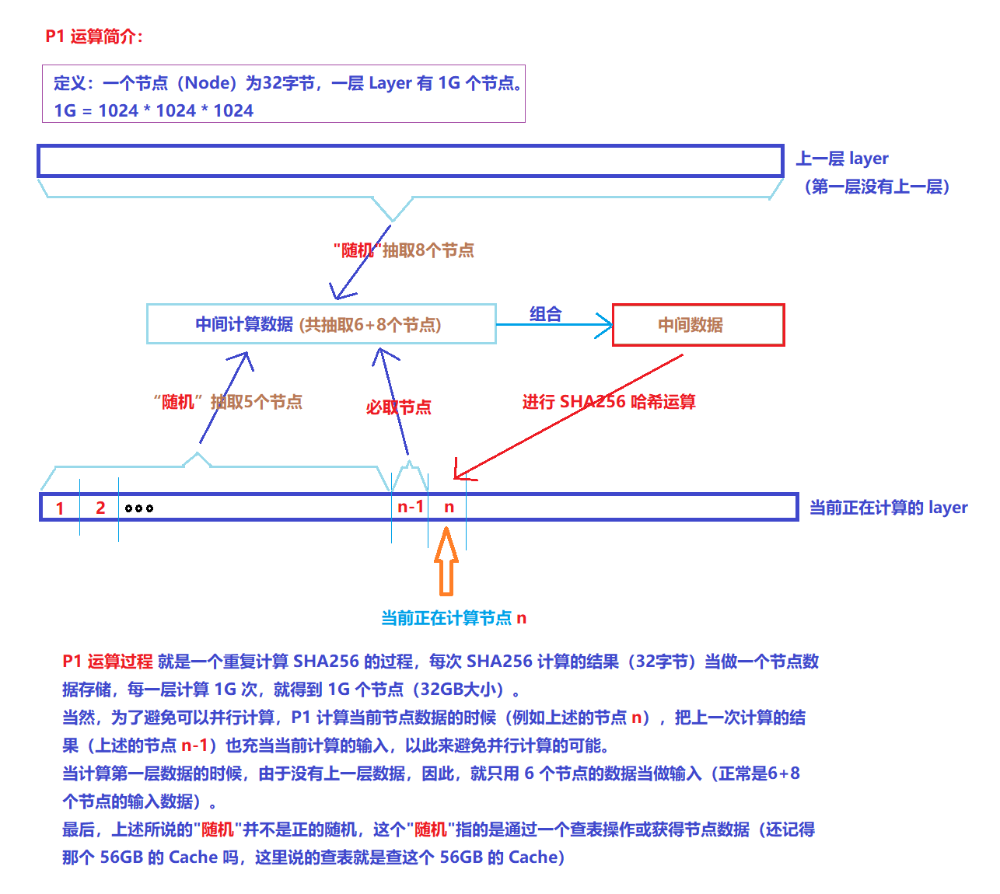
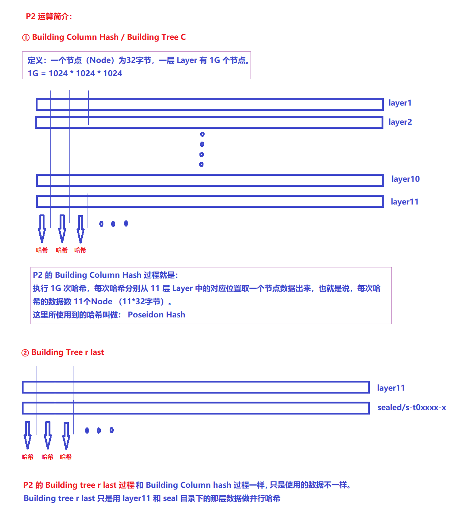

# 密封（Seal）流程简介

`lotus` 密封一个扇区，通常需要经历以下几个过程：

- AddPiece (简称 `AP`) ：主要填充一个扇区，不耗时
- PreCommitPhase1 (简称 `PC1`) ： 进行大量的、不可并行的哈希计算（使用 `SHA256` 哈希算法），非常耗时
- PreCommitPhase2 (简称 `PC2`) ： 进行大量的、可并行的哈希计算（使用 `Poseidon` 哈希算法），比较耗时
- CommitPhase1 (简称 `C1`) : 做一些检查和配置，没有实际计算，不耗时
- CommitPhase2 (简称 `C2`) ： 做存储证明（PoRep）过程，比较耗时
- ~~Unseal (简称 `Uns`)~~
- ~~WindowPoST (简称 `WindPost`)~~
- ~~WinningPoST (简称 `WinPost`)~~

有关密封流程的详细信息，可参考官方的 [【Specification说明文档】](https://filecoin-project.github.io/specs/)。

## 1. AP 计算过程

TODO

## 2. PC1 计算过程

对于 `32GB` 的扇区，`P1` 计算过程是生成 `11` 层数据，每层数据都是 `32GB` 大小，并且除了第一层之外，剩下的 10 层数据的生成过程是完全一样的。
这里涉及到一个节点的概念，其实就是把一个 `32` 字节的数据当做一个节点，一层 `Layer` 由 `1G`（`1G=1024*1024*1024`） 个连续的节点组成，仅此而已。

## 3. PC2 计算过程

`P2` 的运算过程其实也很简单，只是使用的哈希算法是 `Poseidon` 哈希算法而已，本质上还是进行哈希运算。
`P2` 分为两个阶段，一个是 `Building column hash`（也叫做 `Building tree c`），另一个叫做 `Building tree r last`。
只不过，在 `Building column hash` 的时候，会把每层的 `1G` 个节点的划分为大小相等的 `8` 份，每一份都是 `128M` 个节点，最后生成一个 `8` 个 `tree-c`（`tree-c-0` ~ `tree-c-7`）（下图为了简洁，没有体现划分 `8` 份的操作）。
`Building tree r last` 和  `Building column hash` 基本一样，只是使用的数据不一样罢了，最后生成 `tree-r-last-0` ~ `tree-r-last-7`。

`PC2` 的过程可以进行大规模的并行运算，前后没有依赖关系，因此，更适合使用显卡进行计算，唯一需要克服的一点就是：从磁盘读取大量数据并传输到显存的过程。

## 3. C1 计算过程

TODO

## 4. C2 计算过程

TODO

## 5. 其它

本文来自于微信群 `Filecoin技术交流-1/2/3/4群` 群主（`TEARS`）出品，详细信息请查看 [【Filecoin 资源分享目录】](./documents/legacy_resource/README.md)。

如有任何问题，请在微信群 `Filecoin技术交流-1/2/3/4群` 中讨论。

