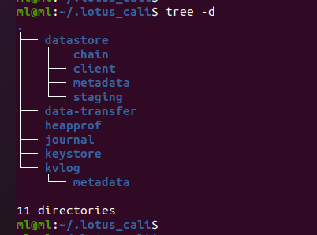
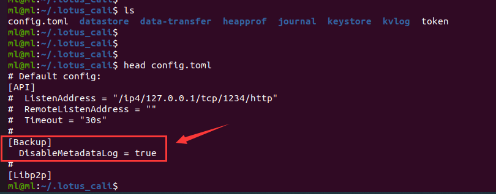
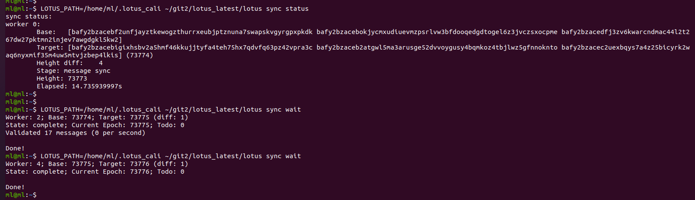

# 测试网快照使用教程（2021/07/14）

## 1. 基本信息

`lotus` 测试网的快照（2021/07/14）下载和使用方式，注意，这是是指 **【测试网】**，不是主网，具体网络信息，请查看这里：[官方网络信息](https://network.filecoin.io/)。

下方操作均以 `Calibration 测试网` 为例进行说明，但是下载地址中有 `Calibration 测试网` 的快照地址和 `Nerpnet 测试网` 的快照地址。

注意，测试网随时可能会重置，如果重置之后，则这个快照信息将不再使用，具体是否重置请查看 [官方网络信息](https://network.filecoin.io/)，或者关注 `Filecoin技术交流群`。

## 2. 导入快照操作（以 calibration 测试网为例）

### 2.1 检查条件

- 已有 `.lotus/` 目录
    现在假设你已经拥有了 `.lotus/` 目录（在这篇文章里面，`.lotus/` 目录是  `~/.lotus_cali/`），如果没有，你可以使用 `lotus daemon` 启动一下你的 `daemon`，然后系统就会自动帮你创建好 `.lotus/` 目录，目录结构如下所示：

    

    在已有 `.lotus/` 目录的情况下，你需要把原来的 `./datastore/` 文件夹下的 `chain/` 目录删除，**但是为了保险起见，还是先把它重命名一下就好，等导入快照成功之后再删除也不迟。**

- 没有 `.lotus/` 目录
    如果没有 `.lotus/` 目录，则可以跳过 **【2.2 禁用 kvlog】**，在 **2.4 导入快照（以 calibration 测试网为例）** 的时候可以直接使用一个新的目录。

### 2.2 禁用 kvlog

然后在 `.lotus/` 目录中禁用 `kvlog`，如果不禁用，可能会出现问题，禁用方法是：编辑 `.lotus/` 目录的 `config.toml` 文件，把 `[Backup]` 下面的 `DisableMetadataLog` 设置为 `true`，并去掉它前面的 `#` 注释符，如下图所示：



### 2.3 下载快照

官方已提供测试网快照下载地址：

- 测试网的快照下载地址：https://snapshots.calibrationnet.filops.net/minimal/latest.zst
- [【参考链接】](https://lotus.filecoin.io/lotus/manage/chain-management/)：https://lotus.filecoin.io/lotus/manage/chain-management/


``` shell
# 官方测试网快照下载方法： 
aria2c -x5 https://snapshots.calibrationnet.filops.net/minimal/latest.zst
```

官方测试网重置时间：`2022-10-31`

```shell
重置相关信息可参考 Slack：
build: https://lotus.filecoin.io/lotus/manage/switch-networks/
stats: https://stats.calibration.fildev.network
faucet: https://faucet.calibration.fildev.network
snapshot: https://snapshots.calibrationnet.filops.net/minimal/latest
```


### 2.4 导入快照（以 calibration 测试网为例）

现在就可以导入快照了，导入命令如下所示：

```shell
# 注意：这里通过环境变量 LOTUS_PATH=/home/ml/.lotus_cali 指定了 .lotus 目录所在的位置，
# 如果没有指定，则默认是在: ~/.lotus/
LOTUS_PATH=/home/ml/.lotus_cali ~/git2/lotus_latest/lotus daemon --import-snapshot ./lotus_cali_snapshot_2021_07_14_high_73770.car --halt-after-import
```

上述命令添加了 `--halt-after-import` 参数，让它导入快照之后停止运行，如果没有加这个参数，则在导入快照之后会直接启动 `daemon` 节点。


导入日志如下所示：

```shell
ml@ml:~$ 
ml@ml:~$ LOTUS_PATH=/home/ml/.lotus_cali ~/git2/lotus_latest/lotus daemon --import-snapshot lotus_cali_snapshot_2021_07_14_high_73770.car --halt-after-import
2021-07-14T22:46:56.144+0800	INFO	main	lotus/daemon.go:215	lotus repo: /home/ml/.lotus_cali
2021-07-14T22:46:56.145+0800	INFO	paramfetch	go-paramfetch@v0.0.2-0.20210614165157-25a6c7769498/paramfetch.go:183	Parameter file /var/tmp/filecoin-proof-parameters/v28-proof-of-spacetime-fallback-merkletree-poseidon_hasher-8-0-0-0170db1f394b35d995252228ee359194b13199d259380541dc529fb0099096b0.vk is ok
2021-07-14T22:46:56.145+0800	INFO	paramfetch	go-paramfetch@v0.0.2-0.20210614165157-25a6c7769498/paramfetch.go:183	Parameter file /var/tmp/filecoin-proof-parameters/v28-stacked-proof-of-replication-merkletree-poseidon_hasher-8-0-0-sha256_hasher-6babf46ce344ae495d558e7770a585b2382d54f225af8ed0397b8be7c3fcd472.vk is ok
2021-07-14T22:46:56.145+0800	INFO	paramfetch	go-paramfetch@v0.0.2-0.20210614165157-25a6c7769498/paramfetch.go:183	Parameter file /var/tmp/filecoin-proof-parameters/v28-proof-of-spacetime-fallback-merkletree-poseidon_hasher-8-0-0-0cfb4f178bbb71cf2ecfcd42accce558b27199ab4fb59cb78f2483fe21ef36d9.vk is ok
2021-07-14T22:46:56.145+0800	INFO	paramfetch	go-paramfetch@v0.0.2-0.20210614165157-25a6c7769498/paramfetch.go:183	Parameter file /var/tmp/filecoin-proof-parameters/v28-proof-of-spacetime-fallback-merkletree-poseidon_hasher-8-8-0-559e581f022bb4e4ec6e719e563bf0e026ad6de42e56c18714a2c692b1b88d7e.vk is ok
2021-07-14T22:46:56.145+0800	INFO	paramfetch	go-paramfetch@v0.0.2-0.20210614165157-25a6c7769498/paramfetch.go:183	Parameter file /var/tmp/filecoin-proof-parameters/v28-proof-of-spacetime-fallback-merkletree-poseidon_hasher-8-0-0-3ea05428c9d11689f23529cde32fd30aabd50f7d2c93657c1d3650bca3e8ea9e.vk is ok
2021-07-14T22:46:56.146+0800	INFO	paramfetch	go-paramfetch@v0.0.2-0.20210614165157-25a6c7769498/paramfetch.go:183	Parameter file /var/tmp/filecoin-proof-parameters/v28-proof-of-spacetime-fallback-merkletree-poseidon_hasher-8-0-0-7d739b8cf60f1b0709eeebee7730e297683552e4b69cab6984ec0285663c5781.vk is ok
2021-07-14T22:46:56.146+0800	INFO	paramfetch	go-paramfetch@v0.0.2-0.20210614165157-25a6c7769498/paramfetch.go:183	Parameter file /var/tmp/filecoin-proof-parameters/v28-proof-of-spacetime-fallback-merkletree-poseidon_hasher-8-0-0-5294475db5237a2e83c3e52fd6c2b03859a1831d45ed08c4f35dbf9a803165a9.vk is ok
2021-07-14T22:46:56.146+0800	INFO	paramfetch	go-paramfetch@v0.0.2-0.20210614165157-25a6c7769498/paramfetch.go:183	Parameter file /var/tmp/filecoin-proof-parameters/v28-proof-of-spacetime-fallback-merkletree-poseidon_hasher-8-8-2-b62098629d07946e9028127e70295ed996fe3ed25b0f9f88eb610a0ab4385a3c.vk is ok
2021-07-14T22:46:56.146+0800	INFO	paramfetch	go-paramfetch@v0.0.2-0.20210614165157-25a6c7769498/paramfetch.go:183	Parameter file /var/tmp/filecoin-proof-parameters/v28-stacked-proof-of-replication-merkletree-poseidon_hasher-8-8-2-sha256_hasher-96f1b4a04c5c51e4759bbf224bbc2ef5a42c7100f16ec0637123f16a845ddfb2.vk is ok
2021-07-14T22:46:56.146+0800	INFO	paramfetch	go-paramfetch@v0.0.2-0.20210614165157-25a6c7769498/paramfetch.go:183	Parameter file /var/tmp/filecoin-proof-parameters/v28-stacked-proof-of-replication-merkletree-poseidon_hasher-8-0-0-sha256_hasher-032d3138d22506ec0082ed72b2dcba18df18477904e35bafee82b3793b06832f.vk is ok
2021-07-14T22:46:56.146+0800	INFO	paramfetch	go-paramfetch@v0.0.2-0.20210614165157-25a6c7769498/paramfetch.go:183	Parameter file /var/tmp/filecoin-proof-parameters/v28-proof-of-spacetime-fallback-merkletree-poseidon_hasher-8-0-0-50c7368dea9593ed0989e70974d28024efa9d156d585b7eea1be22b2e753f331.vk is ok
2021-07-14T22:46:56.146+0800	INFO	paramfetch	go-paramfetch@v0.0.2-0.20210614165157-25a6c7769498/paramfetch.go:183	Parameter file /var/tmp/filecoin-proof-parameters/v28-stacked-proof-of-replication-merkletree-poseidon_hasher-8-0-0-sha256_hasher-ecd683648512ab1765faa2a5f14bab48f676e633467f0aa8aad4b55dcb0652bb.vk is ok
2021-07-14T22:46:56.146+0800	INFO	paramfetch	go-paramfetch@v0.0.2-0.20210614165157-25a6c7769498/paramfetch.go:183	Parameter file /var/tmp/filecoin-proof-parameters/v28-stacked-proof-of-replication-merkletree-poseidon_hasher-8-8-0-sha256_hasher-82a357d2f2ca81dc61bb45f4a762807aedee1b0a53fd6c4e77b46a01bfef7820.vk is ok
2021-07-14T22:46:56.149+0800	INFO	paramfetch	go-paramfetch@v0.0.2-0.20210614165157-25a6c7769498/paramfetch.go:183	Parameter file /var/tmp/filecoin-proof-parameters/v28-proof-of-spacetime-fallback-merkletree-poseidon_hasher-8-8-2-2627e4006b67f99cef990c0a47d5426cb7ab0a0ad58fc1061547bf2d28b09def.vk is ok
2021-07-14T22:46:56.149+0800	INFO	paramfetch	go-paramfetch@v0.0.2-0.20210614165157-25a6c7769498/paramfetch.go:183	Parameter file /var/tmp/filecoin-proof-parameters/v28-proof-of-spacetime-fallback-merkletree-poseidon_hasher-8-8-0-0377ded656c6f524f1618760bffe4e0a1c51d5a70c4509eedae8a27555733edc.vk is ok
2021-07-14T22:46:56.557+0800	INFO	paramfetch	go-paramfetch@v0.0.2-0.20210614165157-25a6c7769498/paramfetch.go:183	Parameter file /var/tmp/filecoin-proof-parameters/v28-fil-inner-product-v1.srs is ok
2021-07-14T22:46:56.557+0800	INFO	paramfetch	go-paramfetch@v0.0.2-0.20210614165157-25a6c7769498/paramfetch.go:207	parameter and key-fetching complete
2021-07-14T22:46:56.566+0800	INFO	badgerbs	v2@v2.2007.2/levels.go:183	All 0 tables opened in 0s

2021-07-14T22:46:56.637+0800	INFO	badger	v2@v2.2007.2/levels.go:183	All 0 tables opened in 0s

2021-07-14T22:46:56.638+0800	INFO	badger	v2@v2.2007.2/value.go:1158	Replaying file id: 0 at offset: 0

2021-07-14T22:46:56.638+0800	INFO	badger	v2@v2.2007.2/value.go:1178	Replay took: 2.672µs

2021-07-14T22:46:56.659+0800	INFO	badger	v2@v2.2007.2/levels.go:183	All 0 tables opened in 0s

2021-07-14T22:46:56.660+0800	INFO	badger	v2@v2.2007.2/value.go:1158	Replaying file id: 0 at offset: 0

2021-07-14T22:46:56.660+0800	INFO	badger	v2@v2.2007.2/value.go:1178	Replay took: 3.419µs

2021-07-14T22:46:56.660+0800	INFO	main	lotus/daemon.go:487	importing chain from lotus_cali_snapshot_2021_07_14_high_73770.car...
 292.06 MiB / 292.06 MiB [==============================================================================================================================] 100.00% 77.56 MiB/s 3s
2021-07-14T22:47:00.426+0800	INFO	chainstore	store/store.go:664	clearing block validation cache...
2021-07-14T22:47:00.448+0800	INFO	chainstore	store/store.go:703	8095 block validation entries cleared.
2021-07-14T22:47:06.508+0800	WARN	chainstore	store/store.go:641	no heaviest tipset found, using [bafy2bzacecz3trtejxtzix4f4eebs7dekm6snfsmvffiqz2rfx7iwgsgtieq4]
2021-07-14T22:47:06.508+0800	INFO	chainstore	store/store.go:646	New heaviest tipset! [bafy2bzacecz3trtejxtzix4f4eebs7dekm6snfsmvffiqz2rfx7iwgsgtieq4] (height=0)
2021-07-14T22:47:06.510+0800	INFO	main	lotus/daemon.go:529	accepting [bafy2bzacebf2unfjayztkewogzthurrxeubjptznuna7swapskvgyrgpxpkdk bafy2bzacebokjycmxudiuevmzpsrlvw3bfdooqedgdtogel6z3jvczsxocpme bafy2bzacedfj3zv6kwarcndmac44l2t267dw27pktmn2injev7awgdgkl5kw2] as new head
2021-07-14T22:47:06.510+0800	WARN	chainstore	store/store.go:525	(!!!) forcing a new head silently; new head: [bafy2bzacebf2unfjayztkewogzthurrxeubjptznuna7swapskvgyrgpxpkdk bafy2bzacebokjycmxudiuevmzpsrlvw3bfdooqedgdtogel6z3jvczsxocpme bafy2bzacedfj3zv6kwarcndmac44l2t267dw27pktmn2injev7awgdgkl5kw2]
2021-07-14T22:47:06.512+0800	WARN	chainstore	store/store.go:618	reorgWorker quit
2021-07-14T22:47:06.524+0800	INFO	badgerbs	v2@v2.2007.2/db.go:1030	Storing value log head: {Fid:0 Len:31 Offset:319610030}

2021-07-14T22:47:06.781+0800	INFO	badgerbs	v2@v2.2007.2/levels.go:1000	[Compactor: 173] Running compaction: {level:0 score:1.73 dropPrefixes:[]} for level: 0

2021-07-14T22:47:07.071+0800	INFO	badgerbs	v2@v2.2007.2/levels.go:962	LOG Compact 0->1, del 1 tables, add 1 tables, took 289.968527ms

2021-07-14T22:47:07.071+0800	INFO	badgerbs	v2@v2.2007.2/levels.go:1010	[Compactor: 173] Compaction for level: 0 DONE
2021-07-14T22:47:07.071+0800	INFO	badgerbs	v2@v2.2007.2/db.go:553	Force compaction on level 0 done
Chain import complete, halting as requested...
ml@ml:~$ 
ml@ml:~$ 
```

### 2.5 启动节点（以 calibration 测试网为例）

如果上一步导入快照的时候没有加 `--halt-after-import` 参数，则就不需要执行这个步骤：

```shell
# 注意这里指定了 ./lotus/ 的目录
LOTUS_PATH=/home/ml/.lotus_cali ~/git2/lotus_latest/lotus daemon
```

启动之后，等待它同步完成，如果没有明显的错误（比如 `ERROR` 类型的信息），则可以不用管它，你可以在其它窗口使用如下命令来查看同步的过程：

```sh
# 查看当前同步状态
LOTUS_PATH=/home/ml/.lotus_cali ~/git2/lotus_latest/lotus sync status
# 查看当前进度
LOTUS_PATH=/home/ml/.lotus_cali ~/git2/lotus_latest/lotus sync wait
```

同步完成之后， `./lotus sync wait` 命令会自动退出，如下所示：




## 3. 其它

### 3.1 参考信息

- [【官方主网快照操作手册】](https://docs.filecoin.io/get-started/lotus/chain/#lightweight-snapshot)： https://docs.filecoin.io/get-started/lotus/chain/#lightweight-snapshot
- [【官方主网快照下载地址】](https://snapshots.mainnet.filops.net/minimal/latest.zst)： https://snapshots.mainnet.filops.net/minimal/latest.zst
- [【官方主网快照推荐下载方法】]()：aria2c -x5 https://snapshots.mainnet.filops.net/minimal/latest.zst
- [【官方测试网快照下载地址】](https://snapshots.calibrationnet.filops.net/minimal/latest.zst)：https://snapshots.calibrationnet.filops.net/minimal/latest.zst
- [【官方测试网快照推荐下载方法】]()：aria2c -x5 https://snapshots.calibrationnet.filops.net/minimal/latest.zst


- [【链数据/快照导入导出操作流程请查看这里】](../lotus_chain_op/lotus_chain_op.md)
- [【2K 本地测试网使用教程请看这里】](../local_2k_dev_tutorial/local_2k_dev_tutorial.md)


### 3.2 文章来源

本文来自于微信群 `Filecoin技术交流-1/2/3/4/5/6群` 群主（`TEARS`）出品，详细信息请查看 [【Filecoin 中国社区论坛】](https://github.com/filecoin-project/community-china)。

如有任何问题，请在微信群 `Filecoin技术交流-1/2/3/4/5/6群` 或 `Filecoin 中国社区论坛的【讨论模块】`中讨论。

