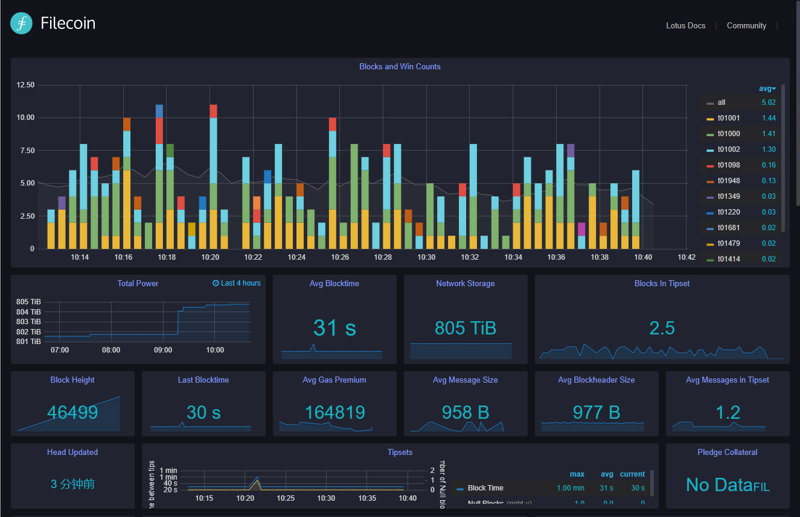
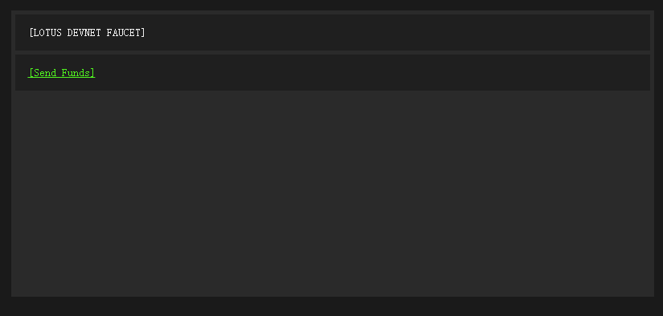
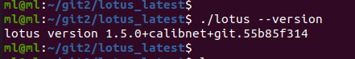
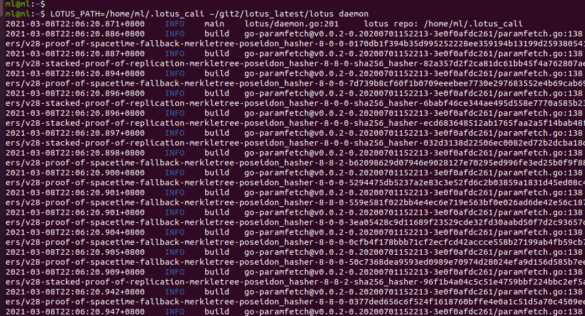
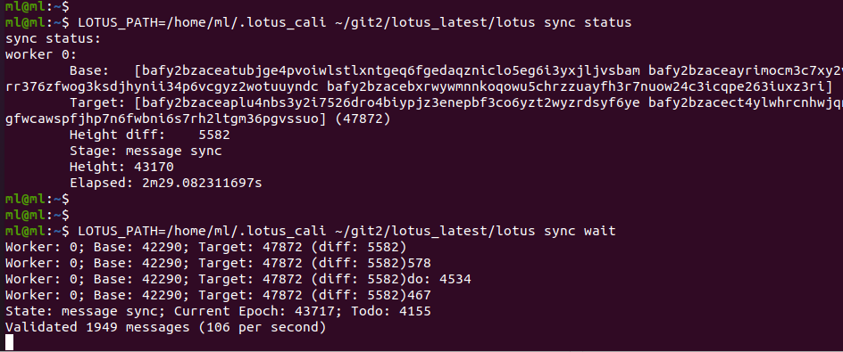
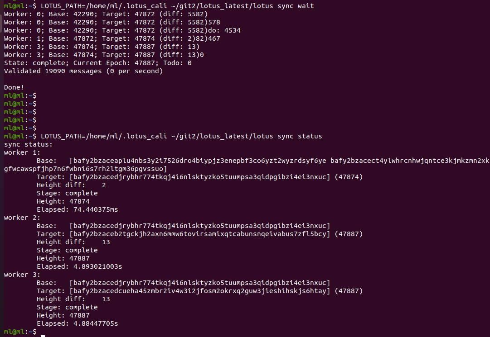
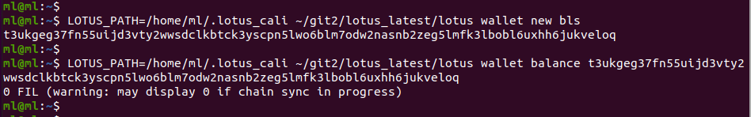
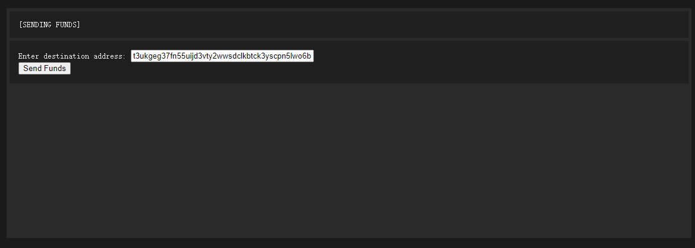
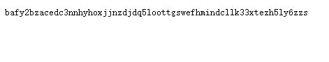
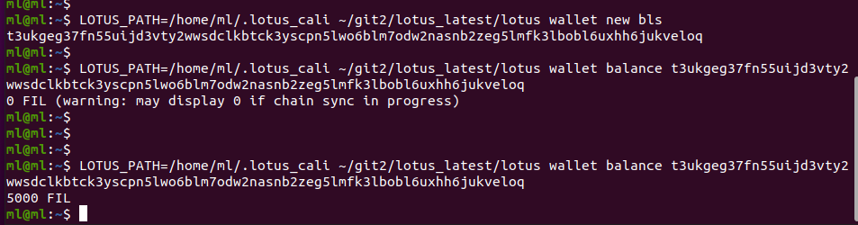

# Calibration 测试网使用教程

## 1. 基本信息

`Calibration 测试网` 是用于测试的一个网络，里面的币不是真正的 `FIL` 币，不能用于市场流通，只能用于测试，关于该网络的详细信息，可以查看 [【官方网站】](https://network.filecoin.io/)，同时，关于该网络的最新消息，可以在 [Slack](filecoinproject.slack.com) 上的 【`fil-net-calibration-discuss`】频道和【`fil-net-calibration-announce`】频道中获取，如遇到任何问题，也可以在 `Slack` 上的 【`fil-net-calibration-discuss`】频道或微信群【`Filecoin技术交流-1/2/3/4群`】进行讨论。

**重要信息：**

- 水龙头地址【官方】：https://faucet.calibration.fildev.network
- 网络面板【官方】：https://stats.calibration.fildev.network
- 备用面板【第三方】：https://calibration.filscan.io/#/home

目前（`2021/03/08`），`calibration 测试网`的网络面板截图如下图所示：



同时，由于测试网上的消息费用大大高于主网中的消息费用（提交一条 `PreCommitSector` 消息可能需要花费 `100 FIL` 左右），从 `2021/02/27` 起，协议实验室成员 `travisperson` 提高了每次从水龙头取币的数量，从原来的每次只能取 `100 FIL` 到现在的每次能取 `5000 FIL`，[欲知详情，请点击](https://filecoinproject.slack.com/archives/C01D42NNLMS/p1614363209108500)。

测试网水龙头截图如下所示：




## 2. 下载代码与编译

直接从官方 github 网站上下载 [lotus 源码](https://github.com/filecoin-project/lotus)，然后切换到对应的版本（示例中使用的版本是：`v1.5.0`），再进行编译，参考示例如下所示：

```sh
git clone https://github.com/filecoin-project/lotus.git
git pull --all
# 拉去所有的 tag 标签
git pull --tags
# 假设我们现在使用 v1.5.0 版本的代码
git checkout v1.5.0
# 注意编译命令：calibnet，前面的环境变量 FFI_BUILD_FROM_SOURCE=1 可选，不过最好加上
FFI_BUILD_FROM_SOURCE=1 make clean calibnet
```

编译完整的 log 请查看这里：[【编译 calibration 网络的 log 日志】](./files/build_calinet_log.md)

查看编译好的 `lotus` 版本信息：`lotus version 1.5.0+calibnet+git.55b85f314`



注意，这里看到的版本信息一定是要带有 `calibnet` 关键字的，否则，你可能编译的版本不适用于测试网。

编译过程中如遇到任何问题，请参考文档：[【本地搭建 2K 测试网入门教程】](https://github.com/filecoin-project/community-china/blob/master/documents/tutorial/local_2k_dev_tutorial/local_2k_dev_tutorial.md)。


## 3. 运行

编译好之后，就可以运行程序了，运行程序和教程：[【本地搭建 2K 测试网入门教程】](https://github.com/filecoin-project/community-china/blob/master/documents/tutorial/local_2k_dev_tutorial/local_2k_dev_tutorial.md)中的运行方式类似，只不过不需要创建创世旷工，并且获取初始 `FIL` 的方式也变成从 `水龙头` 出获取，所连接的网络是官方搭建的一个 `calibration 测试网`，仅此而已。

### 3.1 启动节点

启动节点的命令很简单，如下所示：

```sh
# 环境变量 LOTUS_PATH 可以用来指定 .lotus/ 目录的路径，不指定的话，默认在 home 目录下的 ~/.lotus/ 中
LOTUS_PATH=/home/ml/.lotus_cali ~/git2/lotus_latest/lotus daemon
```

启动之后可以看到如下所示的信息：



然后再开启另一个终端或窗口，再输入如下命令查看同步数据的情况（示例中显示的结果是我从半路同步的过程，因为我之前已经同步过一次，中间停了一天，现在再次同步看到的截图）：

```sh
# 查看同步状态
LOTUS_PATH=/home/ml/.lotus_cali ~/git2/lotus_latest/lotus sync status
# 使用 wait 命令的时候，如果同步没有完成，会一直显示同步过程，只有同步完成之后才会自动退出
# 当然，中间也可以随意的使用 ctrl+c 退出
LOTUS_PATH=/home/ml/.lotus_cali ~/git2/lotus_latest/lotus sync wait
````



同步好之后，看的的截图如下所示：



### 3.2 创建钱包并从水龙头处获取测试代币

同步完成之后，就可以创建一个钱包，并使用创建出来的钱包地址，到官方的水龙头处获取代币（目前一次获取的代币数量是 `5000 FIL`），创建钱包命令如下所示：

```sh
# 注意要创建 bls 类型的钱包地址
LOTUS_PATH=/home/ml/.lotus_cali ~/git2/lotus_latest/lotus wallet new bls
# 示例中的钱包地址是 t3ukgeg37fn55uijd3vty2wwsdclkbtck3yscpn5lwo6blm7odw2nasnb2zeg5lmfk3lbobl6uxhh6jukveloq，
# 注意，你创建的钱包地址和示例中的不会一样
LOTUS_PATH=/home/ml/.lotus_cali ~/git2/lotus_latest/lotus wallet balance t3ukgeg37fn55uijd3vty2wwsdclkbtck3yscpn5lwo6blm7odw2nasnb2zeg5lmfk3lbobl6uxhh6jukveloq
````



使用钱包地址去水龙头取数据，打开 [【水龙头】](https://faucet.calibration.fildev.network)，点击 【`[Send Funds]`】链接，然后输入你的钱包地址，并点击 【`Send Funds`】按钮，如下图所示：



点击 【`Send Funds`】 之后，浏览器会返回一串类似如下所示的数字，然后再过一段时间之后，再去查看你的钱包余额：



大约一分钟左右，你的钱包中就会收到水龙头发过来的代币了，如下图所示：




### 3.3 初始化旷工

钱包有钱了就可以初始化旷工了，初始化旷工命令如下所示：

```sh
# 注意，测试网现在支持的最小扇区是 32GB，已经不再支持 512MB 大小的扇区了
# 默认的旷工目录是在 home 目录下的 ~/.lotusminer/ 中
~/git2/lotus_latest/lotus-miner init --sector-size=32GiB
````

**注：** 可参考 [【本地搭建 2K 测试网入门教程】](https://github.com/filecoin-project/community-china/blob/master/documents/tutorial/local_2k_dev_tutorial/local_2k_dev_tutorial.md)。

### 3.4 启动旷工

初始化好之后，直接启动旷工，启动命令如下所示：

```sh
# 注意，测试网现在支持的最小扇区是 32GB，已经不再支持 512MB 大小的扇区了
~/git2/lotus_latest/lotus-miner run
````

**注：** 可参考 [【本地搭建 2K 测试网入门教程】](https://github.com/filecoin-project/community-china/blob/master/documents/tutorial/local_2k_dev_tutorial/local_2k_dev_tutorial.md)。

### 3.5 质押和查看旷工信息

旷工起来之后，后续的操作基本上和本地 `2KB` 测试网的一样，进行质押操作，查看旷工信息等，如下所示：

```sh
# 执行一次命令，质押一个扇区
~/git2/lotus_latest/lotus-miner sectors pledge
# 查看旷工信息
~/git2/lotus_latest/lotus-miner info
````

**注：** 可参考 [【本地搭建 2K 测试网入门教程】](https://github.com/filecoin-project/community-china/blob/master/documents/tutorial/local_2k_dev_tutorial/local_2k_dev_tutorial.md)。


## 4. 其它

### 4.1 网络重置信息

`Calibration 测试网` 经常会被重置，如果发现测试网用不了了，可能是已经被重置了，因此，需要多关注  [【官方网站】](https://network.filecoin.io/) 和 [Slack](filecoinproject.slack.com) 上的 【`fil-net-calibration-announce`】频道。

历史记录：上次重置时间是：[【2021年02月20号】](https://filecoinproject.slack.com/archives/C01D42NNLMS/p1613779525000400)


### 4.2 文章来源

本文来自于微信群 `Filecoin技术交流-1/2/3/4群` 群主（`TEARS`）出品，详细信息请查看 [【Filecoin 资源分享目录】](https://github.com/CoinSummer/filecoin)。

如有任何问题，请在微信群 `Filecoin技术交流-1/2/3/4群` 中讨论。
